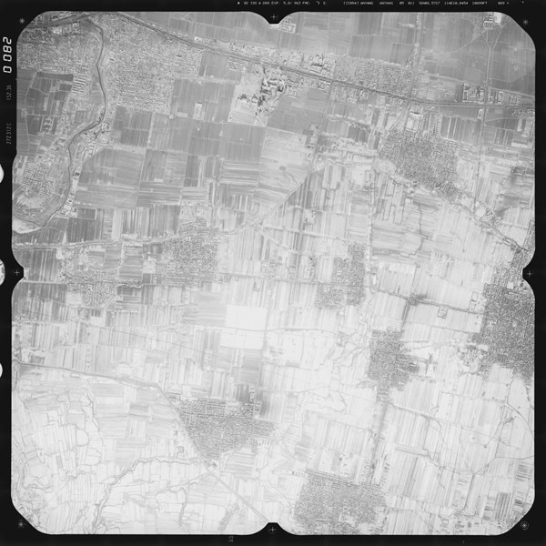
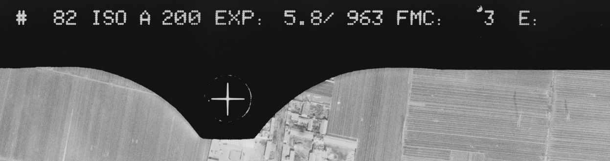
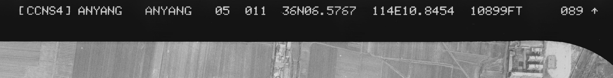
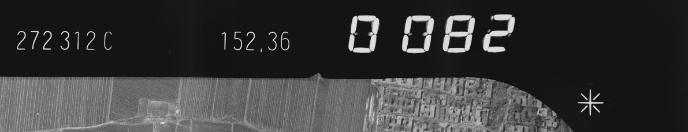
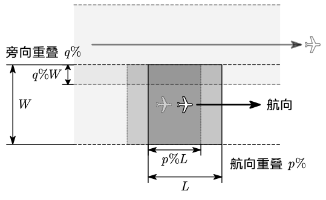
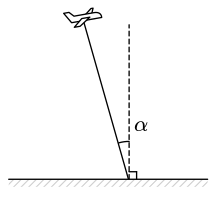
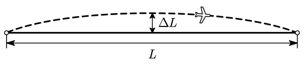
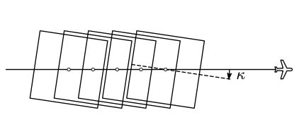

# 2 量测相机与航空摄影

## 量测用相机

### 量测用相机的特点

主距：摄影机物镜后节点到像片主点的垂距。航空摄影时，物距可视为无穷远，像距几乎等于物镜焦距。故将物镜固定调焦于无穷远处，主距等于物镜焦距，均使用 $f$ 表示。

框标：胶片时代，在固定不变的承片框上，安置四个边的中点的标志。其目的是建立像片的直角框标坐标。两两相对的框标连线成正交，其交点成为像片平面坐标系的原点，从而使摄影的像片上构成直角框标坐标系。

::: details 航摄像片举例

如下是一张典型的航摄像片：

可以看到四个角点与四边中点均存在框标，呈十字形。顶部中间放大图：

顶部右侧放大图中可以看到是项目 `ANYANG` 的 `ANYANG` 分区，第 5 航线第 11 片：

左侧放大图：

:::

==**量测用相机的特性**==：

- 像距固定不变是主距（几乎等于物镜焦距）
- 相片上有框标（数字形式隐含）
- 内方位元素已知
- 畸变小
- 结构精密
- 需同时曝光等

### 物镜畸变

- 切向畸变（一般不考虑）
- 径向畸变
  - 桶形畸变
  - 枕形畸变

畸变可以标定后使用公式修正。径向畸变修正量的经验公式：

$$
d_r=k_1r^3+k_2r^5+k_3r^7+\cdots
$$

## 航空摄影

### 摄影比例尺与航高

**摄影比例尺** $\dfrac1m$ 定义为航摄像片上一线段为 $l$ 的影像与地面上相应线段的水平距离 $L$ 之比，即有 $\dfrac1m=\dfrac lL$。

**摄影航高** $H$ 定义为摄影机的物镜中心至摄区的平均高程面（摄影基准面）的距离。

数量关系满足：

$$
\frac1m=\frac lL=\frac fH
$$

其中 $f$ 为摄影机主距。

当选定了摄影机和摄影比例尺后，即 $f$ 和 $m$ 为已知，航空摄影时就要求按计算的航高 $H$ 飞行摄影，以获得符合生产要求的摄影像片。

### 摄影资料的要求

**航向重叠**：同一条航线上相邻两像片的重叠比例。

**旁向重叠**：相邻航线的重叠比例。

**像片倾角** $\alpha$：摄影瞬间，摄影机轴与铅直方向的夹角。

**航摄最大偏距**：航向弯曲时，实际航线与目标航线的最大偏移距离。

**像片旋角** $\kappa$：相邻像片的主点连线与像幅沿航线方向两框标连线间的夹角。

==**传统航空摄影测量对空中摄影形式的要求**==：

- 合适的摄影比例尺
- 相对航高差 $\dfrac{\Delta H}H<5\%$
- 航向重叠 $p>60\%$，旁向重叠 $q>30\%$（航向、旁向重叠小于最低要求时，称航摄漏洞）
- 航线弯曲 $\dfrac{\Delta L}L<3\%$
- 旋片角 $\kappa<6\%$
- （主光轴竖直等）

==**为什么要有重叠度**==：

- 重叠区覆盖整个测区（立体测图的需要）
- 防止出现摄影漏洞（这样就不能用于测图）
- 在空三的时候用于连接相邻模型，补充性的地面控制

## 中英术语对照

| 英文术语                   | 中文术语   |
| -------------------------- | ---------- |
| cartographic aerial camera | 航摄相机   |
| metric camera              | 量测用相机 |
| fiducial mark              | 框标       |
| collimated light           | 准直光线   |
| radial distortion          | 径向畸变   |
| tangential distortion      | 切向畸变   |
| sidelap                    | 旁向重叠   |
| forward overlap            | 航向重叠   |

## 小测问题

- 量测用相机有哪些特性？
- 物镜畸变的种类，在摄影测量中如何处理？
- 传统航空摄影测量对空中摄影的形式有哪些要求？
- 航空摄影测量为什么要选择中心快门相机，对于动态变形检测或室内 SLAM（simultaneous localization and mapping，即时定位与地图构建）工作选择缝隙式滚动快门是否可以，为什么？
