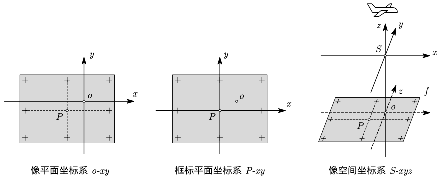
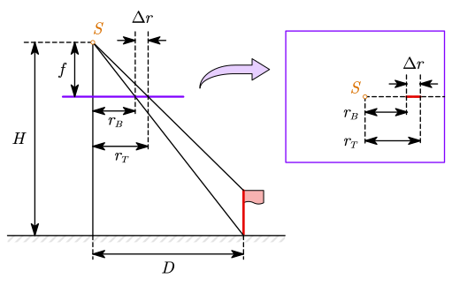

# 3 摄影测量基础知识

## 中心投影

设空间诸物点 $A,B,C,\cdots$ 按照某一规律建立投影射线，取一平面 $P$ 截割投影射线，在平面内得到相应的投影点 $a,b,c,\cdots$，则该平面称为投影面，在平面内得到的图形称为投影图。

若投影光线相互平行且垂直于投影面， 则称为**正射投影**，如图 (a) 所示。若投影光线会聚于一点，则称为**中心投影**，如图 (b) 中三种情况均属中心投影。投影光线会聚的点 $S$ 称为投影中心，由中心投影得到的图称为透视图。

当航空摄影机向地面摄影时，航摄像片是所摄地面的中心投影，类似上图 (b) 中的第一种情形。而地图是地面在水平面上正射投影的缩小，因此，摄影测量可以被认为是研究并实现将中心投影的航摄像片转换为**正射投影（地图）**的科学与技术。

注意 (b) 中左边与中间的两种投影方式。左边的一种，从物点出发的光线经过投影中心 $S$ 后在像平面上成像；中间的一种，物点没有经过投影中心就在像平面上成像。相机在拍摄时实际是左边的一种，但平时为了作图方便，也常使用中间的这种画法。两种画法中，像平面关于投影中心 $S$ 对称。

==**针孔成像原理**==：光线沿直线传播，光从物体经过小孔到达屏幕形成倒立的实像，满足像点、针孔、物点三点共线。

==**框幅式影像成像的基本原理**==：满足中心投影原理，即物点、像点、投影中心三点共线。

==**中心投影与正射投影的区别**==：中心投影的光线会聚于一点（投影中心）；正射投影的投影光线互相平行且与投影平面正交。

==**竖直摄影**（nominally vertical photographs）**与正直摄影**（vertical photographs）==：竖直摄影主光轴近似垂直于基准面（像片倾角为 2°~3°）；正直摄影主光轴严格垂直于基准面。

空间点、直线、线段、平行线组的中心投影：

- 空间点的中心投影是一个确定的点
- 空间直线的中心投影分几种情况：
  - 过投影中心的直线，其中心投影为一个点
  - 与投影面相交时，其中心投影为一线段
  - 与投影面平行时，其中心投影为一直线
- 平行线组的中心投影为一组辐射线束

## 航摄像片特殊点线面

- $P$ 为倾斜的==像片面（投影面）==；$E$ 为水平的地面（物面），也称==基准面==
- $S$ 为摄影中心（投影中心）
  - $E\cap P=TT$ 为==透视轴==，透视轴上的点称为二重点
- 作直线 $So\perp$ 像平面 $P$，$So$ 称为摄影机轴
  - $So\cap P=o$ 为==像主点==；过 $o$ 作 $h_oh_o\parallel TT$，$h_oh_o$ 为==主横线==
  - $So\cap E=O$ 为地面主点
  - $So=f$ 为摄影机==主距==
- 作直线 $Sn\perp$ 地面 $E$，$Sn$ 称为主垂线
  - $Sn\cap P=n$ 为==像底点==，是所有铅直线的交汇点
  - $Sn\cap E=N$ 为地底点
  - $SN=H$ 为==航高==
- $\angle oSN=\alpha$ 称为像片倾角
- 作 $\alpha$ 的平分线 $Sc$
  - $Sc\cap P=c$ 为==等角点==；过 $c$ 作 $h_ch_c\parallel TT$，$h_ch_c$ 为==等比线==
  - $Sc\cap E=C$ 为地面等角点
- 过主垂线 $Sn$ 与摄影机轴 $So$ 的面 $W$ 为==主垂面==，有 $W\perp E$ 且 $W\perp P$
  - $W\cap P=vv$ 为==主纵线==；过 $S$ 作 $SJ\parallel vv$，$SJ\cap E=J$ 称为==主遁点==
  - $W\cap E=VV$ 为==基本方向线（摄影方向线）==
  - 过 $S$ 作面 $Es\parallel E$，$Es$ 为合面（图中未画出）
  - $Es\cap P=h_ih_i$ 为==主合线（地平线）==
  - $h_ih_i\cap W=i$ 为==主合点==，是所有平行于基本方向线的直线的交汇点

根据中心投影特点可知， $i$ 点是 $E$ 面上一组平行于基本方向线 $VV$ 的平行线束在 $P$ 面上构像的合点，而 $n$ 是一组垂直于 $E$ 面的平行线束在 $P$ 面上构像的合点。

## 常见坐标系

- ==**像平面坐标系**== 是以像主点为原点，坐标系方向和框标坐标系的方向相同的平面坐标系；
- ==**像空间坐标系**== 是以投影中心为原点，$z$ 轴为主光轴，$x,y$ 轴与像平面坐标系平行的空间坐标系，其中沿航向方向的轴为 $x$ 轴；
- ==**像空间辅助坐标系**== 是以投影中心为原点，轴向按需求确定的辅助坐标系。

- ==**摄影测量坐标系**== 是以地面某点为坐标原点，$x$ 轴大致和航向相同，$z$ 轴为铅垂线方向，构成右手系，为像空间辅助坐标系转换到地面测量坐标系的过渡性坐标系
- 物方空间坐标是左手系，与大地测量中的高斯克吕格平面坐标系相同，高程以黄海高程系统为基准。用于描述地面点在物方空间的位置

坐标系之间的关系：

- 像平面 → 内方位元素 → 像空间 → 旋转 → 像辅助 → 空间三维相似变换 → 地面摄测
- 像空间 → 共线条件方程式 → 像平面

## 投影差

==**投影差的定义**==：中心投影中，地面点因地形起伏引起的像点位移。与物体的高度、物体与像底点的距离有关。

在正直摄影情况下，有==投影差公式==：

$$
\Delta r=\frac{r_T\cdot h}H
$$

==像底点附近的区域受地形起伏影响较小。==

==等比线的构像比例尺不受像片倾斜影响。==

## 中英术语对照

| 英文术语                       | 中文术语         |
| ------------------------------ | ---------------- |
| perspective center             | 投影中心         |
| nominally vertical photographs | 竖直摄影         |
| vertical photographs           | 正直摄影         |
| principal point (PP)           | 像主点           |
| focal length                   | 焦距             |
| principal distance             | 主距             |
| optical axis                   | 主光轴           |
| image distance                 | 像距             |
| relief displacement            | 投影差           |
| auxiliary space                | 像空间辅助坐标系 |

## 小测问题

- 框幅式光学影像成像几何上满足的基本原理是什么？
- 中心投影影像与正射投影之间有什么样的不同？竖直摄影与正直投影有什么区别？
- 物方空间点、直线、线段、平行线组，其各自的中心投影怎样？
- 航摄像片上的特殊点、线、面：在图上指出像主点、像底点、主合点、等角点、主距、航高、主垂面、主纵线
- 主距、像距、焦距的联系与区别？内方位元素的定义？其中 $(x_0,y_0,-f)$ 中的 $f$ 是上面三个中的哪些？
- 像平面坐标系、像空间坐标系的定义，两者之间的转换关系
