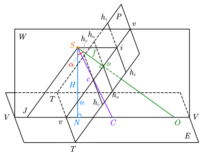

# 3 摄影测量基础知识

## 中心投影

设空间诸物点 $A,B,C,\cdots$ 按照某一规律建立投影射线，取一平面 $P$ 截割投影射线，在平面内得到相应的投影点 $a,b,c,\cdots$，则该平面称为投影面，在平面内得到的图形称为投影图。

若投影光线相互平行且垂直于投影面， 则称为**正射投影**，如图 (a) 所示。若投影光线会聚于一点，则称为**中心投影**，如图 (b) 中三种情况均属中心投影。投影光线会聚的点 $S$ 称为投影中心，由中心投影得到的图称为透视图。

当航空摄影机向地面摄影时，航摄像片是所摄地面的中心投影，类似上图 (b) 中的第一种情形。而地图是地面在水平面上正射投影的缩小，因此，摄影测量可以被认为是研究并实现将中心投影的航摄像片转换为**正射投影（地图）**的科学与技术。

==**针孔成像原理**==：光线沿直线传播，光从物体经过小孔到达屏幕形成倒立的实像，满足像点、针孔、物点三点共线。

==**框幅式影像成像的基本原理**==：满足中心投影原理，即物点、像点、投影中心三点共线。

==**中心投影与正射投影的区别**==：中心投影的光线会聚于一点（投影中心）；正射投影的投影光线互相平行且与投影平面正交。

==**竖直摄影与正直摄影**==：竖直摄影主光轴近似垂直于基准面（像片倾角为 2°~3°）；正直摄影主光轴严格垂直于基准面。

## 航摄像片上特殊的点、线、面

- $P$ 为倾斜的==像片面（投影面）==；$E$ 为水平的地面（物面），也称==基准面==
- $S$ 为摄影中心（投影中心）
  - $E\cap P=TT$ 为==透视轴==，透视轴上的点称为二重点
- 作直线 $So\perp$ 像平面 $P$，$So$ 称为摄影机轴
  - $So\cap P=o$ 为==像主点==；过 $o$ 作 $h_oh_o\parallel TT$，$h_oh_o$ 为==主横线==
  - $So\cap E=O$ 为地面主点
  - $So=f$ 为摄影机==主距==
- 作直线 $Sn\perp$ 地面 $E$，$Sn$ 称为主垂线
  - $Sn\cap P=n$ 为==像底点==
  - $Sn\cap E=N$ 为地底点
  - $SN=H$ 为==航高==
- $\angle oSN=\alpha$ 称为像片倾角
- 作 $\alpha$ 的平分线 $Sc$
  - $Sc\cap P=c$ 为==等角点==；过 $c$ 作 $h_ch_c\parallel TT$，$h_ch_c$ 为==等比线==
  - $Sc\cap E=C$ 为地面等角点
- 过主垂线 $Sn$ 与摄影机轴 $So$ 的面 $W$ 为==主垂面==，有 $W\perp E$ 且 $W\perp P$
  - $W\cap P=vv$ 为==主纵线==；过 $S$ 作 $SJ\parallel vv$，$SJ\cap E=J$ 称为==主遁点==
  - $W\cap E=VV$ 为==基本方向线（摄影方向线）==
  - 过 $S$ 作面 $Es\parallel E$，$Es$ 为合面（图中未画出）
  - $Es\cap P=h_ih_i$ 为==主合线（地平线）==
  - $h_ih_i\cap W=i$ 为==主合点==

根据中心投影特点可知， $i$ 点是 $E$ 面上一组平行于基本方向线 $VV$ 的平行线束在 $P$ 面上构像的合点，而 $n$ 是一组垂直于 $E$ 面的平行线束在 $P$ 面上构像的合点。

## 中英术语对照

| 英文术语                       | 中文术语 |
| ------------------------------ | -------- |
| perspective center             | 投影中心 |
| nominally vertical photographs | 竖直摄影 |
| vertical photographs           | 正直摄影 |
| principal point                | 像主点   |
| focal length                   | 焦距     |
| principal distance             | 主距     |
| optical axis                   | 主光轴   |
| image distance                 | 像距     |

## 小测问题
