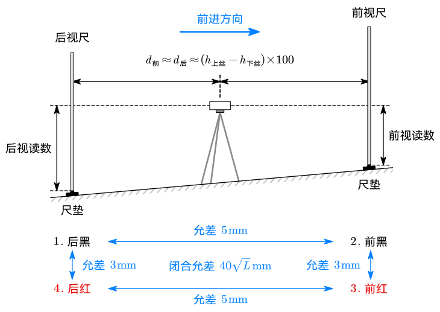

# 3 水准测量理论

## 安置

- 水准路线分为闭合水准路线、附合水准路线和支水准路线
  - 闭合水准路线：从一个水准点出发测一圈回到该点
  - 附合水准路线：从一个已知水准点点出发测到另一个已知水准点
  - 支水准路线：从一个水准点出发，沿一个路线往返测量

- **在前进方向上的水准尺称为前视尺，在前进反方向的称为后视尺。**
- 转点需要安放尺垫并踩实。
- 安置水准仪时，水准仪与前视尺和后视尺的距离应基本一致，即水准仪大致在前后尺正中，以抵消水准面曲率带来的影响。
  - 水准仪估算距离的方法：上下丝读数差 $\times 100$。
  - 低精度水准测量站距要求：$60\sim80\operatorname {m}$
  - 高精度水准测量站距要求：$30\sim50\operatorname {m}$

## 读数

- 两次仪器高法
- 双面尺法
  - 红黑双面尺的两面读数之差成为**尺常数**，一般为 $4.687\operatorname m$ 或 $4.787\operatorname m$
  - 双面尺法测量顺序为「后、前、前、后」，「黑、黑、红、红」，即后视黑面、前视黑面、前视红面、后视红面

## 允差

- 一把尺子红黑面读数差，去掉尺常数之后允差 $\pm3\operatorname {mm}$
- 两把尺子分别算红面高差和黑面高差，允差 $\pm 5\operatorname {mm}$
- 对于长度为 $L\operatorname {km}$ 的水准路线，高差闭合允差为 $\pm40\sqrt L\operatorname {mm}$

## 内业

高差闭合差在允差内但不为零时需进行闭合差分配。闭合差按站距分配，最终相加应使闭合差恰好为 $0$，四舍五入导致的误差需要人工修正。

## 控制水准测量

精度要求：

| 等级 |        双面尺差         |        高差之差         |         视距         |        视距差         |    $\Sigma$ 视距差     |
| :--: | :---------------------: | :---------------------: | :------------------: | :-------------------: | :--------------------: |
| 三等 | $\pm2\operatorname{mm}$ | $\pm3\operatorname{mm}$ | $75\operatorname m$  | $\pm2\operatorname m$ | $\pm5\operatorname m$  |
| 四等 | $\pm3\operatorname{mm}$ | $\pm5\operatorname{mm}$ | $100\operatorname m$ | $\pm3\operatorname m$ | $\pm10\operatorname m$ |

测量过程与数据记录：

1. 后尺黑面上丝
2. 后尺黑面下丝
3. 后尺黑面中丝
4. 前尺黑面上丝
5. 前尺黑面下丝
6. 前尺黑面中丝
7. 前尺红面中丝
8. 后尺红面中丝
9. 后尺黑面上下丝之差 $\times 100$ 得到后视距（检核）
10. 前尺黑面上下丝之差 $\times100$ 得到前视距（检核）
11. 前后视距之差（检核）
12. 前后视距差积累（检核）
13. 前尺红黑面差 - 尺常数（检核）
14. 后尺红黑面差 - 尺常数（检核）
15. 黑面高差
16. 红面高差
17. 红黑面高差之差（检核）
18. 红黑面高差平均值（结果）

<table><thead style="text-align:center;vertical-align:middle">
  <tr>
    <th rowspan="3">测站</th>
    <th rowspan="3">视准点</th>
    <th rowspan="2">后尺</th>
    <th>上丝</th>
    <th rowspan="2">前尺</th>
    <th>上丝</th>
    <th rowspan="3">方向 及 尺号</th>
    <th colspan="2" rowspan="2">水准尺度数</th>
    <th rowspan="3">黑+K-红 K=4.787</th>
    <th rowspan="3">平均高差</th>
  </tr>
  <tr>
    <th>下丝</th>
    <th>下丝</th>
  </tr>
  <tr>
    <th colspan="2">后视距 视距差</th>
    <th colspan="2">前视距 Σ视距差</th>
    <th>黑色面</th>
    <th>红色面</th>
  </tr></thead>
<tbody style="text-align:center">
  <tr>
    <td></td>
    <td></td>
    <td colspan="2">(1) (2) (9) (11)</td>
    <td colspan="2">(4) (5) (10) (12)</td>
    <td>后尺 前尺 后-前 &nbsp;</td>
    <td>(3) (6) (15) &nbsp;</td>
    <td>(8) (7) (16) &nbsp;</td>
    <td>(14) (13) (17) &nbsp;</td>
    <td>(18)</td>
  </tr>
  <tr>
    <td>1</td>
    <td>BM2 | TP1</td>
    <td colspan="2">1 402 1 173 22.9 -1.4</td>
    <td colspan="2">1 343 1 100 24.3 -1.4</td>
    <td>后 103 前 104 后-前 &nbsp;</td>
    <td>1 289 1 221 +0.068 &nbsp;</td>
    <td>6 075 6 009 +0.066 &nbsp;</td>
    <td>+1 -1 +2 &nbsp;</td>
    <td>+0.067</td>
  </tr>
</tbody></table>
