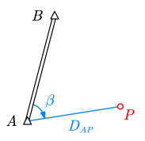
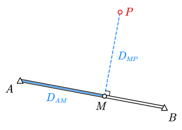
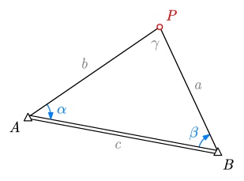
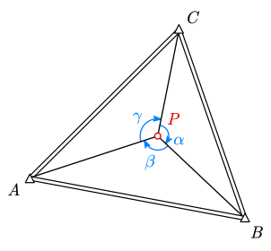
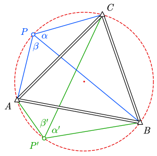
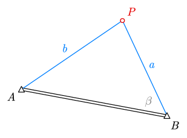
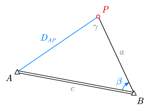

# 5 交会定点

## 概念

交会定点是由已知控制点出发，通过观测角度/距离来计算待定点坐标的方法。典型任务是：在控制导线已经布设完成后，为局部遮挡区域补充一个新控制点。

- 本质：都是先求方向与边长关系，再转成坐标增量计算
- 与地形测量的方法本质一致，但用途不同
  - 交会定点：求得的是新控制点，精度要求高，通常不再连续延伸
  - 地形测量：求得的是地形点，可连续观测多个点

## 方法总览

- 极坐标法
- 直角坐标法
- 方向交会法（前方交会、后方交会）
- 距离交会法（测边交会）
- 方向距离交会法

## 极坐标法

最常用的方式，导线测量的基础。

- 已知 $A(X_A,Y_A),B(X_B,Y_B)$
- 测量方向角改正量（转角）$\beta$、边长 $D_{AP}$（或 $D_{BP}$）

计算流程：

1. 坐标反算基线方位角
   $$
   \alpha_{AB}=\arctan\frac{Y_B-Y_A}{X_B-X_A}
   $$
2. 求待测方向方位角（如从 $A$ 站观测）
   $$
   \alpha_{AP}=\alpha_{AB}+\beta
   $$
3. 求坐标增量并计算坐标
   $$
   \Delta X_{AP}=D_{AP}\cos\alpha_{AP},\quad
   \Delta Y_{AP}=D_{AP}\sin\alpha_{AP}
   $$
   $$
   X_P=X_A+\Delta X_{AP},\quad
   Y_P=Y_A+\Delta Y_{AP}
   $$

适用条件：

- 可测角：$AB$、$AP$ 通视，有测角设备
- 可测边：有测距设备，使用激光测距设备时 $A$ 或 $P$ 有良好回波

## 直角坐标法

- 已知 $A(X_A,Y_A),B(X_B,Y_B)$
- 取 $M$ 为待测点 $P$ 在 $AB$ 上的垂足，测量距离 $D_{AM},D_{MP}$

计算流程：

1. 坐标反算基线方位角 $\alpha_{AB}$
2. 计算投影点 $M$ 坐标
   $$
   X_M=X_A+D_{AM}\cos\alpha_{AB},\quad
   Y_M=Y_A+D_{AM}\sin\alpha_{AB}
   $$
3. 此时已转化为极坐标法，按 $P$ 在 $AB$ 左/右侧求坐标（以左侧为例）
   $$
   X_P=X_M+D_{MP}\cos(\alpha_{AB}-90^\circ)
   $$
   $$
   Y_P=Y_M+D_{MP}\sin(\alpha_{AB}-90^\circ)
   $$

适用条件：待测点到已知点方向不便直接测角测距。适用范围窄，作垂线繁琐，因此不常用，了解即可。

## 方向交会

### 前方交会（测角交会）

- 已知 $A,B$ 坐标
- 分别在 $A,B$ 设站，测量 $\alpha=\angle PAB$，$\beta=\angle PBA$

计算流程：

1. 坐标反算基线方位角 $\alpha_{AB}$，加减 $\alpha,\beta$ 得到 $\alpha_{AP},\alpha_{BP}$

2. 用正弦定理求三角形边长
   $$
   c=\sqrt{(X_B-X_A)^2+(Y_B-Y_A)^2},\quad
   a=c\cdot\frac{\sin\alpha}{\sin\gamma},\quad
   b=c\cdot\frac{\sin\beta}{\sin\gamma}
   $$
3. 此时已转化为极坐标法，由已知点坐标 + 方位角 + 边长求 $P$ 坐标

适用条件：

- $AB$、$AP$、$BP$ 通视，有测角设备
- $A,B$ 点可到达
- **无需测距**

因此通常在无测距设备时（例如只有经纬仪）使用。

### 方向后方交会

在待定点 $P$ 设站，向三个已知点 $A,B,C$ 观测夹角。$P$ 可位于已知点三角形内部，也可在外部。

- 已知点 $A,B,C$ 坐标
- 在待定点 $P$ 设站，测量 $\alpha=\angle BPC$，$\beta=\angle BPA$（也可以选择其他组合，最终能得到 $PA,PB,PC$ 两两夹角即可）

教材介绍后方交会的重心公式：

$$
\left\{ \begin{aligned}
x_P&=\frac{p_Ax_A+p_Bx_B+p_Cx_C}{p_A+p_B+p_C} \\[4pt]
y_P&=\frac{p_Ay_A+p_By_B+p_Cy_C}{p_A+p_B+p_C}
\end{aligned}\right.
$$

其中权重为

$$
\left\{ \begin{aligned}
p_A&=\frac{\tan\alpha\cdot\tan A}{\tan\alpha-\tan A} \\[4pt]
p_B&=\frac{\tan\beta\cdot\tan B}{\tan\beta-\tan B} \\[4pt]
p_C&=\frac{\tan\gamma\cdot\tan C}{\tan\gamma-\tan C}
\end{aligned}\right.
$$

> [!note]
>
> **危险圆问题**
>
> $A,B,C,P$ 四点不可共圆。
>
> 
>
> 考虑共圆的情形。由于同一弧的圆周角相等，$P$ 在圆上任意一点时均有 $\alpha=\angle A$，$\beta=\angle B$。反映在上面的公式中就是权重分母为零。
>
> 如果接近共圆则分母将会极小，使得数值解不稳定，应尽量避免。

适用条件：

- $PA$、$PB$、$PC$ 通视，有测角设备
- 待测点可到达
- **无需测距**

常用于控制点不可到达、待测点可到达的情况。

## 距离交会（测边交会）

- 已知 $A,B$ 坐标
- 观测 $AP=b,\;BP=a$

计算流程：

1. 坐标反算基线方位角 $\alpha_{BA}$
2. 由余弦定理求内角（如 $\beta$）
   $$
   \beta=\arccos\left(\frac{a^2+c^2-b^2}{2ac}\right)
   $$
3. 求 $\alpha_{BP}$
   $$
   \alpha_{BP}=\alpha_{BA}+\beta
   $$
4. 求待定点坐标
   $$
   X_P=X_B+a\cos\alpha_{BP},\quad
   Y_P=Y_B+a\sin\alpha_{BP}
   $$

适用条件：

- $AB$、$BP$ 通视，有测距设备
- 待测点可到达
- **无需测角**

常用于无测角仪器（例如仅有激光测距仪）、控制点不通视等情况。

## 方向距离交会

- 已知 $A,B$ 坐标
- 观测一条边 $D_{AP}$、一个角 $\beta=\angle ABP$

计算流程：

1. 坐标反算基线方位角 $\alpha_{BA}$ 与边长 $D_{AB}$

2. 正弦定理求 $\gamma=\angle APB$，得到 $\alpha_{AP}$

   $$
   \gamma=\arcsin\left(\frac{D_{AB}}{D_{AP}}\sin\beta\right),\quad
   \alpha_{AP}=\alpha_{BP}+\gamma
   $$

3. 此时已转化为极坐标法，由已知点坐标 + 方位角 + 边长求 $P$ 坐标
   $$
   X_P=X_A+D_{AP}\cos(\alpha_{BP}+r),\quad
   Y_P=Y_A+D_{AP}\sin(\alpha_{BP}+r)
   $$

适用条件：

- $PA$、$PB$ 通视
- 有测距和测角设备

常用于其中一个控制点没有测距回波，或其中一个控制点不可到达的情况
