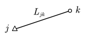
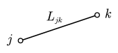
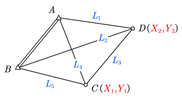

# 10 间接平差的应用

## 测边网间接平差

以边长为观测值、以未知点纵横坐标为参数，可列立方程。

### 单测边误差方程

#### 单未知点

- 参数：坐标 $X_k,Y_k$
- 近似值：坐标 $X_k^0,Y_k^0$，边长 $L_{jk}^0$

有观测方程

$$
\hat L_{jk}=\sqrt{(\hat X_k-X_j)^2+(\hat Y_k-Y_j)^2}
$$

记 $\hat X_k=X_k^0+\hat x_k$，$\hat Y_k=Y_k^0+\hat y_k$，有线性化

$$
\begin{aligned}
\hat L_{jk}
&=L_{jk}^0+\frac{\partial \hat L_{jk}}{\partial\hat X_k}\hat x_k
  +\frac{\partial \hat L_{jk}}{\partial\hat Y_k}\hat y_k \\
&=L_{jk}^0+\frac{X_k^0-X_j}{L_{jk}^0}\hat x_k
  +\frac{Y_k^0-Y_j}{L_{jk}^0}\hat y_k \\
&=L_{jk}^0+\hat x_k\cos\alpha_{jk}^0+\hat y_k\sin\alpha_{jk}^0
\end{aligned}
$$

#### 双未知点

- 参数：坐标 $X_j,Y_j,X_k,Y_k$
- 近似值：坐标 $X_j^0,Y_j^0,X_k^0,Y_k^0$，边长 $L_{jk}^0$

有观测方程

$$
\hat L_{jk}=\sqrt{(\hat X_k-\hat X_j)^2+(\hat Y_k-\hat Y_j)^2}
$$

记 $\hat X_j=X_j^0+\hat x_j$，$\hat Y_j=Y_j^0+\hat y_j$，$\hat X_k=X_k^0+\hat x_k$，$\hat Y_k=Y_k^0+\hat y_k$，有线性化

$$
\begin{aligned}
\hat L_{jk}
&=L_{jk}^0+\frac{\partial \hat L_{jk}}{\partial X_j}\hat x_j
  +\frac{\partial \hat L_{jk}}{\partial\hat Y_j}\hat y_j
  +\frac{\partial \hat L_{jk}}{\partial\hat X_k}\hat x_k
  +\frac{\partial \hat L_{jk}}{\partial\hat Y_k}\hat y_k \\
&=L_{jk}^0+\frac{X_k^0-X_j^0}{L_{jk}^0}(\hat x_k-\hat x_j)
  +\frac{Y_k^0-Y_j^0}{L_{jk}^0}(\hat y_k-\hat y_j) \\
&=L_{jk}^0+(\hat x_k-\hat x_j)\cos\alpha_{jk}^0+(\hat x_k-\hat x_j)\sin\alpha_{jk}^0
\end{aligned}
$$

### 测边网求解

$$
\begin{aligned}
{\color{blue}\hat L_1}
&=\sqrt{(X_A-{\color{red}\hat X_2})^2
+(Y_A-{\color{red}\hat Y_2})^2} \\

{\color{blue}\hat L_2}
&=\sqrt{(X_B-{\color{red}\hat X_2})^2
+(Y_B-{\color{red}\hat Y_2})^2} \\

{\color{blue}\hat L_3}
&=\sqrt{({\color{red}\hat X_1}-{\color{red}\hat X_2})^2
+({\color{red}\hat Y_1}-{\color{red}\hat Y_2})^2} \\

{\color{blue}\hat L_4}
&=\sqrt{(X_A-{\color{red}\hat X_1})^2
+(Y_A-{\color{red}\hat Y_1})^2} \\

{\color{blue}\hat L_5}
&=\sqrt{(X_B-{\color{red}\hat X_1})^2
+(Y_B-{\color{red}\hat Y_1})^2} \\
\end{aligned}
$$

线性化得到 $\hat{\boldsymbol L}=\boldsymbol B\hat{\boldsymbol X}+\boldsymbol d$

$$
\begin{bmatrix}
\hat L_1\\
\hat L_2\\
\hat L_3\\
\hat L_4\\
\hat L_5
\end{bmatrix}
=
\begin{bmatrix}
0 & 0 & \cos\alpha^0_{A2} & \sin\alpha^0_{A2}\\
0 & 0 & \cos\alpha^0_{B2} & \sin\alpha^0_{B2}\\
\cos\alpha^0_{21} & \sin\alpha^0_{21} & -\cos\alpha^0_{21} & -\sin\alpha^0_{21}\\
\cos\alpha^0_{A1} & \sin\alpha^0_{A1} & 0 & 0\\
\cos\alpha^0_{B1} & \sin\alpha^0_{B1} & 0 & 0
\end{bmatrix}
\begin{bmatrix}
\hat x_1\\
\hat y_1\\
\hat x_2\\
\hat y_2
\end{bmatrix}
+
\begin{bmatrix}
L^0_{A2}\\
L^0_{B2}\\
L^0_{21}\\
L^0_{A1}\\
L^0_{B1}
\end{bmatrix}
$$

边长误差方程的特点：

- 两待定点的坐标参数的系数等值反号
- 已知点坐标系数不出现在设计矩阵中
- $j,k$ 均为已知点时，无误差方程
- $j,k$ 边的误差方程，$j\to k$ 或 $k\to j$ 列立，其结果相同

### 精度评定

$$
\hat{\sigma}_0^2
=
\frac{\boldsymbol V^{\rm T}\boldsymbol{PV}}{n-t}
=
\frac{\boldsymbol V^{\rm T}\boldsymbol{PV}}{r}
\qquad
\boldsymbol{Q}_{\hat{x}\hat{x}}=\boldsymbol{N}^{-1}
$$

- 函数式

  $$
  \hat{F}
  =
  \hat{L}_{jk}
  =
  \sqrt{
  (\hat{X}_k-\hat{X}_j)^2
  +
  (\hat{Y}_k-\hat{Y}_j)^2
  }
  $$

- 权函数式

  $$
  \begin{gathered}
  \mathrm d\hat{F}
  =
  -\frac{\Delta X^0_{jk}}{L^0_{jk}}\mathrm d\hat{x}_j
  -\frac{\Delta Y^0_{jk}}{L^0_{jk}}\mathrm d\hat{y}_j
  +\frac{\Delta X^0_{jk}}{L^0_{jk}}\mathrm d\hat{x}_k
  +\frac{\Delta Y^0_{jk}}{L^0_{jk}}\mathrm d\hat{y}_k
  =
  \boldsymbol{f}^{T}\mathrm d\hat{\boldsymbol{x}} \\

  Q_{\hat{F}\hat{F}}
  =
  \boldsymbol{f}^{T}\boldsymbol{Q}_{\hat{x}\hat{x}}\boldsymbol{f} \\

  \hat{\sigma}_{\hat{F}}
  =
  \hat{\sigma}_0\sqrt{Q_{\hat{F}\hat{F}}}
  \end{gathered}
  $$

- 相对精度
  $$
  \frac{\hat{\sigma}_{\hat{F}}}{\hat{F}}
  =
  \frac{\hat{\sigma}_0\sqrt{Q_{\hat{F}\hat{F}}}}{\hat{L}_{jk}}
  $$
