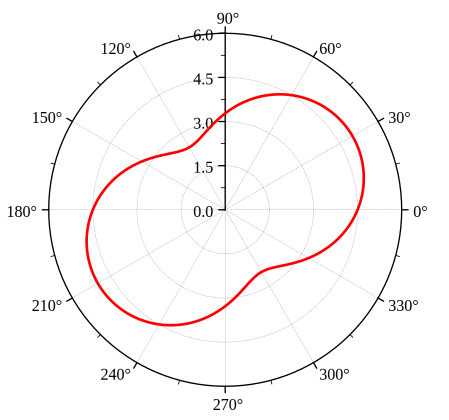
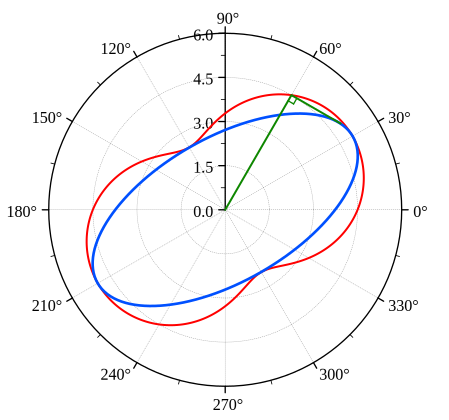

# 12 误差椭圆

## 点位误差

设平面点 $P$ 的真坐标为 $(\tilde x_p,\tilde y_p)$，平差坐标为 $(\hat x_p,\hat y_p)$，则点位真误差为

$$
\Delta x=\tilde x_p-\hat x_p,\quad
\Delta y=\tilde y_p-\hat y_p,\quad
\Delta P=\sqrt{\Delta x^2+\Delta y^2}
$$

点位方差定义为

$$
\sigma_P^2=E(\Delta P^2)=E(\Delta x^2)+E(\Delta y^2)
=\sigma_x^2+\sigma_y^2
$$

若单位权中误差为 $\sigma_0$，点 $P$ 的坐标协因数阵为

$$
\boldsymbol Q_{XX}=
\begin{bmatrix}
Q_{xx} & Q_{xy}\\
Q_{xy} & Q_{yy}
\end{bmatrix}
$$

则

$$
\sigma_P^2=\sigma_0^2(Q_{xx}+Q_{yy}),\quad
\sigma_P=\sigma_0\sqrt{Q_{xx}+Q_{yy}}
$$

点位方差与坐标轴选取无关。任意两个互相垂直方向上的位差平方之和都等于点位方差。

## 任意方向上的位差

设方向 $\varphi$ 从 $x$ 轴正向起算，点位误差在该方向上的投影为

$$
\Delta_\varphi=\Delta x\cos\varphi+\Delta y\sin\varphi
$$

其协因数和方差为

$$
\begin{aligned}
Q_{\varphi\varphi}
&=
\begin{bmatrix}\cos\varphi&\sin\varphi\end{bmatrix}
\begin{bmatrix}
Q_{xx}&Q_{xy}\\
Q_{xy}&Q_{yy}
\end{bmatrix}
\begin{bmatrix}\cos\varphi\\\sin\varphi\end{bmatrix}\\
&=Q_{xx}\cos^2\varphi+Q_{yy}\sin^2\varphi+Q_{xy}\sin2\varphi
\end{aligned}
$$

$$
\sigma_\varphi^2=\sigma_0^2Q_{\varphi\varphi}
$$

垂直方向 $\varphi+90^\circ$ 上有

$$
Q_{\varphi+90^\circ,\varphi+90^\circ}
=Q_{xx}\sin^2\varphi+Q_{yy}\cos^2\varphi-Q_{xy}\sin2\varphi
$$

因此

$$
\sigma_\varphi^2+\sigma_{\varphi+90^\circ}^2
=\sigma_0^2(Q_{xx}+Q_{yy})
=\sigma_P^2
$$

## 位差极值

任意方向位差的极值方向由

$$
\frac{\mathrm d Q_{\varphi\varphi}}{\mathrm d\varphi}=0
$$

得到

$$
\tan2\varphi_0=\frac{2Q_{xy}}{Q_{xx}-Q_{yy}}
$$

这给出两个互相垂直的方向：一个为极大位差方向，一个为极小位差方向。

令

$$
K=\sqrt{(Q_{xx}-Q_{yy})^2+4Q_{xy}^2}
$$

则最大、最小协因数为

$$
Q_E=\frac12(Q_{xx}+Q_{yy}+K),\quad
Q_F=\frac12(Q_{xx}+Q_{yy}-K)
$$

对应位差为

$$
E=\sigma_0\sqrt{Q_E},\quad
F=\sigma_0\sqrt{Q_F}
$$

其中 $E$ 称为误差椭圆长半轴，$F$ 称为误差椭圆短半轴。

极大方向 $\varphi_E$ 可用特征向量公式确定：

$$
\tan\varphi_E=\frac{Q_{xy}}{Q_E-Q_{yy}}
=\frac{Q_E-Q_{xx}}{Q_{xy}}
$$

极小方向为

$$
\varphi_F=\varphi_E+90^\circ
$$

若 $Q_{xy}=0$，则坐标轴方向就是极值方向：

- $Q_{xx}>Q_{yy}$ 时，$x$ 方向为 $E$ 轴，$y$ 方向为 $F$ 轴
- $Q_{xx}<Q_{yy}$ 时，$y$ 方向为 $E$ 轴，$x$ 方向为 $F$ 轴

## 误差曲线与误差椭圆

### 误差曲线

误差曲线是以方向角 $\varphi$ 和该方向位差 $\sigma_\varphi$ 为极坐标的轨迹。

若从 $E$ 轴方向起算角度 $\psi$，则

$$
\sigma_\psi^2=E^2\cos^2\psi+F^2\sin^2\psi
$$

误差曲线形如花生。

误差曲线能直接表示任意方向的位差，但不是标准曲线，作图和使用不方便。

### 误差椭圆

误差椭圆以 $E,F$ 为半轴，在主轴坐标系下方程为

$$
\frac{x_E^2}{E^2}+\frac{y_F^2}{F^2}=1
$$

误差曲线是误差椭圆的垂足曲线：从椭圆中心作某方向射线，再作垂直于该方向的椭圆切线，中心到切线的距离即为该方向的位差。

因此误差椭圆本身不表示点位误差的轨迹，而是用于图解各方向位差的工具。

## 相对误差椭圆

普通点位误差椭圆描述待定点相对于已知基准的点位精度；相对误差椭圆描述两个待定点之间的相对位置精度。

对待定点 $i,j$，令

$$
\Delta x_{ij}=\hat x_j-\hat x_i,\quad
\Delta y_{ij}=\hat y_j-\hat y_i
$$

则坐标差协因数为

$$
\begin{aligned}
Q_{\Delta x\Delta x}
&=Q_{x_ix_i}+Q_{x_jx_j}-2Q_{x_ix_j}\\
Q_{\Delta y\Delta y}
&=Q_{y_iy_i}+Q_{y_jy_j}-2Q_{y_iy_j}\\
Q_{\Delta x\Delta y}
&=Q_{x_iy_i}-Q_{x_jy_i}-Q_{x_iy_j}+Q_{x_jy_j}
\end{aligned}
$$

将

$$
Q_{xx},Q_{yy},Q_{xy}
\quad\text{替换为}\quad
Q_{\Delta x\Delta x},Q_{\Delta y\Delta y},Q_{\Delta x\Delta y}
$$

即可按同样公式计算相对误差椭圆的 $E,F,\varphi_E$。

若点 $i$ 为已知点，其坐标协因数为 $0$，相对误差椭圆退化为点 $j$ 的普通误差椭圆。

## 点位落入误差椭圆内的概率

以 $E,F$ 为标准半轴时，点位误差服从二维正态分布。若取 $\lambda$ 倍误差椭圆

$$
B_\lambda:\quad
\frac{x_E^2}{(\lambda E)^2}+\frac{y_F^2}{(\lambda F)^2}\le 1
$$

则点落入该椭圆内的概率为

$$
P(B_\lambda)=1-\exp\left(-\frac{\lambda^2}{2}\right)
$$

常用值：

| $\lambda$ | $P(B_\lambda)$ |
| :-------: | :------------: |
|    $1$    |    $0.3935$    |
|    $2$    |    $0.8647$    |
|    $3$    |    $0.9889$    |
|    $4$    |    $0.9997$    |

注意一维正态分布中 $\pm1\sigma$ 的概率约为 $68.3\%$，但二维标准误差椭圆内的概率只有约 $39.35\%$。

## 解题流程

已知某点坐标协因数阵和单位权中误差，求误差椭圆：

1. 取出

$$
\boldsymbol Q_{XX}=
\begin{bmatrix}
Q_{xx}&Q_{xy}\\
Q_{xy}&Q_{yy}
\end{bmatrix}
$$

2. 计算

$$
K=\sqrt{(Q_{xx}-Q_{yy})^2+4Q_{xy}^2}
$$

3. 求主轴协因数

$$
Q_E=\frac12(Q_{xx}+Q_{yy}+K),\quad
Q_F=\frac12(Q_{xx}+Q_{yy}-K)
$$

4. 求半轴长度

$$
E=\sigma_0\sqrt{Q_E},\quad
F=\sigma_0\sqrt{Q_F}
$$

5. 求主轴方向

$$
\tan\varphi_E=\frac{Q_{xy}}{Q_E-Q_{yy}}
\quad\text{或}\quad
\tan2\varphi_E=\frac{2Q_{xy}}{Q_{xx}-Q_{yy}}
$$

6. 若要求任意方向位差，先将方向角化为从 $E$ 轴起算的角

$$
\psi=\varphi-\varphi_E
$$

再用

$$
\sigma_\psi=\sqrt{E^2\cos^2\psi+F^2\sin^2\psi}
$$

相对误差椭圆题目则先由两点坐标协因数阵求出坐标差协因数阵。
