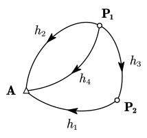

# 5 条件平差

## 建模

条件平差是「对观测值本身进行平差」的模型，核心是先建立观测值真值之间的函数关系。

### 基本计数关系

- 观测值个数：$n$
- 必要观测数：$t$
- 多余观测数：$r=n-t$
- 条件方程个数：$r$

### 条件方程的一般形式

$$
\boldsymbol A\hat{\boldsymbol L}+\boldsymbol A_0=\boldsymbol 0
$$

其中 $\boldsymbol A\in\mathbb R^{r\times n}$，且应满足 $\operatorname{rank}(\boldsymbol A)=r$（即行满秩，条件方程之间相互独立）。

### 列式要求

条件方程应满足：

- 足数：个数等于 $r$
- 独立：线性无关
- 最简：尽量采用最短路线、最小闭合环，避免冗余组合

> [!tip]
>
> 实务上常用“先列附合条件，再列闭合条件”的顺序，通常更容易保证独立与最简。
>
> - 附合条件：例如两个已知控制点之间的路线
> - 闭合条件：例如高程闭合环路
>
> 对于闭合环，优先列最简的小环。

## 求解

### 误差方程推导

由

$$
\hat{\boldsymbol L}=\boldsymbol L+\boldsymbol V
$$

并令闭合差

$$
\boldsymbol W=-\left(\boldsymbol A\boldsymbol L+\boldsymbol A_0\right)
$$

得到误差方程

$$
\boldsymbol A\boldsymbol V-\boldsymbol W=\boldsymbol 0
$$

随机模型记为

$$
\boldsymbol D=\sigma_0^2\boldsymbol Q=\sigma_0^2\boldsymbol P^{-1}
$$

因此，在约束 $\boldsymbol A\boldsymbol V-\boldsymbol W=0$ 下，要使

$$
\boldsymbol V^{\rm T}\boldsymbol P\boldsymbol V=\min
$$

根据 [拉格朗日乘数法](../../高等数学/9-多元函数微分学/9.4-多元函数的极值与最值#条件极值)，要求函数 $f$ 在条件 $\varphi=0$ 条件下的极值，则作拉格朗日函数 $L=f-\lambda\varphi$。这里令 $\lambda=2\boldsymbol k^{\rm T}$，其中 $\boldsymbol k_{n\times1}$ 称为**联系数向量**，加个系数 $2$ 是便于计算。

构造

$$
\boldsymbol \varPhi=\boldsymbol V^{\rm T}\boldsymbol P\boldsymbol V
-2\boldsymbol k^{\rm T}(\boldsymbol A\boldsymbol V-\boldsymbol W)
$$

$\boldsymbol \varPhi$ 对 $\boldsymbol V$ 求一阶导数并令为零可得

$$
\begin{gathered}
\dfrac{\mathrm d\boldsymbol \varPhi}{\mathrm d\boldsymbol V}=2\boldsymbol V^{\rm T}\boldsymbol P-2\boldsymbol k^{\rm T}\boldsymbol A=\boldsymbol 0 \\
\Rightarrow \boldsymbol V^{\rm T}\boldsymbol P=\boldsymbol k^{\rm T}\boldsymbol A \\
\Rightarrow \boldsymbol P^{\rm T}\boldsymbol V=\boldsymbol A^{\rm T}\boldsymbol k \\
\end{gathered}
$$

由于权阵为对称阵，$\boldsymbol P^{\rm T}=\boldsymbol P$，有

$$
\boldsymbol V=\boldsymbol P^{-1}\boldsymbol A^{\rm T}\boldsymbol k=\boldsymbol Q\boldsymbol A^{\rm T}\boldsymbol k
$$

上式称为**改正数方程**。

代回约束，得到

$$
\boldsymbol N\boldsymbol k-\boldsymbol W=\boldsymbol 0,
\quad\text{其中}\,
\boldsymbol N=\boldsymbol A\boldsymbol Q\boldsymbol A^{\rm T}
$$

上式称为**法方程**。

故

$$
\boldsymbol k=\boldsymbol N^{-1}\boldsymbol W,
\quad
\boldsymbol V=\boldsymbol Q\boldsymbol A^{\rm T}\boldsymbol N^{-1}\boldsymbol W
$$

最终平差值

$$
\hat{\boldsymbol L}=\boldsymbol L+\boldsymbol V
$$

> [!important]
>
> **最终公式**
>
> 对于闭合差 $\boldsymbol W=-\left(\boldsymbol A\boldsymbol L+\boldsymbol A_0\right)$：
>
> 令 $\boldsymbol N=\boldsymbol A\boldsymbol Q\boldsymbol A^{\rm T}$，则有改正数向量
>
> $$
> \boldsymbol V=\boldsymbol Q\boldsymbol A^{\rm T}\boldsymbol N^{-1}\boldsymbol W
> $$
>
> 最终平差值
>
> $$
> \hat{\boldsymbol L}=\boldsymbol L+\boldsymbol V
> $$

## 精度评定

### 单位权方差估值

$$
\hat\sigma_0^2=
\frac{\boldsymbol V^{\rm T}\boldsymbol P\boldsymbol V}{n-t}
=\frac{\boldsymbol V^{\rm T}\boldsymbol P\boldsymbol V}{r}
$$

### 改正数与平差值的协因数阵

$$
\begin{gathered}
\boldsymbol Q_{VV}=\boldsymbol Q\boldsymbol A^{\rm T}\boldsymbol N^{-1}\boldsymbol A\boldsymbol Q \\
\boldsymbol Q_{\hat L\hat L}=\boldsymbol Q-\boldsymbol Q_{VV}
=\boldsymbol Q-\boldsymbol Q\boldsymbol A^{\rm T}\boldsymbol N^{-1}\boldsymbol A\boldsymbol Q
\end{gathered}
$$

对应协方差阵为

$$
\boldsymbol D_{\hat L\hat L}=\hat\sigma_0^2\boldsymbol Q_{\hat L\hat L}
$$

::: example

已知 $H_A=12.736\operatorname m$，为求 $P_1$, $P_2$ 点的高程，进行了 4 条路线的水准测量，结果如下图，试用条件平差法求：

1. $P_1$, $P_2$ 点的高程平差值及中误差；
2. 平差后 $P_1$, $P_2$ 点间高差的中误差。

$$
\begin{aligned}
h_1&=4.250\operatorname m &
h_2&=8.537\operatorname m &
h_3&=12.784\operatorname m &
h_4&=8.537\operatorname m \\
s_1&=1\operatorname{km} &
s_2&=2\operatorname{km} &
s_3&=1\operatorname{km} &
s_4&=2\operatorname{km}
\end{aligned}
$$

---

依题意有 $n=4,\,t=2,\,r=2$，列立两个条件方程：

$$
\begin{cases}
\hat h_2-\hat h_4=0\\
\hat h_1+\hat h_2-\hat h_3=0
\end{cases}
$$

$$
\boldsymbol A\hat{\boldsymbol L}+\boldsymbol A_0=\boldsymbol 0,\quad\boldsymbol A=\begin{bmatrix}
0&1&0&-1\\
1&1&-1&0
\end{bmatrix}
$$

故有

$$
\boldsymbol W=-\boldsymbol {AL}=\begin{bmatrix}
0 \\ -0.003
\end{bmatrix}
$$

水准网按距离倒数定权，有 $\boldsymbol Q=\operatorname {diag}(1,2,1,2)$，故有

$$
\begin{gathered}
\boldsymbol N=\boldsymbol A\boldsymbol Q\boldsymbol A^{\rm T}=\begin{bmatrix}
4&2 \\ 2&4
\end{bmatrix} \\
\Rightarrow \boldsymbol N^{-1}=\frac16\begin{bmatrix}
2&-1 \\ -1&2
\end{bmatrix}
\end{gathered}
$$

$$
\boldsymbol V=\boldsymbol Q\boldsymbol A^{\rm T}\boldsymbol N^{-1}\boldsymbol W=\begin{bmatrix}
-0.001 \\ -0.001 \\ 0.001 \\ -0.001
\end{bmatrix}
$$

故有最终平差值

$$
\hat{\boldsymbol L}=\boldsymbol L+\boldsymbol V=\begin{bmatrix}
4.249 \\ 8.536 \\ 12.785 \\ 8.536
\end{bmatrix}
$$

$$
\begin{cases}
\hat h_{P_1}=h_A-\hat h_2=12.736-8.536=4.200 \operatorname m \\
\hat h_{P_2}=h_A+\hat h_1=12.736+4.249=16.985 \operatorname m
\end{cases}
$$

又有

$$
\hat\sigma_0^2=
\frac{\boldsymbol V^{\rm T}\boldsymbol P\boldsymbol V}{r}=1.5\times10^{-6} \operatorname {m^2}
$$

$$
\boldsymbol Q_{\hat L\hat L}=\boldsymbol Q-\boldsymbol Q_{VV}
=\boldsymbol Q-\boldsymbol Q\boldsymbol A^{\rm T}\boldsymbol N^{-1}\boldsymbol A\boldsymbol Q=\frac13\begin{bmatrix}
2&-1&1&-1\\
-1&2&1&2\\
1&1&2&1\\
-1&2&1&2
\end{bmatrix}
$$

$$
\boldsymbol D_{\hat L\hat L}=\sigma_0^2\boldsymbol Q_{\hat L\hat L}=\begin{bmatrix}
2&-1&1&-1\\
-1&2&1&2\\
1&1&2&1\\
-1&2&1&2
\end{bmatrix}\times0.5\times10^{-6}
$$

故有

$$
\begin{gathered}
\sigma_{\hat h_1}^2=2\times0.5\times10^{-6}=10^{-6}\Rightarrow \sigma_{\hat h_1}=10^{-3}\operatorname {m} \\
\sigma_{\hat h_2}^2=2\times0.5\times10^{-6}=10^{-6}\Rightarrow \sigma_{\hat h_2}=10^{-3}\operatorname {m} \\
\sigma_{\hat h_3}^2=2\times0.5\times10^{-6}=10^{-6}\Rightarrow \sigma_{\hat h_3}=10^{-3}\operatorname {m} \\
\end{gathered}
$$

又有 $\hat h_{P_1}=H_A-\hat h_2$，$\hat h_{P_2}=H_A-\hat h_1$，$\Delta \hat h_{P_1P_2}=\hat h_3$，故有

$$
\begin{gathered}
\sigma_{\hat h_{P1}}=\sigma_{\hat h_2}=10^{-3}\operatorname {m} \\
\sigma_{\hat h_{P2}}=\sigma_{\hat h_1}=10^{-3}\operatorname {m} \\
\sigma_{\Delta \hat h_{P_1P_2}}=\sigma_{\hat h_3}=10^{-3}\operatorname {m} \\
\end{gathered}
$$

:::

## 平差结果的相关性

评定 $\hat{\boldsymbol L}$ 和 $\boldsymbol V$ 的相关性

$$
\begin{aligned}
{\boldsymbol V}
&=
\boldsymbol Q\boldsymbol A^{\rm T}\boldsymbol k
=
\boldsymbol Q\boldsymbol A^{\rm T}\boldsymbol N^{-1}\boldsymbol w
\\
&=
-\boldsymbol Q\boldsymbol A^{\rm T}\boldsymbol N^{-1}
(\boldsymbol A\boldsymbol L+\boldsymbol A_0)
\\
&=
-\boldsymbol Q\boldsymbol A^{\rm T}\boldsymbol N^{-1}\boldsymbol A\boldsymbol L
-
\boldsymbol Q\boldsymbol A^{\rm T}\boldsymbol N^{-1}\boldsymbol A_0
\end{aligned}
$$

$$
\begin{aligned}
\hat{\boldsymbol L}
&=\boldsymbol L+\boldsymbol V \\
&=
(\boldsymbol I-\boldsymbol Q\boldsymbol A^{\rm T}\boldsymbol N^{-1}\boldsymbol A)\boldsymbol L
-
\boldsymbol Q\boldsymbol A^{\rm T}\boldsymbol N^{-1}\boldsymbol A_0
\end{aligned}
$$

$$
\begin{aligned}
\boldsymbol Q_{\hat LV}
&=
(\boldsymbol I-\boldsymbol Q\boldsymbol A^{\rm T}\boldsymbol N^{-1}\boldsymbol A)
\boldsymbol Q
(-\boldsymbol Q\boldsymbol A^{\rm T}\boldsymbol N^{-1}\boldsymbol A)^{\rm T}
\\
&=
-(\boldsymbol I-\boldsymbol Q\boldsymbol A^{\rm T}\boldsymbol N^{-1}\boldsymbol A)
\boldsymbol Q\boldsymbol A^{\rm T}\boldsymbol N^{-1}\boldsymbol A\boldsymbol Q
\\
&=
-\boldsymbol Q\boldsymbol A^{\rm T}\boldsymbol N^{-1}\boldsymbol A\boldsymbol Q
+
\boldsymbol Q\boldsymbol A^{\rm T}\boldsymbol N^{-1}
\cancel{\boldsymbol A\boldsymbol Q\boldsymbol A^{\rm T}}
\cancel{\boldsymbol N^{-1}}\boldsymbol A\boldsymbol Q
\\
&=\boldsymbol 0
\end{aligned}
$$

**故 $\hat{\boldsymbol L}$ 和 $\boldsymbol V$ 是==不相关==的。**

$\boldsymbol L=\hat{\boldsymbol L}-\boldsymbol V$，$\hat{\boldsymbol L}$ 和 $\boldsymbol V$ 不相关，因此有

$$
\begin{gathered}
\boldsymbol Q=\boldsymbol Q_{\hat L\hat L}+\boldsymbol Q_{VV} \\
\Rightarrow \boldsymbol Q_{\hat L\hat L}=\boldsymbol Q-\boldsymbol Q_{VV}
\end{gathered}
$$

## 公式总结

- 函数模型：$\boldsymbol A\boldsymbol V-\boldsymbol W=\boldsymbol 0$
- 随机模型：$\boldsymbol D=\sigma_0^2\boldsymbol Q=\sigma_0^2\boldsymbol P^{-1}$

| 平差步骤         | 公式                                                                                                                                                                                                                  |
| ---------------- | --------------------------------------------------------------------------------------------------------------------------------------------------------------------------------------------------------------------- |
| 列条件方程       | $f(\tilde{\boldsymbol L})=\boldsymbol 0$，$\boldsymbol A\tilde{\boldsymbol L}+\boldsymbol A_0=\boldsymbol 0$ $\boldsymbol {Nk}-\boldsymbol W=\boldsymbol 0$，$\boldsymbol W=-(\boldsymbol {AL}+\boldsymbol A_0)$ |
| 组成法方程       | $\boldsymbol {Nk}-\boldsymbol W=\boldsymbol 0$，其中 $\boldsymbol N=\boldsymbol {AQA}^{\rm T}$                                                                                                                        |
| 法方程解         | $\boldsymbol k=\boldsymbol N^{-1}\boldsymbol W$                                                                                                                                                                       |
| 计算改正数       | $\boldsymbol V=\boldsymbol {QA}^{\rm T}\boldsymbol k$                                                                                                                                                                 |
| 观测量平差值     | $\hat{\boldsymbol L}=\boldsymbol L+\boldsymbol V$                                                                                                                                                                     |
| 单位权方差估值   | $\hat\sigma_0^2=\dfrac{\boldsymbol V^{\rm T}\boldsymbol {PV}}{n-t}=\dfrac{\boldsymbol V^{\rm T}\boldsymbol {PV}}r$                                                                                                    |
| 平差值函数的方差 | $\boldsymbol Q_{\hat F\hat F}=\boldsymbol F^{\rm T}\boldsymbol Q_{\hat L\hat L}\boldsymbol F$ $\boldsymbol D_{\hat F\hat F}=\hat\sigma_0^2\boldsymbol Q_{\hat F\hat F}$                                          |
