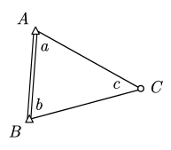
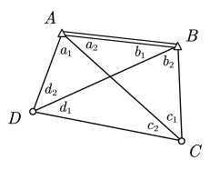
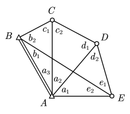
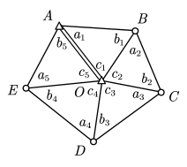
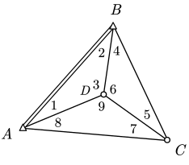
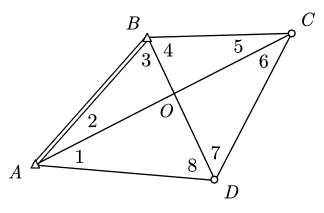
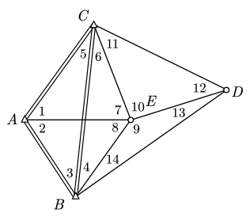
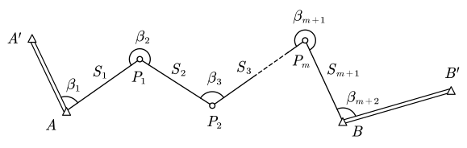
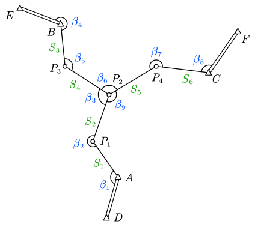

# 6 条件平差的应用

## 测角网条件平差

以角度为观测值。

- 典型图形
  - 单三角形
  - 大地四边形
  - 中点多边形
  - 扇形
  - 上述图形的组合图形
- 必要起算数据 $d=4$
  - 位置基准 2 个（一点的坐标）
  - 方位基准 1 个（一边的方位角）
  - 长度基准 1 个（一边的边长）
  - 或：两点的坐标
- 必要观测数：$t=2p-q-4$
  - $p$：**全部点**个数
  - $q$：多余起算数据个数

> [!warning]
>
> **必要观测数不等于未知边数**
>
> 未知边数可能多于必要观测数。假设我们不测角改测边，确定图形形状并不一定需要所有边的长度，例如下方的大地四边形，只需要定住 AD、AC、BD、BC 三条边即可定住图形，不需要同时知道 CD。亦即，边长不是相互独立的。因此不能通过未知变数判断必要观测数。

### 典型图形的多余观测数

|    类型    |                  例图                  |                       例图的观测数                       |
| :--------: | :------------------------------------: | :------------------------------------------------------: |
|  单三角形  |    | $\begin{aligned}t&=2\times3-4=2\\r&=3-2=1\end{aligned}$  |
| 大地四边形 |  | $\begin{aligned}t&=2\times4-4=4\\r&=8-4=4\end{aligned}$  |
|    扇形    |      | $\begin{aligned}t&=2\times5-4=6\\r&=11-6=5\end{aligned}$ |
| 中点多边形 |     | $\begin{aligned}t&=2\times6-4=8\\r&=15-8=7\end{aligned}$ |

### 典型图形的条件方程列立

- **图形条件**（内角和条件）：三角形内角和为 $108^\circ$
- **圆周条件**：一个周角为 $360^\circ$
- **边长条件**（极条件）：由不同正弦定理推算路线得到的同一边的边长相等

#### 单三角形

$$
n=3,\quad t=2,\quad r=1
$$

有图形条件：$\hat L_a+\hat L_b+\hat L_c=180^\circ$

#### 中点多边形

$$
n=9,\quad t=4,\quad r=5
$$

有图形条件 3 个、圆周条件 1 个、边长条件 1 个。

- 图形条件：

  $$
  \begin{cases}
  \hat L_1+\hat L_2+\hat L_3=180^\circ \\
  \hat L_4+\hat L_6+\hat L_5=180^\circ \\
  \hat L_7+\hat L_8+\hat L_9=180^\circ
  \end{cases}
  $$

- 圆周条件：
  $$
  \hat L_3+\hat L_6+\hat L_9=360^\circ
  $$

下面介绍边长条件。

一种列立方式是，通过不同路径的三角形正弦定理表达两条边之间的关系。

> 通过 $\triangle\text{ABD}$ 和 $\triangle\text{ACD}$ 的正弦定理有
>
> $$
> \hat S_{AB}=\frac{\sin\hat L_3}{\sin\hat L_2}\hat S_{AD}=\frac{\sin\hat L_3\sin\hat L_7}{\sin\hat L_2\sin\hat L_8}\hat S_{CD}
> $$
>
> 通过 $\triangle\text{ABD}$ 和 $\triangle\text{BCD}$ 的正弦定理有
>
> $$
> \hat S_{AB}=\frac{\sin\hat L_3}{\sin\hat L_1}\hat S_{BD}=\frac{\sin\hat L_3\sin\hat L_5}{\sin\hat L_1\sin\hat L_4}\hat S_{CD}
> $$
>
> 联立得到
>
> $$
> \begin{gathered}
> \frac{\cancel{\sin\hat L_3}\sin\hat L_7}{\sin\hat L_2\sin\hat L_8}=
> \frac{\cancel{\sin\hat L_3}\sin\hat L_5}{\sin\hat L_1\sin\hat L_4} \\
> \Rightarrow \frac{\sin\hat L_1\sin\hat L_4\sin\hat L_7}
> {\sin\hat L_2\sin\hat L_5\sin\hat L_8}=1
> \end{gathered}
> $$

另一种列立方式是，选择中心点为「极」，通过正弦定理从一条边出发绕行一圈回到原边。

> 选择点 D 为极，从边 DA 出发，有
>
> $$
> \begin{aligned}
> \triangle\text{DAB}&: &
> \frac{\hat S_{DA}}{\hat S_{DB}}&=\frac{\sin\hat L_2}{\sin\hat L_1} \\
> \triangle\text{DBC}&: &
> \frac{\hat S_{DB}}{\hat S_{DC}}&=\frac{\sin\hat L_5}{\sin\hat L_4} \\
> \triangle\text{DCA}&: &
> \frac{\hat S_{DC}}{\hat S_{DA}}&=\frac{\sin\hat L_8}{\sin\hat L_7} \\
> \end{aligned}
> $$
>
> 将三式相乘，边长全部约去：
>
> $$
> \begin{gathered}
> \frac{\sin\hat L_2}{\sin\hat L_1}\cdot
> \frac{\sin\hat L_5}{\sin\hat L_4}\cdot
> \frac{\sin\hat L_8}{\sin\hat L_7}
> =\frac{\hat S_{DA}}{\hat S_{DB}}\cdot
> \frac{\hat S_{DB}}{\hat S_{DC}}\cdot
> \frac{\hat S_{DC}}{\hat S_{DA}}=1 \\
> \Rightarrow \frac{\sin\hat L_1\sin\hat L_4\sin\hat L_7}
> {\sin\hat L_2\sin\hat L_5\sin\hat L_8}=1
> \end{gathered}
> $$

两种列立方式是等价的。实际上这里还可以通过不同路径列立边与边的关系、或选择不同的极列立，但最终只有一个独立边长方程，几种列立方式可以互相推出。

#### 大地四边形

$$
n=8,\quad t=4,\quad r=4
$$

有图形条件 3 个、边长条件 1 个。

图形条件取三个三角形内角和即可，此处不再列出。下面考虑边长条件。

可以以 O 点为极：

$$
1=\frac{S_{OA}}{S_{OB}}
\frac{S_{OB}}{S_{OC}}
\frac{S_{OC}}{S_{OD}}
\frac{S_{OD}}{S_{OA}}
=\frac{\sin\tilde L_3}{\sin\tilde L_2}
\frac{\sin\tilde L_5}{\sin\tilde L_4}
\frac{\sin\tilde L_7}{\sin\tilde L_6}
\frac{\sin\tilde L_1}{\sin\tilde L_8}
$$

也可以以 D 点为极：

$$
1=\frac{S_{DA}}{S_{DB}}
\frac{S_{DB}}{S_{DC}}
\frac{S_{DC}}{S_{DA}}
=\frac{\sin\tilde L_3}{\sin(\tilde L_1+\tilde L_2)}
\frac{\sin(\tilde L_5+\tilde L_6)}{\sin\tilde L_4}
\frac{\sin\tilde L_1}{\sin\tilde L_6}
$$

### 边长条件的线性化

条件平差列立需要将所有方程化为线性。边长条件含有正弦函数，因此需要进行线性化。

考虑边长条件方程

$$
\frac{\sin\hat L_1\sin\hat L_3\sin\hat L_5}
{\sin\hat L_2\sin\hat L_4\sin\hat L_6}=1
$$

设多元函数 $G$，其自变量为 $\hat L_i$：

$$
G=\frac{\sin\hat L_1\sin\hat L_4\sin\hat L_7}
{\sin\hat L_2\sin\hat L_5\sin\hat L_8}
$$

将其在 $\hat L_i=L_i$ 处展开。设 $\hat L_i=L_i$ 时的函数值为 $G_0$，有

$$
G= G_0+\sum_i\left(\frac{\partial G}{\partial \hat L_i} \right)_{\hat L_i=L_i}\frac{\hat L_i-L_i}{\rho''}=G_0+\sum_i\left(\frac{\partial G}{\partial \hat L_i} \right)_{\hat L_i=L_i}\frac{v_i}{\rho''}
$$

其中 $\rho''$ 是角秒与弧度之间的转换比，$\rho''=\dfrac{180\times60\times60''}{\pi\operatorname {rad}}$。

考虑 $\dfrac{\partial G}{\partial \hat L_i}$。对于分子上的项，例如 $\hat L_1$，有

$$
\begin{aligned}
\frac{\partial G}{\partial \hat L_1}&=
\frac\partial{\partial {\hat L_1}}
\frac{\sin\hat L_1\sin\hat L_3\sin\hat L_5}
{\sin\hat L_2\sin\hat L_4\sin\hat L_6} \\
&=\frac{\sin\hat L_3\sin\hat L_5}
{\sin\hat L_2\sin\hat L_4\sin\hat L_6}\left(\frac\partial {\partial {\hat L_1}}\sin\hat L_1 \right) \\
&=\frac{\sin\hat L_3\sin\hat L_5}
{\sin\hat L_2\sin\hat L_4\sin\hat L_6}\cos\hat L_1 \\
&=\frac{\sin\hat L_1\sin\hat L_3\sin\hat L_5}
{\sin\hat L_2\sin\hat L_4\sin\hat L_6}\frac{\cos\hat L_1}{\sin\hat L_1} \\
&=G\cot\hat L_1\\
\end{aligned}
$$

故有 $\displaystyle\left(\frac{\partial G}{\partial \hat L_1} \right)_{\hat L_1=L_1}=
G_0\cot L_1$。

对于分母上的项，例如 $\hat L_2$，有

$$
\begin{aligned}
\frac{\partial G}{\partial \hat L_2}&=
\frac\partial{\partial {\hat L_2}}
\frac{\sin\hat L_1\sin\hat L_3\sin\hat L_5}
{\sin\hat L_2\sin\hat L_4\sin\hat L_6} \\
&=\frac{\sin\hat L_1\sin\hat L_3\sin\hat L_5}
{\sin\hat L_4\sin\hat L_6}\left(\frac\partial {\partial {\hat L_2}}\frac1{\sin\hat L_2} \right) \\
&=\frac{\sin\hat L_1\sin\hat L_3\sin\hat L_5}
{\sin\hat L_4\sin\hat L_6}\left(-\frac{\cos\hat L_2}{\sin^{2}\hat L_2} \right) \\
&=\frac{\sin\hat L_1\sin\hat L_3\sin\hat L_5}
{\sin\hat L_2\sin\hat L_4\sin\hat L_6}\left(-\frac{\cos\hat L_2}{\sin\hat L_2} \right) \\
&=-G\cot\hat L_2\\
\end{aligned}
$$

故有 $\displaystyle\left(\frac{\partial G}{\partial \hat L_2} \right)_{\hat L_2=L_2}=-
G_0\cot L_2$。因此有

$$
\begin{gathered}
G=G_0+\frac{G_0}{\rho''}\sum_{i,分子}v_i\cot L_i-\frac{G_0}{\rho''}\sum_{j,分母}v_j\cot L_j=1 \\
\sum_{i,分子}v_i\cot L_i-\sum_{j,分母}v_j\cot L_j=\rho''\left(\frac1{G_0}-1 \right)
\end{gathered}
$$

对于本例即有

$$
v_1\cot L_1-v_2\cot L_2+v_3\cot L_3-v_4\cot L_4+v_5\cot L_5-v_6\cot L_6=\rho''\left(\frac1{G_0}-1 \right)
$$

写成矩阵形式为

$$
\boldsymbol f=\begin{bmatrix}
\cot L_1 & -\cot L_2 & \cot L_3 & -\cot L_4 & \cot L_5 & -\cot L_6
\end{bmatrix}^{\rm T}
$$

$$
\begin{gathered}
\boldsymbol f^{\rm T}\boldsymbol {V}=\boldsymbol f^{\rm T}(\hat{\boldsymbol L}-\boldsymbol L)=\rho''\left(\frac1{G_0}-1 \right) \\
\Rightarrow \boldsymbol f^{\rm T}\hat{\boldsymbol L}=\rho''\left(\frac1{G_0}-1 \right)+\boldsymbol f^{\rm T}\boldsymbol {L}
\end{gathered}
$$

### 附合测角网条件方程的列立

附合测角网提供了多余的起算数据，附合条件数 = 多余的起算数据个数

$$
r=n-t=r_1+r_2
$$

其中 $r_1$ 为独立网条件个数，$r_2$ 为附合条件数。

附合条件一般有三种形式：

- **边长条件**（基线条件）：条件方程个数 = 多余已知边数
- **方位角条件**（固定角条件）：条件方程个数 = 多余已知方位角个数
- **纵横坐标条件**：条件方程个数 = 多余已知点组个数 $\times 2$

> [!note]
>
> **已知点组**
>
> 用已知边和已知方位角连接在一起的已知点

::: example

列立下图中测角网的条件方程。

---

依题意 $n=14$，$t=2\times5-2-4=4$，$r=14-4=10$。

有附合条件 $r_2=3$：

$$
\begin{cases}
\hat L_1+\hat L_2=\alpha_{AB}-\alpha_{AC} \\
\hat L_3=360^\circ-\alpha_{BA}+\alpha_{BC} \\
\hat L_5=\alpha_{CA}-\alpha_{CB}
\end{cases}
$$

则有独立网条件 $r_1=r-r_2=10-3=7$。其中有图形条件

$$
\begin{cases}
\hat L_1+\hat L_5+\hat L_6+\hat L_7=180^\circ \\
\hat L_2+\hat L_3+\hat L_4+\hat L_8=180^\circ \\
\hat L_{10}+\hat L_{11}+\hat L_{12}=180^\circ \\
\hat L_9+\hat L_{13}+\hat L_{14}=180^\circ
\end{cases}
$$

有圆周条件

$$
\hat L_7+\hat L_8+\hat L_9+\hat L_{10}=360^\circ
$$

还有两个边长条件。注意到 BCDE 构成一个中点三角形，贡献一个极条件，例如以点 E 为极得到

$$
1=\frac{S_{EC}}{S_{EB}}
\frac{S_{EB}}{S_{ED}}
\frac{S_{ED}}{S_{EC}}
=\frac{\sin\tilde L_4}{\sin\tilde L_6}
\frac{\sin\tilde L_{13}}{\sin\tilde L_{14}}
\frac{\sin\tilde L_{11}}{\sin\tilde L_{12}}
$$

ABEC 构成大地四边形，贡献一个极条件，以 A 点为极得到

$$
1=\frac{S_{AC}}{S_{AE}}
\frac{S_{AE}}{S_{AB}}
\frac{S_{AB}}{S_{AC}}
=\frac{\sin\tilde L_7}{\sin(\tilde L_5+\tilde L_6)}
\frac{\sin(\tilde L_3+\tilde L_4)}{\sin\tilde L_8}
\frac{\sin\tilde L_5}{\sin\tilde L_3}
$$

:::

## 导线网条件平差

- 必要起算数据 $d=3$
  - 位置基准 2 个（一点的坐标）
  - 方位基准 1 个（一边的方位角）
  - 不再需要长度基准
- 必要观测数：$t=2p-q-3=2p'$
  - $p$：**全部点**个数
  - $q$：多余起算数据个数
  - $p'$：**待定点**个数

### 单附合导线

- 待定点数：$m$
- 观测数 $n=2m+3$
  - 测角数 $n_\beta=m+2$
  - 测边数 $n_S=m+1$
- 必要观测数 $t=2m$
- 多余观测数 $r=3$

多余观测数由方位角条件贡献 1 个、纵横坐标条件贡献 2 个。

#### 方位角条件

$$
\alpha_{BB'}=\alpha_{AA'}+\sum_{i=1}^{m+2}\hat\beta_i-(m+2)\times180^\circ
$$

其中

$$
\begin{gathered}
\hat\beta_i=\beta_i-v_i \\
\sum_{i=1}^{m+2}v_i-w_\alpha=0 \\
w_\alpha=\sum_{i=1}^{m+2}\beta_i+\alpha_{AA'}-\alpha_{BB'}-(m+2)\times180^\circ
\end{gathered}
$$

方位角 $\beta_i$ **转折左角取正、转折右角取负**。

#### 纵横坐标条件

$$
X_A+\sum_{i=1}^{m+1}\Delta\hat X_1-X_B=0
$$

其中

$$
\Delta\hat X_i=\hat S_i\cos\hat\alpha_1
$$

$$
\begin{aligned}
\hat\alpha_1
&=\alpha_{AA'}+\hat\beta_1-180^\circ
=\alpha_{AA'}+\beta_1-v_1-180^\circ
=\alpha_1^0-v_1 \\
\hat\alpha_2
&=\hat\alpha_1+\hat\beta_2-180^\circ
=\alpha_1^0-v_1+\beta_2-v_2-180^\circ
=\alpha_2^0-v_1-v_2 \\
&\cdots \\
\Rightarrow \hat\alpha_i
&=\alpha_i^0-v_{\alpha_i}
=\alpha_i^0-\sum_{j=1}^iv_j
\end{aligned}
$$

$$
\begin{aligned}
\Delta\hat X_i&=\hat S_i\cos\hat\alpha_i \\
&=S_i\cos\alpha_i^0-v_{S_i}\cos\alpha_i^0+\frac{S_i\sin\alpha_i^0}{\rho''}\sum_{j=1}^iv_j \\
&=\Delta X_i^0-v_{S_i}\cos\alpha_i^0+\frac{S_i\sin\alpha_i^0}{\rho''}v_{\alpha_i} \\
&=\Delta X_i^0-v_{S_i}\cos\alpha_i^0+\frac{\Delta Y_i}{\rho''}v_{\alpha_i} \\
\end{aligned}
$$

定义

$$
w_x=X_A+\sum_{i=1}^{m+1}\Delta X_i^0 -X_B=X_B^0-X_B
$$

上面两式代入横坐标条件得到

$$
\begin{gathered}
\sum_{i=1}^{m+1}v_{S_i}\cos\alpha_i^0
-\frac1{\rho''}\sum_{i=1}^{m+1}v_i(Y_m^0-Y_i^0)
-w_x=0 \\
w_x=X_A+\sum_{i=1}^{m+1}\Delta X_i^0 -X_B=X_B^0-X_B
\end{gathered}
$$

同理有纵坐标条件

$$
\begin{gathered}
\sum_{i=1}^{m+1}v_{S_i}\sin\alpha_i^0
-\frac1{\rho''}\sum_{i=1}^{m+1}v_i(X_m^0-X_i^0)
-w_y=0 \\
w_y=Y_A+\sum_{i=1}^{m+1}\Delta Y_i^0 -Y_B=Y_B^0-Y_B
\end{gathered}
$$

### 单节点导线网

- $n=n_S+n_\alpha=6+9=15$
- $t=2p''=2\times4=8$
- $r=15-8=7$
  - 方位角条件 2 个
  - 纵横坐标条件 4 个
  - 圆周条件 1 个
