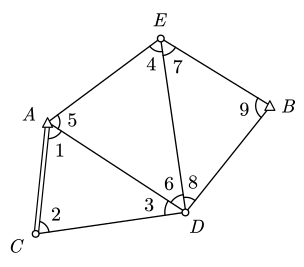
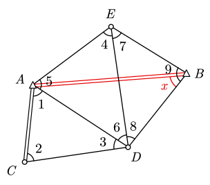

# 7 附有参数的条件平差

## 引入

一些情况下平差的条件方程难以直接列立。

考虑上图网型，已知 A、B 两点坐标以及 AC 边长，观测了角 $L_1,\cdots,L_9$。故有

$$
n=9,\quad t=5,\quad r=4
$$

可以列立 3 个三角形对应的图形条件，但还有一个极条件难以列立。考虑到 A、B 两点坐标已知，不妨连接 A、B 两点并设参数 $x=\angle ABD$：

随着新增参数 $x$，为了求解这个参数需要新增一个条件方程，也就是说此时需要列立两个边长条件。

AB、AC 边长已知，通过正弦定理可以得到

$$
\frac{S_{AB}}{S_{AC}}
=\frac{S_{AB}}{S_{AD}}\frac{S_{AD}}{S_{AC}}
=\frac{\sin(\hat L_6+\hat L_8)}{\sin \hat x}\frac{\sin\hat L_2}{\sin \hat L_3}
$$

以 A 点为极可列立极条件

$$
1=\frac{S_{AB}}{\hat S_{AE}}
\frac{\hat S_{AD}}{\hat S_{AB}}
\frac{\hat S_{AE}}{\hat S_{AD}}=
\frac{\sin(\hat L_4+\hat L_7)\sin\hat x\sin\hat L_6}
{\sin(\hat L_9-\hat x)\sin(\hat L_6+\hat L_8)\sin \hat L_4}
$$

## 数学模型

记参数个数为 $u$，则条件方程个数为 $c=r+u=n-t+u$。

在条件平差 $\boldsymbol A\hat{\boldsymbol L}+\boldsymbol A_0=\boldsymbol 0$ 的基础上加入参数向量得到

$$
\boldsymbol A\hat{\boldsymbol L}+\boldsymbol B\hat{\boldsymbol X}+\boldsymbol A_0=\boldsymbol 0
$$

令

$$
\hat{\boldsymbol L}=\boldsymbol L+\boldsymbol V,
\quad
\hat{\boldsymbol X}=\boldsymbol X_0+\hat{\boldsymbol x},
\quad
\boldsymbol W=-\left(\boldsymbol A\boldsymbol L+\boldsymbol B\boldsymbol X_0+\boldsymbol A_0\right)
$$

得到

$$
\boldsymbol A\boldsymbol V+\boldsymbol B\hat{\boldsymbol x}-\boldsymbol W=\boldsymbol 0
$$

该式称为 **附有参数的条件平差的条件方程**。

## 求解

欲使 $\boldsymbol V^{\rm T}\boldsymbol P\boldsymbol V=\min$，由拉格朗日法构造

$$
\boldsymbol \varPhi=\boldsymbol V^{\rm T}\boldsymbol P\boldsymbol V
-2\boldsymbol k^{\rm T}(\boldsymbol A\boldsymbol V+\boldsymbol B\hat{\boldsymbol x}-\boldsymbol W)
$$

$\boldsymbol \varPhi$ 对 $\boldsymbol V$ 和 $\hat{\boldsymbol x}$ 分别求一阶导数并令为零

$$
\begin{aligned}
\dfrac{\mathrm d\boldsymbol \varPhi}{\mathrm d\boldsymbol V}
&=2\boldsymbol V^{\rm T}\boldsymbol P-2\boldsymbol k^{\rm T}\boldsymbol A
=\boldsymbol 0 \\

\dfrac{\mathrm d\boldsymbol \varPhi}{\mathrm d\hat{\boldsymbol x}}
&=-2\boldsymbol k^{\rm T}\boldsymbol B=\boldsymbol 0
\end{aligned}
$$

得到基础方程

$$
\boldsymbol V=\boldsymbol Q\boldsymbol A^{\rm T}\boldsymbol k,
\quad
\boldsymbol B^{\rm T}\boldsymbol k=\boldsymbol 0
$$

联立得块法方程

$$
\begin{bmatrix}
\boldsymbol N & \boldsymbol B \\
\boldsymbol B^{\rm T} & \boldsymbol 0
\end{bmatrix}
\begin{bmatrix}
\boldsymbol k \\
-\hat{\boldsymbol x}
\end{bmatrix}
=
\begin{bmatrix}
\boldsymbol W \\
\boldsymbol 0
\end{bmatrix},
\quad
\boldsymbol N=\boldsymbol A\boldsymbol Q\boldsymbol A^{\rm T}
$$

设

$$
\boldsymbol N_B=\boldsymbol B^{\rm T}\boldsymbol N^{-1}\boldsymbol B
$$

则

$$
\begin{cases}
\hat{\boldsymbol x}=\boldsymbol N_B^{-1}\boldsymbol B^{\rm T}\boldsymbol N^{-1}\boldsymbol W \\
\boldsymbol V=\boldsymbol {QA}^{\rm T}\boldsymbol k=-\boldsymbol {QA}^{\rm T}\boldsymbol N^{-1}(\boldsymbol B\hat{\boldsymbol x}-\boldsymbol W)
\end{cases}
$$

> [!important]
>
> **最终公式**
>
> 对于闭合差 $\boldsymbol W=-\left(\boldsymbol A\boldsymbol L+\boldsymbol B\boldsymbol X_0+\boldsymbol A_0\right)$：
>
> 令 $\boldsymbol N=\boldsymbol A\boldsymbol Q\boldsymbol A^{\rm T}$，$\boldsymbol N_B=\boldsymbol B^{\rm T}\boldsymbol N^{-1}\boldsymbol B$，则有改正数向量
>
> $$
> \begin{cases}
> \hat{\boldsymbol x}=\boldsymbol N_B^{-1}\boldsymbol B^{\rm T}\boldsymbol N^{-1}\boldsymbol W \\
> \boldsymbol V=\boldsymbol {QA}^{\rm T}\boldsymbol k=-\boldsymbol {QA}^{\rm T}\boldsymbol N^{-1}(\boldsymbol B\hat{\boldsymbol x}-\boldsymbol W)
> \end{cases}
> $$
>
> 最终平差值
>
> $$
> \begin{cases}
> \hat{\boldsymbol L}=\boldsymbol L+\boldsymbol V \\
> \hat{\boldsymbol X}=\boldsymbol X^0+\hat{\boldsymbol x}
> \end{cases}
> $$

## 精度评定

- 单位权方差估值公式不变：$\hat\sigma_0^2=\dfrac{\boldsymbol V^{\rm T}\boldsymbol P\boldsymbol V}{n-t}$，与参数改正数 $\hat{\boldsymbol x}$ 无关
- 改正数协因数阵：$\boldsymbol Q_{VV}=\boldsymbol Q\boldsymbol A^{\rm T}\boldsymbol N^{-1}\boldsymbol A\boldsymbol Q-\boldsymbol Q\boldsymbol A^{\rm T}\boldsymbol N^{-1}\boldsymbol A\boldsymbol N_B^{-1}\boldsymbol B^{\rm T}\boldsymbol N^{-1}\boldsymbol {AQ}$
- 平差结果协因数阵：$\boldsymbol Q_{\hat L\hat L}=\boldsymbol Q-\boldsymbol Q_{VV}$
- 参数改正数协因数阵：$\boldsymbol Q_{\hat x\hat x}=\boldsymbol N_B^{-1}$

## 公式总结

- 函数模型：$\boldsymbol A\boldsymbol V+\boldsymbol B\hat{\boldsymbol x}-\boldsymbol W=\boldsymbol 0$
- 随机模型：$\boldsymbol D=\sigma_0^2\boldsymbol Q=\sigma_0^2\boldsymbol P^{-1}$

| 平差步骤         | 公式                                                                                                                                                                                                                                                                               |
| ---------------- | ---------------------------------------------------------------------------------------------------------------------------------------------------------------------------------------------------------------------------------------------------------------------------------- |
| 列条件方程       | $\boldsymbol A\boldsymbol V+\boldsymbol B\hat{\boldsymbol x}-\boldsymbol W=\boldsymbol 0$                                                                                                                                                                                          |
| 组成法方程       | $\begin{bmatrix}\boldsymbol N & \boldsymbol B \\\boldsymbol B^{\rm T} & \boldsymbol 0\end{bmatrix}\begin{bmatrix}\boldsymbol k \\-\hat{\boldsymbol x}\end{bmatrix}=\begin{bmatrix}\boldsymbol W \\\boldsymbol 0\end{bmatrix}$ 其中 $\boldsymbol N=\boldsymbol {AQBA}^{\rm T}$ |
| 法方程解         | $\begin{bmatrix}\boldsymbol k \\-\hat{\boldsymbol x}\end{bmatrix}=\begin{bmatrix}\boldsymbol N & \boldsymbol B \\\boldsymbol B^{\rm T} & \boldsymbol 0\end{bmatrix}^{-1}\begin{bmatrix}\boldsymbol W \\\boldsymbol 0\end{bmatrix}$                                                 |
| 计算改正数       | $\hat{\boldsymbol x}=\boldsymbol N_B^{-1}\boldsymbol B^{\rm T}\boldsymbol N^{-1}\boldsymbol W$ $\boldsymbol V=\boldsymbol {QA}^{\rm T}\boldsymbol k$ 其中 $\boldsymbol N_B=\boldsymbol B^{\rm T}\boldsymbol N^{-1}\boldsymbol B$                                         |
| 观测量平差值     | $\hat{\boldsymbol X}=\boldsymbol X^0+\hat{\boldsymbol x}$ $\hat{\boldsymbol L}=\boldsymbol L+\boldsymbol V$                                                                                                                                                                    |
| 单位权方差估值   | $\hat\sigma_0^2=\dfrac{\boldsymbol V^{\rm T}\boldsymbol {PV}}{n-t}=\dfrac{\boldsymbol V^{\rm T}\boldsymbol {PV}}r$ $\boldsymbol Q_{\hat x\hat x}=\boldsymbol N_B^{-1}$                                                                                                        |
| 平差值函数的方差 | $\boldsymbol Q_{\hat F\hat F}=\boldsymbol F^{\rm T}\boldsymbol Q_{\hat L\hat L}\boldsymbol F$ $\boldsymbol D_{\hat F\hat F}=\hat\sigma_0^2\boldsymbol Q_{\hat F\hat F}$                                                                                                       |
