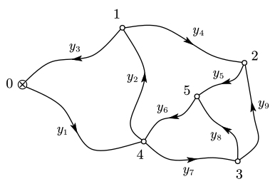

# 8 间接平差

## 引入

考虑下面的水准网。

$$
n=9,\quad t=5,\quad r=4
$$

网型复杂，条件方程较难列立。因此不妨转换思路，直接用各点高程表达测量值。设点 $i$ 的高程值为 $x_i$，则有：

$$
\begin{aligned}
\hat{y}_1 &= \hat{x}_4 - x_0 &
\hat{y}_2 &= \hat{x}_1 - \hat{x}_4 &
\hat{y}_3 &= x_0 - \hat{x}_1 \\
\hat{y}_4 &= \hat{x}_2 - \hat{x}_1 &
\hat{y}_5 &= \hat{x}_5 - \hat{x}_2 &
\hat{y}_6 &= \hat{x}_4 - \hat{x}_5 \\
\hat{y}_7 &= \hat{x}_3 - \hat{x}_4 &
\hat{y}_8 &= \hat{x}_5 - \hat{x}_3 &
\hat{y}_9 &= \hat{x}_2 - \hat{x}_3
\end{aligned}
$$

以矩阵方式表达为 $\hat{\boldsymbol L}=\boldsymbol B\hat{\boldsymbol X}+\boldsymbol d$：

$$
\begin{bmatrix}
\hat y_1\\
\hat y_2\\
\hat y_3\\
\hat y_4\\
\hat y_5\\
\hat y_6\\
\hat y_7\\
\hat y_8\\
\hat y_9
\end{bmatrix}
=
\begin{bmatrix}
0 & 0 & 0 & 1 & 0\\
1 & 0 & 0 & -1 & 0\\
-1 & 0 & 0 & 0 & 0\\
-1 & 1 & 0 & 0 & 0\\
0 & -1 & 0 & 0 & 1\\
0 & 0 & 0 & 1 & -1\\
0 & 0 & 1 & -1 & 0\\
0 & 0 & -1 & 0 & 1\\
0 & 1 & -1 & 0 & 0
\end{bmatrix}
\begin{bmatrix}
\hat x_1\\
\hat x_2\\
\hat x_3\\
\hat x_4\\
\hat x_5
\end{bmatrix}
+
\begin{bmatrix}
-x_0\\
0\\
x_0\\
0\\
0\\
0\\
0\\
0\\
0
\end{bmatrix}
$$

间接平差的核心：将观测估值向量 $\hat{\boldsymbol L}$ 表达为参数估值向量 $\hat{\boldsymbol X}$ 和基准向量 $\boldsymbol d$ 的函数。

## 建模

### 基本计数关系

- 观测值个数：$n$
- 独立参数个数：$t$
- 多余观测数：$r=n-t$

### 线性函数模型

$$
\hat{\boldsymbol L}=\boldsymbol B\hat{\boldsymbol X}+\boldsymbol d
$$

其中：

- $\boldsymbol B\in\mathbb R^{n\times t}$：设计矩阵，参数独立因此列满秩，$\operatorname{rank}(\boldsymbol B)=t$
- $\boldsymbol d\in\mathbb R^{n\times1}$：已知常向量（起算数据等）

令

$$
\hat{\boldsymbol X}=\boldsymbol X_0+\hat{\boldsymbol x},
\quad
\boldsymbol l=\boldsymbol L-\boldsymbol B\boldsymbol X_0-\boldsymbol d
$$

得到误差方程

$$
\boldsymbol V=\boldsymbol B\hat{\boldsymbol x}-\boldsymbol l
$$

随机模型为

$$
\boldsymbol D=\sigma_0^2\boldsymbol Q=\sigma_0^2\boldsymbol P^{-1}
$$

> [!tip]
>
> 非线性模型（如边长、角度方程）先在近似值处一阶线性化，再按上式组建 $\boldsymbol B,\boldsymbol l$，通常需迭代至改正数足够小。

## 求解

目标函数取最小：

$$
\boldsymbol V^{\rm T}\boldsymbol P\boldsymbol V=\min
$$

在约束 $\boldsymbol V=\boldsymbol B\hat{\boldsymbol x}-\boldsymbol l$ 下，设联系数向量 $\boldsymbol k_{n\times 1}$，得拉格朗日条件极值函数：

$$
\boldsymbol \varPhi=\boldsymbol V^{\rm T}\boldsymbol {PV}-2\boldsymbol k^{\rm T}(\boldsymbol B\hat{\boldsymbol x}-\boldsymbol V-\boldsymbol l)=\min
$$

$$
\begin{aligned}
\frac{\mathrm d\boldsymbol \varPhi}{\mathrm d\boldsymbol V}&=2\boldsymbol V^{\rm T}\boldsymbol P-2\boldsymbol k^{\rm T}=\boldsymbol 0
\Rightarrow \boldsymbol k=\boldsymbol {PV} \\
\frac{\mathrm d\boldsymbol \varPhi}{\mathrm d\hat{\boldsymbol x}}&=2\boldsymbol k^{\rm T}\boldsymbol B=\boldsymbol 0
\Rightarrow\boldsymbol B^{\rm T}\boldsymbol k=\boldsymbol 0
\end{aligned}
\Rightarrow \boldsymbol B^{\rm T}\boldsymbol {PV}=\boldsymbol 0
$$

$$
\begin{cases}
\boldsymbol V=\boldsymbol B\hat{\boldsymbol x}-\boldsymbol l
\Rightarrow \boldsymbol B\hat{\boldsymbol x}=\boldsymbol V+\boldsymbol l \\
\boldsymbol B^{\rm T}\boldsymbol {PV}=\boldsymbol 0
\end{cases}
\Rightarrow
\begin{aligned}
\boldsymbol B^{\rm T}\boldsymbol {PB}\hat{\boldsymbol x}
&=\boldsymbol B^{\rm T}\boldsymbol P(\boldsymbol V+\boldsymbol l) \\
&=\cancel{\boldsymbol B^{\rm T}\boldsymbol {PV}}+\boldsymbol B^{\rm T}\boldsymbol {Pl}
\end{aligned}
$$

令 $\boldsymbol N_{bb}=\boldsymbol B^{\rm T}\boldsymbol P\boldsymbol B$，$\boldsymbol U=\boldsymbol B^{\rm T}\boldsymbol P\boldsymbol l$，得法方程

$$
\boldsymbol N_{bb}\hat{\boldsymbol x}-\boldsymbol U=\boldsymbol 0
$$

故

$$
\hat{\boldsymbol x}=\boldsymbol N_{bb}^{-1}\boldsymbol U
=
\left(\boldsymbol B^{\rm T}\boldsymbol P\boldsymbol B\right)^{-1}\boldsymbol B^{\rm T}\boldsymbol P\boldsymbol l
$$

再求

$$
\boldsymbol V=\boldsymbol B\hat{\boldsymbol x}-\boldsymbol l,
\quad
\hat{\boldsymbol X}=\boldsymbol X_0+\hat{\boldsymbol x},
\quad
\hat{\boldsymbol L}=\boldsymbol L+\boldsymbol V
$$

> [!important]
>
> **最终公式**
>
> 令 $\boldsymbol l=\boldsymbol L-\boldsymbol B\boldsymbol X_0-\boldsymbol d$，有
>
> $$
> \hat{\boldsymbol x}=
> \left(\boldsymbol B^{\rm T}\boldsymbol P\boldsymbol B\right)^{-1}
> \boldsymbol B^{\rm T}\boldsymbol P\boldsymbol l
> $$
>
> 则可求得改正结果
>
> $$
> \boldsymbol V=\boldsymbol B\hat{\boldsymbol x}-\boldsymbol l,\quad
> \hat{\boldsymbol X}=\boldsymbol X_0+\hat{\boldsymbol x},\quad
> \hat{\boldsymbol L}=\boldsymbol L+\boldsymbol V
> $$

::: example

在该水准网中，已知

$$
\begin{aligned}
y_1&=+2.362 \operatorname m & s_1&=1.3 \operatorname{km} \\
y_2&=+1.352 \operatorname m & s_2&=2.5 \operatorname{km} \\
y_3&=-3.717 \operatorname m & s_3&=3.1 \operatorname{km} \\
y_4&=+0.582 \operatorname m & s_4&=2.7 \operatorname{km} \\
y_5&=-1.132 \operatorname m & s_5&=0.9 \operatorname{km} \\
y_6&=-0.799 \operatorname m & s_6&=1.1 \operatorname{km} \\
y_7&=+1.874 \operatorname m & s_7&=1.5 \operatorname{km} \\
y_8&=-1.074 \operatorname m & s_8&=0.8 \operatorname{km} \\
y_9&=+0.060 \operatorname m & s_9&=1.2 \operatorname{km} \\
\end{aligned}
$$

求解各观测值平差值与各点高程平差值。

---

依题意有观测值向量

$$
\boldsymbol y=[
  +2.362,
  +1.352,
  -3.717,
  +0.582,
  -1.132,
  -0.799,
  +1.874,
  -1.074,
  +0.060
]^{\rm T}\operatorname m
$$

有权阵

$$
\boldsymbol P=\operatorname {diag}\left(
\frac1{1.3},
\frac1{2.5},
\frac1{3.1},
\frac1{2.7},
\frac1{0.9},
\frac1{1.1},
\frac1{1.5},
\frac1{0.8},
\frac1{1.2}
\right)
$$

有设计矩阵

$$
\boldsymbol B=\begin{bmatrix}
0 & 0 & 0 & 1 & 0\\
1 & 0 & 0 & -1 & 0\\
-1 & 0 & 0 & 0 & 0\\
-1 & 1 & 0 & 0 & 0\\
0 & -1 & 0 & 0 & 1\\
0 & 0 & 0 & 1 & -1\\
0 & 0 & 1 & -1 & 0\\
0 & 0 & -1 & 0 & 1\\
0 & 1 & -1 & 0 & 0
\end{bmatrix}
$$

故有

$$
\boldsymbol U=\boldsymbol B^{\rm T}\boldsymbol {Pl}
=[-1.2,-9.2,+1.3,+1.2,+7.9]^{\rm T}\operatorname {mm}
$$

$$
\boldsymbol N_{bb}=\boldsymbol B^{\rm T}\boldsymbol {PB}=
\begin{bmatrix}
+1.0930 & -0.3704 & +0.0000 & -0.4000 & +0.0000\\
-0.3704 & +2.3148 & -0.8333 & +0.0000 & -1.1111\\
+0.0000 & -0.8333 & +2.7500 & -0.6667 & -1.2500\\
-0.4000 & +0.0000 & -0.6667 & +2.7450 & -0.9091\\
+0.0000 & -1.1111 & -1.2500 & -0.9091 & +3.2702
\end{bmatrix}
$$

解得

$$
\hat{\boldsymbol x}=\boldsymbol N_{bb}^{-1}\boldsymbol U
=[-1.9,-3.3,+0.4,+0.8,+1.7]^{\rm T} \operatorname {mm}
$$

故有参数估值（各点高程平差值）：

$$
\hat{\boldsymbol X}=\boldsymbol X^0+\hat{\boldsymbol x}
=[5.083,5.664,5.604,3.731,4.531]^{\rm T}\operatorname m
$$

得到观测值误差估值

$$
\begin{aligned}
\boldsymbol V&=\boldsymbol B\hat{\boldsymbol x}-\boldsymbol l \\
&=[−0.8,−0.3,−1.9,+1.4,+1.0,+0.9,+0.4,−0.3,+0.7]^{\rm T} \operatorname{mm}
\end{aligned}
$$

有观测值估值：

$$
\begin{aligned}
\hat{\boldsymbol L}&=\boldsymbol L+\boldsymbol V \\
&=[+2.3612,+1.3517,-3.7189,+0.5834,-1.131,-0.7981,+1.8744,-1.0743,+0.0607]
\operatorname m
\end{aligned}
$$

:::

::: example

$$
\begin{array}{c|cccc}
x/\operatorname {cm} & 1 & 2 & 3 & 4 \\
\hline
y/\operatorname {cm} & 1.90 & 2.70 & 3.35 & 4.32 \\
\end{array}
$$

为确定某一抛物线方程 $y^2=ax$，观测了如上的 4 组数据，且 $x_i$ 无误差，$y_i$ 为相互独立的等精度观测值，试用间接平差求：

1. 该抛物线方程；
2. 待定系数 $\hat a$ 的中误差。

---

依题意，有 $n=4,t=1,r=n-t=3$。

令 $\varGamma=\sqrt a$，则

$$
\hat y_i=\hat\varGamma\sqrt{x_i}
$$

有

$$
\hat{\boldsymbol L}=\boldsymbol B\hat\varGamma
$$

其中

$$
\boldsymbol L=
\begin{bmatrix}
1.90 \\
2.70 \\
3.35 \\
4.32
\end{bmatrix},
\quad
\boldsymbol B=
\begin{bmatrix}
1 \\
\sqrt2 \\
\sqrt3 \\
2
\end{bmatrix}
$$

取近似值

$$
\varGamma_0=\frac14\sum\frac{y_i}{\sqrt{x_i}}=1.97583
$$

设

$$
\hat\varGamma=\varGamma_0+\hat\lambda
$$

因观测值等精度，故

$$
\boldsymbol P=\boldsymbol I
$$

误差方程为

$$
\boldsymbol V=\boldsymbol B\hat\lambda-\boldsymbol l
$$

其中

$$
\boldsymbol l=\boldsymbol L-\boldsymbol B\varGamma_0=
\begin{bmatrix}
-0.07583 \\
-0.09455 \\
-0.07224 \\
+0.36834
\end{bmatrix}
$$

法方程为

$$
\boldsymbol N_{bb}\hat\lambda-\boldsymbol U=0
$$

其中

$$
\begin{gathered}
\boldsymbol N_{bb}=\boldsymbol B^{\rm T}\boldsymbol P\boldsymbol B
=\boldsymbol B^{\rm T}\boldsymbol B=10 \\
\boldsymbol U=\boldsymbol B^{\rm T}\boldsymbol P\boldsymbol l
=\boldsymbol B^{\rm T}\boldsymbol l=0.40245
\end{gathered}
$$

故

$$
\hat\lambda=\boldsymbol N_{bb}^{-1}\boldsymbol U
=\frac1{10}\times0.40245=0.04025
$$

于是

$$
\begin{gathered}
\hat a=\hat\varGamma^2=4.06458 \\
\hat\varGamma=\varGamma_0+\hat\lambda=2.01608
\end{gathered}
$$

又有

$$
\boldsymbol Q_{\hat\lambda\hat\lambda}=\boldsymbol N_{bb}^{-1}=\frac1{10}
$$

改正数为

$$
\boldsymbol V=\boldsymbol B\hat\lambda-\boldsymbol l=
\begin{bmatrix}
+0.11608 \\
+0.15117 \\
+0.14195 \\
-0.28784
\end{bmatrix}
$$

单位权方差估值为

$$
\hat\sigma_0^2
=\frac{\boldsymbol V^{\rm T}\boldsymbol P\boldsymbol V}{r}
=\frac{\boldsymbol V^{\rm T}\boldsymbol V}{3}
=0.04644
$$

由误差传播定律，

$$
\boldsymbol Q_{\hat a\hat a}
=(2\hat\varGamma)^2\boldsymbol Q_{\hat\lambda\hat\lambda}
=1.62583
$$

故

$$
D_{\hat a\hat a}
=\hat\sigma_0^2\boldsymbol Q_{\hat a\hat a}
=0.07550
=\sigma_{\hat a}^2
$$

因此

$$
\sigma_{\hat a}=\sqrt{\sigma_{\hat a}^2}=0.27478
$$

综上，有

$$
\hat a=4.065,\quad \sigma_{\hat a}=0.275
$$

抛物线方程近似为 $y^2=4.065x$。

:::

## 精度评定

### 参数估值协因数阵

$$
\begin{gathered}
\boldsymbol Q_{\hat x\hat x}=
\left(\boldsymbol B^{\rm T}\boldsymbol P\boldsymbol B\right)^{-1} \\
\boldsymbol D_{\hat x\hat x}=\sigma_0^2\boldsymbol Q_{\hat x\hat x}
\end{gathered}
$$

### 平差观测值协因数阵

由

$$
\hat{\boldsymbol L}
=
\boldsymbol B\hat{\boldsymbol X}+\boldsymbol d
=
\boldsymbol B\left(\boldsymbol X_0+\hat{\boldsymbol x}\right)+\boldsymbol d
$$

可得

$$
\boldsymbol Q_{\hat L\hat L}
=
\boldsymbol B\boldsymbol Q_{\hat x\hat x}\boldsymbol B^{\rm T}
=
\boldsymbol B\left(\boldsymbol B^{\rm T}\boldsymbol P\boldsymbol B\right)^{-1}\boldsymbol B^{\rm T}
$$

$$
\boldsymbol D_{\hat L\hat L}=\sigma_0^2\boldsymbol Q_{\hat L\hat L}
$$

### 残差协因数阵

$$
\boldsymbol Q_{VV}
=
\boldsymbol Q-\boldsymbol Q_{\hat L\hat L}
=
\boldsymbol Q-\boldsymbol B\left(\boldsymbol B^{\rm T}\boldsymbol P\boldsymbol B\right)^{-1}\boldsymbol B^{\rm T}
$$

类似条件平差，有

$$
\boldsymbol Q_{\hat L V}=\boldsymbol 0
$$

即**平差值与改正数不相关**，$\boldsymbol Q=\boldsymbol Q_{\hat L\hat L}+\boldsymbol Q_{VV}$。

### 单位权方差估值

$$
\hat\sigma_0^2=\frac{\boldsymbol V^{\rm T}\boldsymbol P\boldsymbol V}{n-t}
=\frac{\boldsymbol V^{\rm T}\boldsymbol P\boldsymbol V}{r}
$$

### 参数函数精度

若

$$
\hat{\boldsymbol F}=\boldsymbol M\hat{\boldsymbol X}+\boldsymbol M_0
$$

则

$$
\boldsymbol Q_{\hat F\hat F}=\boldsymbol M\boldsymbol Q_{\hat x\hat x}\boldsymbol M^{\rm T},
\quad
\boldsymbol D_{\hat F\hat F}=\hat\sigma_0^2\boldsymbol Q_{\hat F\hat F}
$$

## 公式总结

| 平差步骤        | 公式                                                                                                                                                                                                                                                             |
| --------------- | ---------------------------------------------------------------------------------------------------------------------------------------------------------------------------------------------------------------------------------------------------------------- |
| 列参数方程      | $\boldsymbol V=\boldsymbol B\hat{\boldsymbol x}-\boldsymbol l$，$\boldsymbol l=\boldsymbol L-\boldsymbol B\boldsymbol X_0-\boldsymbol d$                                                                                                                         |
| 组成法方程      | $\boldsymbol N_{bb}\hat{\boldsymbol x}-\boldsymbol U=\boldsymbol 0$，$\boldsymbol N_{bb}=\boldsymbol B^{\rm T}\boldsymbol P\boldsymbol B$，$\boldsymbol U=\boldsymbol B^{\rm T}\boldsymbol P\boldsymbol l$                                                       |
| 法方程解        | $\hat{\boldsymbol x}=\left(\boldsymbol B^{\rm T}\boldsymbol P\boldsymbol B\right)^{-1}\boldsymbol B^{\rm T}\boldsymbol P\boldsymbol l$                                                                                                                           |
| 计算改正数      | $\boldsymbol V=\boldsymbol B\hat{\boldsymbol x}-\boldsymbol l$                                                                                                                                                                                                   |
| 参数/观测平差值 | $\hat{\boldsymbol X}=\boldsymbol X_0+\hat{\boldsymbol x}$，$\hat{\boldsymbol L}=\boldsymbol L+\boldsymbol V$                                                                                                                                                     |
| 单位权方差估值  | $\hat\sigma_0^2=\dfrac{\boldsymbol V^{\rm T}\boldsymbol P\boldsymbol V}{n-t}$                                                                                                                                                                                    |
| 协因数阵        | $\boldsymbol Q_{\hat x\hat x}=\left(\boldsymbol B^{\rm T}\boldsymbol P\boldsymbol B\right)^{-1}$，$\boldsymbol Q_{\hat L\hat L}=\boldsymbol B\boldsymbol Q_{\hat x\hat x}\boldsymbol B^{\rm T}$，$\boldsymbol Q_{VV}=\boldsymbol Q-\boldsymbol Q_{\hat L\hat L}$ |
