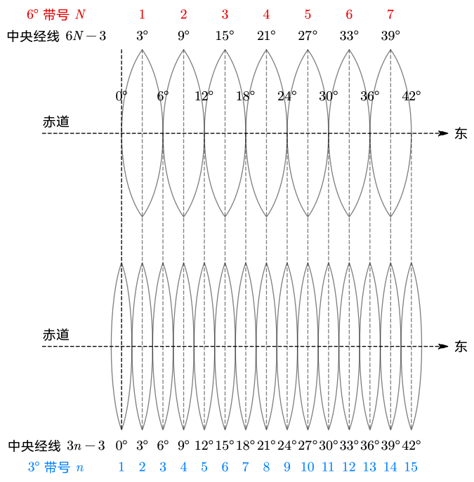
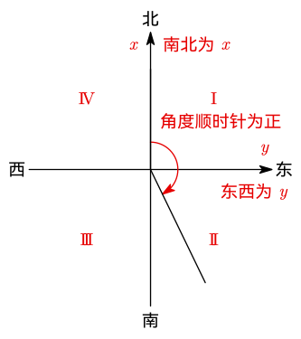

# 1 坐标系统与测量

## 地球形状的表达

- 水准面：处于静止状态的水面，与铅垂线处处垂直
- 平均海水面：根据验潮站长期测量得到的平均海水高度所在的水准面
- **大地水准面**：假想的，平均海水面向陆地延伸并且包围整个地球
  - 地球内部质量不均匀，大地水准面有起伏，封闭，不规则，无法用数学公式精确表达
  - 认为是地球真实轮廓，包围的形体成为大地体
  - **是外业测量的基准**
- **地球椭球体**：使用旋转椭球面拟合大地水准面得到的数学模型，与其垂直的称为**法线**
  - 可以用数学公式表达和计算
  - 不同国家采用自己的参考椭球体，尽量贴合全球地形或自己国家地形
  - 一般取半径 $R=\dfrac13(2a+b)\approx 6371\operatorname {km}$
  - **是内业计算的基准**

|            | 大地水准面     | 地球椭球体     |
| ---------- | -------------- | -------------- |
| 来源       | 平均海水面延伸 | 大地水准面拟合 |
| 数学表达式 | 无             | 有             |
| 垂直线     | 铅垂线         | 法线           |
| 基准       | 外业测量       | 内业计算       |

## 坐标系统

### 空间三维直角坐标系

以地球质心为原点建立的空间直角坐标系，$x,y,z$ 没有实际对应含义，尤其 $z$ 不是高程。一般用于卫星定位。了解即可。

### 球面基准大地坐标系

- 经度 $L$ 为所在子午面与 首子午面 的夹角
- 纬度 $B$ 为**椭球面法线**与赤道平面夹角（不是与地心连线）

### 高斯平面直角坐标系

高斯投影是一种将地球曲面投影到平面的手段。

#### 先按经线等分投影带

- $6\degree$ 带：全球分为 $\dfrac{360\degree}{6\degree}=60$ 带，$0\degree\mathrm E\to6\degree\mathrm E$ 为 $1$ 号带
- $3\degree$ 带：全球分为 $\dfrac{360\degree}{3\degree}=120$ 带，$1.5\degree\mathrm W\to1.5\degree\mathrm E$ 为 $1$ 号带

$3\degree$ 带的中央经线均为 $6\degree$ 带的分割经线或中央经线。

各带对应经度建议画图现推。记住图形以及 $6\degree$ 带从 $0\degree$ 出发、$3\degree$ 带第一带中心为 $0\degree$ 即可。

带宽越窄，投影产生的长度变形就越小，精度就越高。

#### 带内建立平面坐标系

- 将中央子午线西移 $500\operatorname {km}$ 作为 $x$ 轴
- 沿着赤道建立 $y$ 轴

**注意南北为 $x$，东西为 $y$。**

取得坐标后，**在横坐标前冠带号**。例如第 20 带内的点 $A(323\:512\operatorname m,527\:680\operatorname m)$，则最终横坐标为 ${\color{orange}20}\:527\:680\operatorname m$。

> [!tip]
>
> **$500\operatorname{km}$ 的来源**
>
> 为了让 $y$ 坐标恒为正且保持三位数。
>
> 地球赤道长约 $40000\operatorname {km}$，则一个 $6\degree$ 带内东西长 $\dfrac{40000\operatorname {km}}{60}\approx 666\operatorname {km}$，则最大可能的负数 $y$ 坐标约为 $-333\operatorname {km}$。
>
> - 假设加 $400\operatorname {km}$，则最小 $y$ 坐标为 $67\operatorname {km}$，为两位数
> - 加 $500\operatorname {km}$，则最小 $y$ 坐标为 $167\operatorname {km}$，保持三位数
>
> 在前冠带号时，稳定的位数不会导致混淆。

### 地区平面直角坐标系

- **南北为 $x$，东西为 $y$**
- **角度顺时针为正**
- **象限位置不同，但与 $x,y$ 坐标正负性的关系仍与一般一致**
  - 第一象限：$+x,+y$
  - 第二象限：$-x,+y$
  - 第三象限：$-x,-y$
  - 第四象限：$+x,-y$

> 上海地方坐标系以国际饭店楼顶旗杆中心作为原点。

### 高程系统

定义高差

$$
h_{AB}=H_B-H_A
$$

下标始终遵循「后减前」。

> 全国高程基准来自青岛验潮站。
>
> 上海市地方采用吴淞高程零点。

### 小结

|          | 空间坐标系              | 大地坐标系                             | 平面高程系                                               |
| -------- | ----------------------- | -------------------------------------- | -------------------------------------------------------- |
| 定位方式 | 空间直角坐标系          | 大地坐标 + 大地高                      | 平面直角坐标 + 高程                                      |
| 应用范围 | 全球                    | 全球                                   | 仅局部                                                   |
| 坐标变量 | $x,y,z$ 无实际含义 | 经度 $L$ 纬度 $B$ 大地高 $H$ | 平面南北轴坐标 $X$ 平面东西轴坐标 $Y$ 高程 $H$ |

## 地面点位置确定与坐标变换

### 三北与方位角

方位角：从基准方向出发，顺时针转到目标方向走过的角度，取值范围为 $[0\degree,360\degree)$。

| 基准方向     | 真北         | 坐标北                | 磁北            |
| ------------ | ------------ | --------------------- | --------------- |
| 来源         | 北极方向     | 坐标系 $x$ 轴方向     | 地磁场方向      |
| 与真北夹角   | $0\degree$   | 子午线收敛角 $\theta$ | 磁偏角 $\delta$ |
| 产出的方位角 | 真方位角 $A$ | 坐标方位角 $\alpha$   | 磁方位角 $A_磁$ |
| 地位         | 基准         | 最常用                |                 |

子午线收敛角、磁偏角均是从真北出发，顺时针为正，逆时针为负。

磁方位角除 $A_磁$ 外也用 $A_\mathrm m$。

### 坐标变换

二维坐标变换需要 $3+1$ 个参数：

- 平移量 $x_0,y_0$
- 旋转量 $\alpha$
- (比例系数 $s$)

二维坐标变换公式：

$$
\begin{pmatrix}
x_P \\ y_P
\end{pmatrix} = s
\begin{pmatrix}
\cos\alpha & -\sin\alpha \\
\sin\alpha & \cos\alpha
\end{pmatrix}
\begin{pmatrix}
x_P' \\ y_P'
\end{pmatrix}
+ \begin{pmatrix}
x_0 \\ y_0
\end{pmatrix}
$$

三维坐标变换需要 $6+1$ 个参数：

- 平移量 $x_0,y_0,z_0$
- 绕三轴旋转量 $\alpha,\beta,\gamma$
- (比例系数 $s$)

三维坐标变换公式与二维形式类似。

> [!note]
>
> 旋转变换矩阵
>
> $$
> \begin{align}
> 逆时针 &&
> \begin{pmatrix}
> \cos & \sin \\
> -\sin & \cos
> \end{pmatrix} \\
> 顺时针 &&
> \begin{pmatrix}
> \cos & -\sin \\
> \sin & \cos
> \end{pmatrix} \\
> \end{align}
> $$
>
> 将其拓展为三维：
>
> $$
> \begin{align}
> 绕 &z& \boldsymbol R_Z&=
> \begin{pmatrix}
> \cos & \sin & 0 \\
> -\sin & \cos & 0 \\
> 0 & 0 & 1
> \end{pmatrix} \\
> 绕 &y& \boldsymbol R_Y&=
> \begin{pmatrix}
> \cos & 0 & \sin \\
> 0 & 1 & 0 \\
> -\sin & 0 & \cos
> \end{pmatrix} \\
> 绕 &x& \boldsymbol R_X&=
> \begin{pmatrix}
> 1 & 0 & 0 \\
> 0 & \cos & \sin \\
> 0 & -\sin & \cos
> \end{pmatrix} \\
> \end{align}
> $$
>
> 其余部分一样，绕哪个轴转，那个轴的行和列定位常数，交点为 $1$ 其余为 $0$。
>
> 旋转方向基于右手螺旋定则判定，大拇指指向旋转轴正方向，四指方向为旋转方向。

## 基本观测量

基本观测量包括**距离、角度、高==差==**。

> [!warning]
>
> 是高**差**而不是高程。高程无法直接测量。

### 距离

- 倾斜距离（斜距，SD 或 $S$）：两点连成的线段的长度
- 水平距离（平距，HS 或 $D$）：两点在水平面投影之间的距离

### 角度

- 水平角是空间两相交直线在水平面的投影线之间的夹角，范围 $[0\degree,360\degree)$
- 垂直角
  - 高度角：目标与水平方向的夹角，范围 $[-90\degree,+90\degree]$
  - 天顶距：目标与竖直向上方向的夹角，范围 $[0,180\degree]$

### 高差

- 绝对高程：地面点到大地水准面的铅垂距离（又称为海拔）
- 相对高程：地面点到任意水准面的铅垂距离
- 高差：两点间高程之差，只要在同一个高程面起算就行，哪个面无所谓

## 水准面曲率对观测量的影响

将水准面当作平面处理的范围要求：

- 对水平距离：**半径 $10\operatorname {km}$ 或面积 $300\operatorname {km^2}$ 内**
- 对水平角度：**面积 $10\operatorname {km^2}$ 内**
- 对垂直距离：**不可忽略**
  - 低精度水准测量站距要求：$60\sim80\operatorname {m}$
  - 高精度水准测量站距要求：$30\sim50\operatorname {m}$
