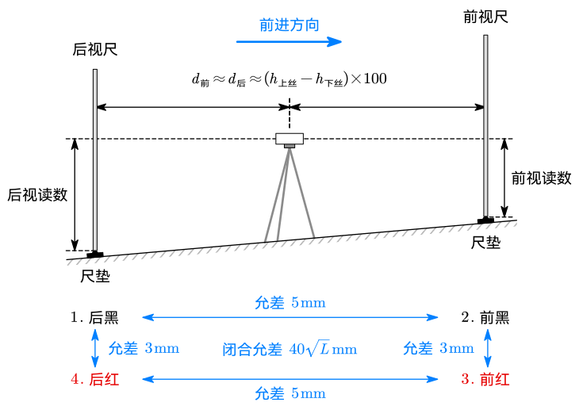

# 3 水准测量理论

## 安置

- 水准路线分为闭合水准路线、附合水准路线和支水准路线
  - 闭合水准路线：从一个水准点出发测一圈回到该点
  - 附合水准路线：从一个已知水准点点出发测到另一个已知水准点
  - 支水准路线：从一个水准点出发，沿一个路线往返测量

- **在前进方向上的水准尺称为前视尺，在前进反方向的称为后视尺。**
- 转点需要安放尺垫并踩实。
- 安置水准仪时，水准仪与前视尺和后视尺的距离应基本一致，即水准仪大致在前后尺正中，以抵消水准面曲率带来的影响。
  - 水准仪估算距离的方法：上下丝读数差 $\times 100$。
  - 低精度水准测量站距要求：$60\sim80\operatorname {m}$
  - 高精度水准测量站距要求：$30\sim50\operatorname {m}$

## 读数

- 两次仪器高法
- 双面尺法
  - 红黑双面尺的两面读数之差成为**尺常数**，一般为 $4.687\operatorname m$ 或 $4.787\operatorname m$
  - 双面尺法测量顺序为「后、前、前、后」，「黑、黑、红、红」，即后视黑面、前视黑面、前视红面、后视红面

## 允差

- 一把尺子红黑面读数差，去掉尺常数之后允差 $\pm3\operatorname {mm}$
- 两把尺子分别算红面高差和黑面高差，允差 $\pm 5\operatorname {mm}$
- 对于长度为 $L\operatorname {km}$ 的水准路线，高差闭合允差为 $\pm40\sqrt L\operatorname {mm}$

## 内业

高差闭合差在允差内但不为零时需进行闭合差分配。闭合差按站距分配，最终相加应使闭合差恰好为 $0$，四舍五入导致的误差需要人工修正。
