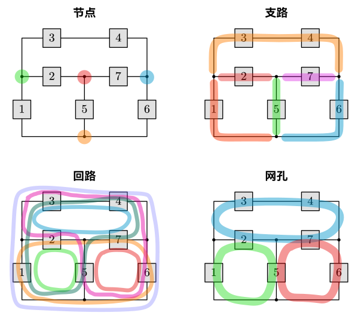
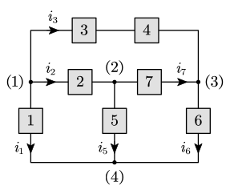
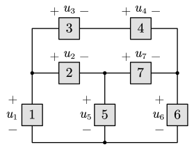
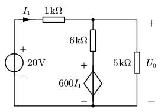

# 基尔霍夫定律

> [!warning]
>
> 基尔霍夫定律是接下来研究各类电路的基础。必须熟练。

## 概念

- 支路（branch）：流过同一电流的一段电路；
- 节点（node）：支路与支路的连接点；
- 回路（loop）：经过支路构成的闭合路径，在一个回路中每条支路仅允许经过一次；
- 网孔：平面电路中不与其他支路相交的回路。

## 基尔霍夫定律

### 基尔霍夫电流定律（KCL）

#### 文字表达

**在集中参数电路中，任一时刻对任一节点，流出该节点的支路电流代数和等于 0**。（即流入电流 $=$ 流出电流）

#### 公式表达

$$
\sum i(t)=0
$$

#### 图形表达

列式时规定：**流出为正，流入为负**。

::: example

列出下图各节点的 KCL 方程。

---

$$
\begin{align}
&(1)& i_1+i_2+i_3=0 \\
&(2)& -i_2+i_5+i_7=0 \\
&(3)& -i_3+i_6-i_7=0 \\
&(4)& -i_1-i_5-i_6=0 \\
\end{align}
$$

:::

方程数量的结论：**若电路有 $n$ 个节点，可以列出 $n-1$ 个独立的 KCL 方程**。

例如上例中 $(4)=-(1)-(2)-(3)$，4 个节点实际上只有 3 个独立方程。

::: details 为什么有且只有 $n-1$ 个独立方程？

方程组的未知数是 $n$ 条支路的电流。对于每个支路，有且只有一个起点和一个终点。起点处是流出电流取正号，终点处是流入电流取负号。因此，将所有方程相加，所有的未知数必然消去，最终结果为 $0=0$，即方程组不是满秩的，$r<n$。

任意去掉一个方程。由于少了一个方程，少掉的这个方程内的所有电流值都「落单」了，即其余方程内包含且仅包含一个这些电流值。则包含这些落单电流值的节点方程不可能由其他方程导出，即这 $n-1$ 个方程是独立的。

需要注意，这只是一个简化过的理解方式。如需严谨证明，可参考 [这篇知乎回答](https://www.zhihu.com/question/378249460/answer/1790772753)。

:::

#### 广义 KCL：节点与闭合面

可以将一个联通的闭合面整体看作一个节点，例如上图中就可以直接列出：

$$
-1-2+I_x=0\Rightarrow I_x=3\operatorname{(A)}
$$

## 基尔霍夫电压定律

#### 文字表述

在集中参数电路中，任一时刻沿任一回路，各支路电压（降）代数和为 0。

#### 公式表达

$$
\sum u(t)=0
$$

#### 图形表达

列式时规定：**沿着回路的方向，电压下降为正，上升为负**。

::: example

列出下图各网孔的 KVL 方程。

---

我们取顺时针方向为参考方向，对于图中的三个网孔，有

$$
\begin{align}
u_3+u_4-u_7-u_2&=0\\
u_2+u_5-u_1&=0\\
u_7+u_6-u_5&=0
\end{align}
$$

:::

方程数量的结论：**若电路有 $b$ 条支路、$n$ 个节点，则可以列出 $l=b-n+1$ 个独立的 KVL 方程，且独立方程格式等于网孔个数**。

此结论的证明需要图论的知识。此处不提。

::: example

求如图电路中控制量 $I_1$ 及电压 $U_0$。

---

设 $R_1=1\operatorname {k\ohm}$，$R_2=6\operatorname {k\ohm}$，流经 $R_2$ 的电流为 $I_2$，方向向下，$R_3=5\operatorname {k\ohm}$，流经的电流为 $I_3$，$U_S=20\operatorname V$，列 KVL、KCL 方程如下：

$$
\begin{cases}
U_S-I_1R_1-I_2R_2-600I_1=0\\
U_S-I_1R_1-I_3R_3=0\\
I_1=I_2+I_3
\end{cases}
$$

解得 $\begin{cases}I_1=5\operatorname {mA}\\I_2=2\operatorname {mA}\\I_3=3\operatorname {mA} \end{cases}$

故有 $U_0=I_3R_3=15\operatorname V$。

:::
