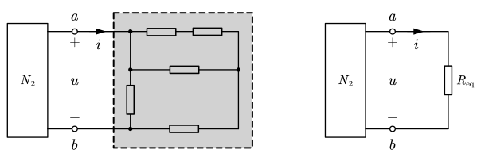
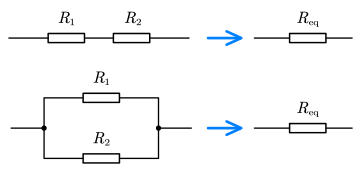
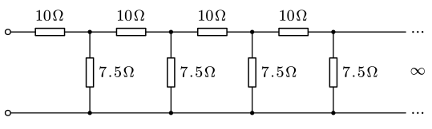
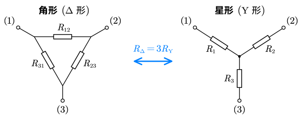
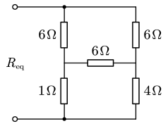
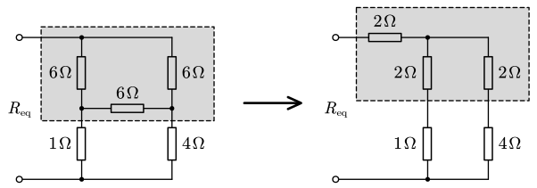

# 等效变换

## 等效的概念

等效：两个电路的端囗**外特性（VCR）相同**，即**两个电路对任何外电路的作用相同**。

补充概念：二端网络一一只有两个端子和外部电路相连的网络。

## 电阻网络的等效

### 串并联等效

- 串联等效：$R_1+R_2=R_\mathrm {eq}$
- 串联等效：$G_1+G_2=G_\mathrm {eq}$（即 $\dfrac1{R_1}+\dfrac1{R_2}=\dfrac1{R_\mathrm {eq}}$）

::: example

求图示电路两端点间的等效电阻。

---

假设两个端点间的等效电阻为 $R_x$。由于这一段结构是无限循环，可以取出一截，剩下的等效电阻依然为 $R_x$：

由此可以列出式子：

$$
R_x=10+\frac1{\frac1{7.5}+\frac1{R_x}}
$$

解得 $R_x=-5\,\ohm$（舍去）或 $R_x=15\,\ohm$

:::

### 星角网络等效变换

对称情况下，$R_{12}=R_{23}=R_{31}=R_\Delta$，则角形网络可以等效成星形网络， 且 $R_1=R_2=R_3=R_\mathrm Y=\dfrac13R_\Delta$。也可以反过来。

**牢记角形阻值是星形三倍，不要记反！**

> [!note]
>
> 考试一般只考对称的星角变换（即三个电阻阻值相同）。这里给出三个电阻阻值不同的公式。
>
> 星变角：
> $$
> \begin{align}
> R_{12}&={R_1R_2+R_2R_3+R_3R_1\over R_3} \\
> R_{23}&={R_1R_2+R_2R_3+R_3R_1\over R_1} \\
> R_{31}&={R_1R_2+R_2R_3+R_3R_1\over R_2} \\
> \end{align}
> $$
> 角变星：
> $$
> \begin{align}
> R_1&={R_{12}R_{31}\over R_{12}+R_{23}+R_{31}} \\
> R_2&={R_{12}R_{23}\over R_{12}+R_{23}+R_{31}} \\
> R_3&={R_{23}R_{31}\over R_{12}+R_{23}+R_{31}} \\
> \end{align}
> $$

::: example

求图中等效电阻 $R_\mathrm {eq}$。

---

注意到图中三个 $6\,\ohm$ 的电阻构成角形结构，将其转换为星形结构：

故有

$$
R_\mathrm {eq}=2+\frac1{\frac1{2+1}+\frac1{2+4}}=4\,\ohm
$$

:::

## 含源支路的等效变换
