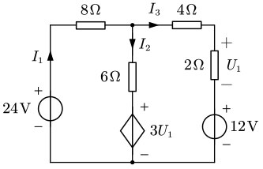
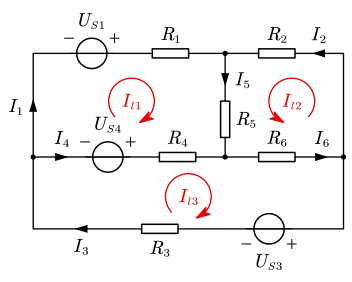
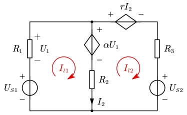
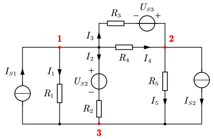
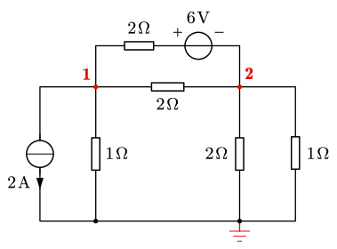

# 2.2 线性直流电路的求解

## 支路电流法

- 回顾 KCL 可知：若电路中有 $n$ 个节点，则可以列出 $n-1$ 个独立的 KCL 方程
- 回顾 KVL 可知：若电路中有 $b$ 条支路、$n$ 个节点，则可以列出 $b-(n-1)$ 个独立的 KVL 方程（等于网孔个数）

支路电流法：以 $b$ 个支路电流为待求量，按 KCL、KVL 列出 $b$ 个独立方程。

> [!tip]
>
> 对于含有受控源的电路，先当独立源处理，再将控制量用支路电流表示。

::: example

列支路电流方程，求 $I_1,I_2,I_3$。

---

图中三条支路、两个节点，故可以列出 $2-1=1$ 个 KCL 方程和 $3-1=2$ 个 KVL 方程。

$$
\begin{align}
&{\rm KCL:}&-I_1+I_2+I_3&=0\\
&{\rm KVL:}&8I_1+6I_2+3U_1-24&=0\\
&& 4I_3+2I_3+12-3U_1-6I_2&=0
\end{align}
$$

将控制量用支路电流表示：

$$
U_1=2I_3
$$

联立上面所有方程，解得

$$
I_1=\frac{12}7\operatorname A,\quad I_2=2\operatorname A,\quad I_3=-\frac27\operatorname A
$$

:::

## 回路电流法

支路电流法存在缺点：待求量太多。在复杂的电路图中，若支路太多，则方程会很繁杂。因此我们引入**回路电流法**。

由于电流具有连续性，可在每个独立回路中假设一个闭合流通的电流，称为回路电流。

解题步骤：

- 列写回路电流方程：因以 $l=b-(n-1)$ 个独立的回路电流作为待求量，列写 $l$ 个回路的 KVL 方程。
- 对于节点的 KCL 方程，回路电流**自动满足**。

例如下面这张图中，三个网孔的电流设为 $I_{l1},I_{l2},I_{l3}$：

则有

$$
\begin{align}
I_1&=I_{l1} & I_4&=I_{l3}-I_{l1}\\
I_2&=I_{l2} & I_5&=I_{l1}+I_{l2}\\
I_3&=I_{l3} & I_6&=I_{l2}+I_{l3}\\
\end{align}
$$

待求量由 6 个变成 3 个。现在列写其回路电流方程：

$$
\begin{align}
l_1&: \textcolor{red}{(R_1+R_4+R_5)}I_{l1} \textcolor{green}{+R_5} I_{l2} \textcolor{cyan}{-R_4} I_{l3} = U_{S1}+U_{S4} \\
l_2&:\textcolor{green}{+R_5}I_{l1}+\textcolor{red}{(R_2+R_5+R_6)}I_{l2}\textcolor{yellow}{+R_6}I_{l3}=0 \\
l_3&:\textcolor{cyan}{-R_4}I_{l1}\textcolor{yellow}{+R_6}I_{l2}+\textcolor{red}{(R_3+R_4+R_6)}I_{l3}=-U_{S3}-U_{S4} \\
\end{align}
$$

- $\textcolor{red}\blacksquare$ 红色标出的为**自阻**：表示本回路中全部电阻之和，**恒为正**；
- $\textcolor{green}\blacksquare\textcolor{cyan}\blacksquare\textcolor{yellow}\blacksquare$ 其余颜色标出的为**互阻**：表示两个回路共有的电阻之和，**正负号需要判断**；
- 等式右侧为沿着回路电压源**电压升的代数和**。

即：自阻压降 $+$ 互阻压降 $=$ 电压升。

::: example

列写下方电路图的回路电流方程：

---

$$
\begin{align}
(R_1+R_2)I_{l1}-R_2I_{l2}&=U_{S1}-\alpha U_1 \\
(R_2+R_3)I_{l2}-R_RI_{l1}&=\alpha U_1-rI_2-U_{S2}
\end{align}
$$

受控源方程：

$$
\begin{align}
U_1&=-R_1I_{l1}\\
I_2&=I_{l1}-I_{l2}
\end{align}
$$

:::

## 节点电压法

- 节点电压：系统中任选一点为参考点，令**参考点电位为 0**，其他节点到参考点的电压称节点电压。
- 节点电压法：以 $n-1$ 个节点电压为待求量（自动满足 KVL），**列写 $n-1$ 个独立的 KCL 方程**。

例如，考虑下面这张图：

将 3 作为参考节点，列写 1 和 2 两点的节点电压：

$$
\begin{align}
n1&:\textcolor{red}{\underbrace{\left(\frac1{R_1}+\frac1{R_2}+\frac1{R_3}+\frac1{R_4} \right)}_{G_{11}}}U_{n1}\textcolor{green}{\underbrace{-\left(\frac1{R_3}+\frac1{R_4}\right)}_{G_{12}}}U_{n2}=\textcolor{blue}{I_{S1}}+\textcolor{yellow}{\frac{U_{S2}}{R_2}-\frac{U_{S3}}{R_3}} \\\\

n2&:\textcolor{green}{\underbrace{-\left(\frac1{R_3}+\frac1{R_4} \right)}_{G_{21}}}U_{n1}+\textcolor{red}{\underbrace{\left(\frac1{R_3}+\frac1{R_4}+\frac1{R_5} \right)}_{G_{22}}}U_{n2}=\textcolor{blue}{-I_{S2}}+\textcolor{yellow}{\frac{U_{S3}}{R_3}}
\end{align}
$$

- $\textcolor{red}\blacksquare$ 红色为**自导**：与本节点相连的各支路电导之和，**恒为正**；
- $\textcolor{green}\blacksquare$ 绿色为**互导**：节点之间的各支路（==包括含源支路==）电导之和，**恒为负**；
- $\textcolor{blue}\blacksquare$ 蓝色为**流入节点的电流源代数和**；
- $\textcolor{yellow}\blacksquare$ 黄色为**流入节点的电压源支路等效的电流代数和**。

> [!note]
>
> **节点电压法的本质**
>
> 节点电压法的本质依然是节点电流法。观察量纲，等号左侧的 $G\cdot U$ 都是电流。
>
> 将等号左侧的式子重新整理，有
>
> $$
> G_{kk}U_{k}-\sum_{i\ne k}G_{ik}U_i=\sum G_{ik}(U_i-U_k)=\sum I_{ik}
> $$
>
> 即，等号左侧的式子实质上就是该节点与其他节点之间支路的电流，以流出为正。整个等式就是 流出电流 = 流入电流。

::: example

求解图中节点 1 与 2 相对于参考点的电位。

---

$$
\begin{align}
\left(1+\frac12+\frac12 \right)U_{n1}-\left(\frac12+\frac12 \right)U_{n2}&=-2+\frac62 \\
\left(1+\frac12+\frac12 +\frac12\right)U_{n2}-\left(\frac12+\frac12 \right)U_{n1}&=-\frac62
\end{align}
$$

解得 $U_{n1}=-\dfrac18,\;U_{n2}=-\dfrac54$。

:::
