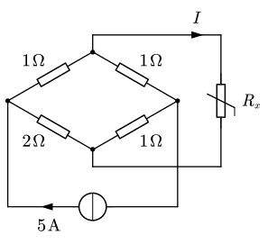
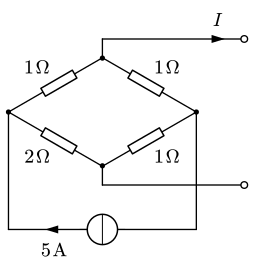

# 3.2 电路定理 2

## 等效电源定理 <T red>重要</T>

**等效电源定理**：能够将任何**线性含源一端囗**电路化简为**戴维南电路或诺顿电路**。包含戴维南定理与诺顿定理。

- **戴维南定理**
  - 线性含源一端口电路，可用**戴维南电路**等效代替；
  - 戴维南电路中的**电压源** $U_S$ 等于**开路电压** $U_{OC}$；
  - 戴维南电路中的 $R_i$ 等于该含源一端口电路内部**各独立源置零后所得无源一端口的输入电阻** $R_{in}$。
- **诺顿定理**
  - 线性含源一端口电路，可用**诺顿电路**等效代替；
  - 戴维南电路中的**电流源** $I_S$ 等于线性含源一端口的**短路电流** $I_{SC}$；
  - 戴维南电路中的 $G_i$ 等于该含源一端口电路内部**各独立源置零后所得无源一端口的输入电导** $G_{in}$。

==那么这里的核心就是：等效电阻 $R_{in}$ 的计算==

1. 先将内部独立源置零（电压源短路、电流源开路）
2. 分是否含有受控源
   - 不含受控源：将剩下的电阻等效变换即可
   - 含有受控源
     - 外加电源 $R_{in}=\dfrac{U_S}I$ 或 $R_{in}=\dfrac U{I_S}$
     - 先求 $U_{OC}$、$I_{SC}$，$R_{in}=\dfrac{U_{OC}}{I_{SC}}$

::: example

计算电桥中 $R_x$ 分别等于 $0\,\ohm$、$0.8\,\ohm$、$1.6\,\ohm$ 时，该支路的电流和功率。

---

注意到电路中有变动的负载只是 $R_x$，因此可以将其视为一端口网络，将其化为戴维南电路。

:::

