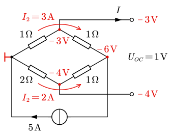
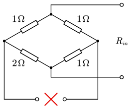
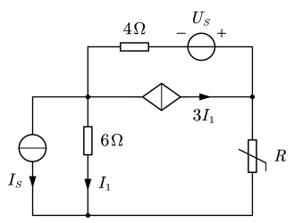
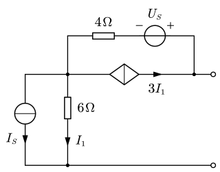
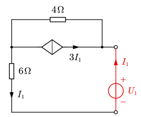

# 3.2 等效电源定理

**等效电源定理**：能够将任何**线性含源一端囗**电路化简为**戴维南电路或诺顿电路**。包含戴维南定理与诺顿定理。

- **戴维南定理**
  - 线性含源一端口电路，可用**戴维南电路**等效代替；
  - 戴维南电路中的**电压源** $U_S$ 等于**开路电压** $U_{OC}$；
  - 戴维南电路中的 $R_i$ 等于该含源一端口电路内部**各独立源置零后所得无源一端口的输入电阻** $R_{in}$。
- **诺顿定理**
  - 线性含源一端口电路，可用**诺顿电路**等效代替；
  - 戴维南电路中的**电流源** $I_S$ 等于线性含源一端口的**短路电流** $I_{SC}$；
  - 戴维南电路中的 $G_i$ 等于该含源一端口电路内部**各独立源置零后所得无源一端口的输入电导** $G_{in}$。

==那么这里的核心就是：等效电阻 $R_{in}$ 的计算==

1. 先将内部独立源置零（电压源短路、电流源开路）
2. 分是否含有受控源
   - 不含受控源：将剩下的电阻等效变换即可
   - 含有受控源
     - 外加电源 $R_{in}=\dfrac{U_S}I$ 或 $R_{in}=\dfrac U{I_S}$
     - 先求 $U_{OC}$、$I_{SC}$，$R_{in}=\dfrac{U_{OC}}{I_{SC}}$

::: example

计算电桥中 $R_x$ 分别等于 $0\,\ohm$、$0.8\,\ohm$、$1.6\,\ohm$ 时，该支路的电流和功率。

---

注意到电路中有变动的负载只是 $R_x$，因此可以将其视为一端口网络，将其化为戴维南电路。

先求开路电压。$5\operatorname A$ 按电导比 $3:2$ 分给两支路，取左侧为参考点，到两端子处电势分别降落 $3\operatorname V$ 和 $4\operatorname V$，得到 $U_{OC}=1\operatorname V$。

接下来求等效内阻。将独立源置零，电流源开路，求端口电阻

容易看出是 $2\,\ohm$ 和 $3\,\ohm$ 并联，有 $R_i=\dfrac{3\times2}{3+2}=1.2\,\ohm$。

因此求得等效戴维南电路：

有

$$
I={U_{OC}\over R_i+R_x}=\frac1{1.2+R_x},\quad P=I^2R_x
$$

分别代入得

$$
\begin{array}{l}
R_x=0\,\ohm&I=\dfrac65\operatorname A&P=0\operatorname W \\
R_x=0.8\,\ohm&I=0.5\operatorname A&P=0.2\operatorname W \\
R_x=1.6\,\ohm&I=\dfrac5{14}\operatorname A&P=\dfrac{10}{49}\operatorname W \\
\end{array}
$$

:::

::: example

如图所示电路，已知 $R=8\,\ohm$ 时，$I=1\operatorname A$。求 $R$ 为何值时 $I=0.5\operatorname A$？

---

考虑将 $R$ 以外的部分视为一端口电路：

求等效电阻。将内部独立源置零（电流源开路、电压源短路），并在端口处添加一个电源。只需求出 $U_1$ 和 $I_1$ 的比例关系即可求出等效电阻。

列回路电流方程。取外面的大回路列方程（互阻取的回路是上半部分的小回路）：

$$
(6+4)I_1+4\times3I_1=U_1 \Rightarrow 22I_1=U_1
$$

得到 $R_i=22\,\ohm$。有等效电路：

利用题目条件 $R=8\,\ohm$ 时 $I=1\operatorname A$，故有 $U_{OC}=(22+8)\times1=30\operatorname V$。

故有 $I'=\dfrac{30}{22+R'}=0.5$，解得 $R'=38\,\ohm$。

:::
