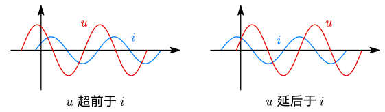

# 7.1 正弦电流

## 正弦电流

- 定义：按正弦规律变化的电流，一般表示为正弦或余弦函数。
- 正弦电流的三要素：**振幅（幅值）、角频率、初相位**。（可能会考概念）

$$
i=I_m\cos(\omega t+\varphi_i)
$$

### 振幅和有效值

若在一个周期内，电流产生的焦耳热等效于直流电流 $I$
$$
\int_0^Ti^2(t)R\mathrm dr\doteq I^2RT
$$
则成 $I$ 为该交流电流的有效值。当 $i(t)=I_m\cos(\omega t+\varphi_i)$ 时，有 ==$I_m=\sqrt2I$==。

### 角频率与频率

- 角频率 $\omega$：单位 $\mathrm{rad/s}$，即角速度
- 频率 $f$：单位 $\operatorname {Hz}$

关系：$\omega=\dfrac{2\pi}T=2\pi f$

### 初相位与相位

$$
i=I_m\cos(\textcolor{red}{\omega t+\varphi_i})
$$

- 相位 $\varphi=\omega t+\varphi_i$
- 初相位 $\varphi_i$：$t=0$ 时的相位

## 正弦量的相量表示

> [!warning]
>
> 是**相**量，不是**向**量。

### 重温复数

利用复数表示正弦量。电路理论中通常使用 $\mathrm j$ 表示复数单位。

- 直角坐标式：$A=a+\mathrm jb$
- 极坐标式：$A=|A|e^{\mathrm j\theta}$ 或 $A=|A|\angle\theta$

故有其中几个量的关系式：
$$
\begin{align}
a&=|A|\cos\theta \\
b&=|A|\sin\theta \\
|A|&=\sqrt{a^2+b^2} \\
\theta &=\arctan\frac ba
\end{align}
$$

### 用复数表示正弦量

- 振幅作为复数的模
- 初相位作为复数的幅角

$$
i=I_m\cos(\omega t+\varphi)\longleftrightarrow I_me^{\mathrm j\varphi}
$$

- 振幅（最大值）相量：$\dot I_m=I_me^{\mathrm j\varphi}=I_m\angle\varphi$
- 有效值相量：$\dot I=I\angle\varphi=\dfrac1{\sqrt2}\dot I_m$

可是相量是复数，且没有角频率等信息。如何将其与正弦量对应起来？答案是乘以 $e^{\mathrm j\omega t}$：
$$
I_me^{\mathrm j\varphi}\cdot e^{\mathrm j\omega t}=I_me^{\mathrm j(\omega t+\varphi)}=I_m\cos(\omega t+\varphi)+\mathrm jI_m\sin(\omega t+\varphi)
$$
则实部就是对应的正弦量。

::: example
$$
\begin{gathered}
i=4\sqrt2\cos(\omega t+45^\circ)\operatorname A\longrightarrow \dot I=4e^{\mathrm j45^\circ}=4\angle 45^\circ\operatorname A \\\\
u=220\sqrt2\cos(\omega t-30^\circ)\operatorname V
\longrightarrow \dot U=220e^{-\mathrm j30^\circ}\operatorname V=220\angle{-30^\circ}\operatorname V
\end{gathered}
$$
:::

此外，向量作为复数，可在复平面上用有向线段来表示，即**相量图**。
