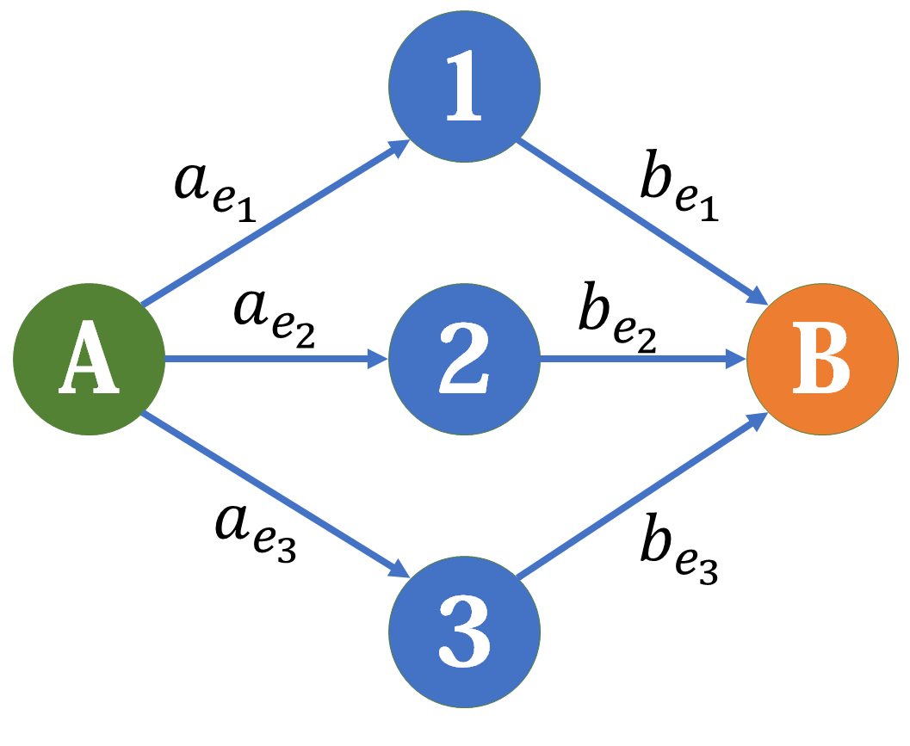
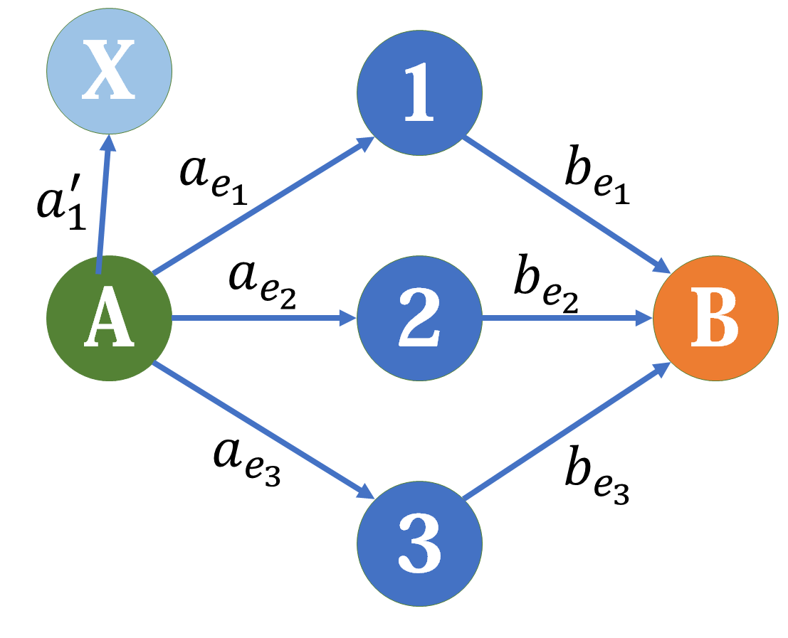
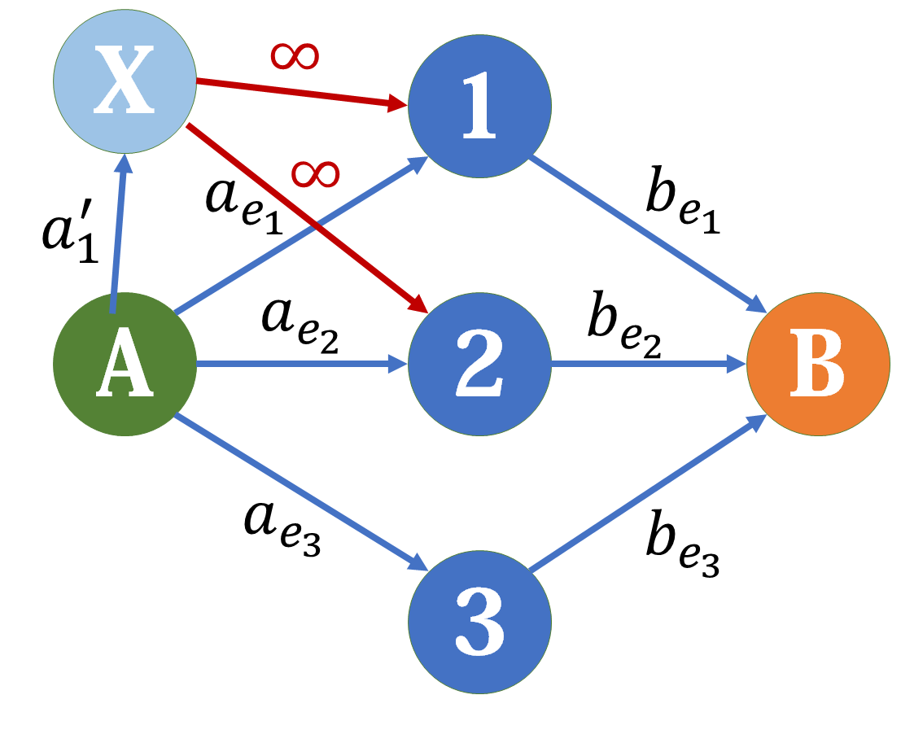
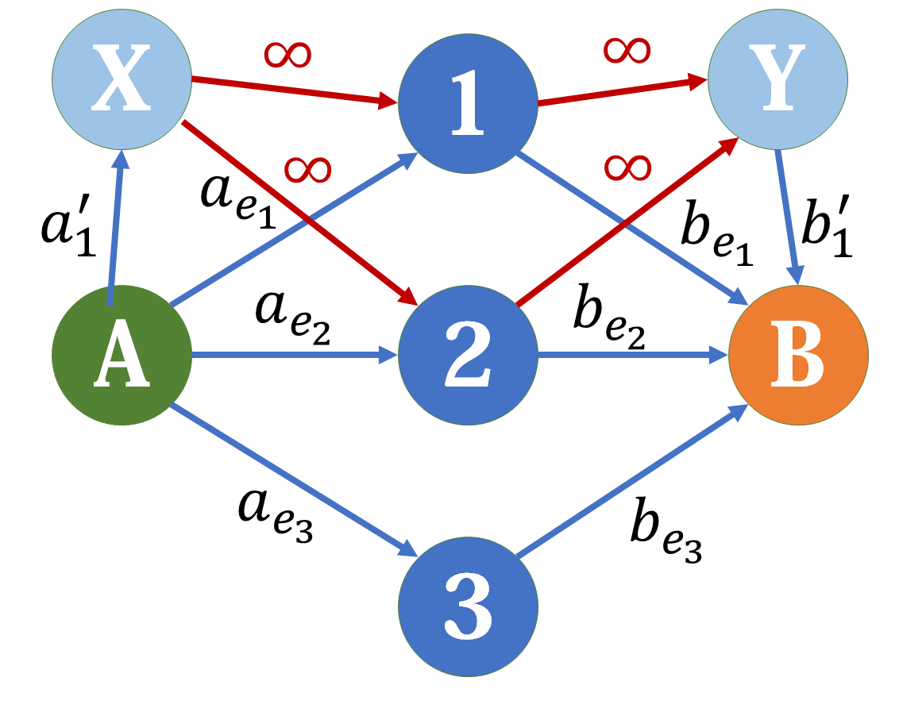
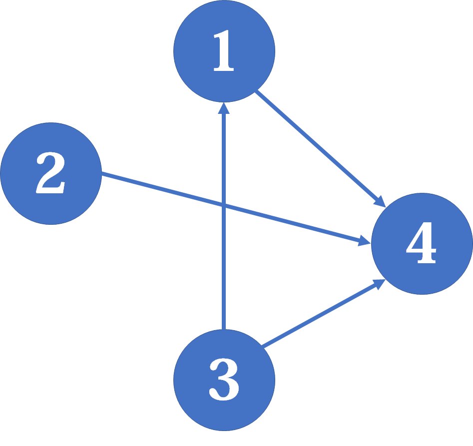
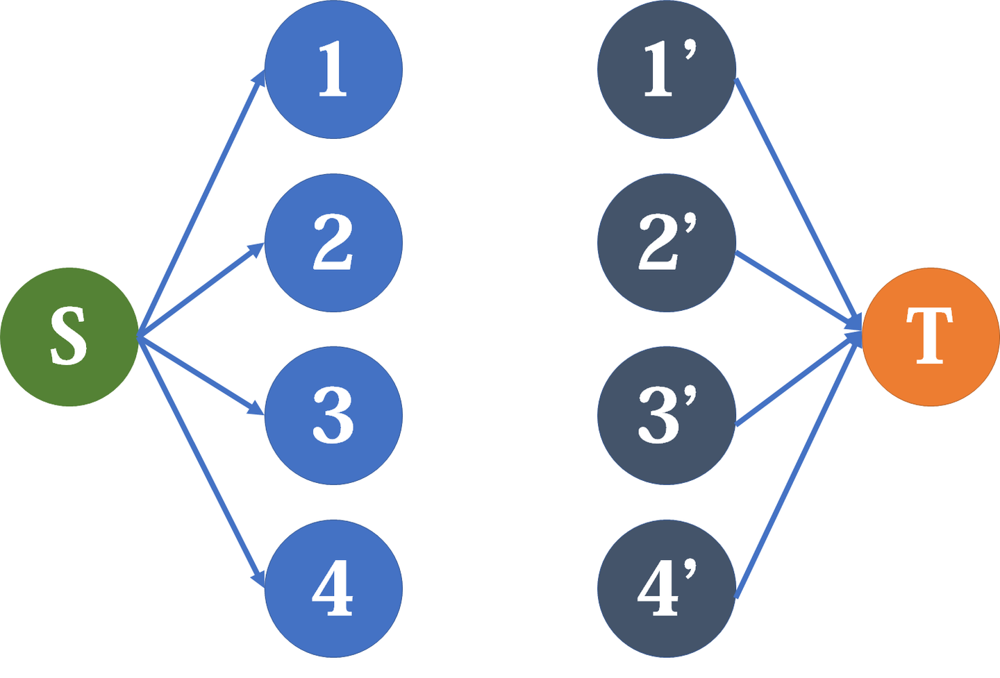
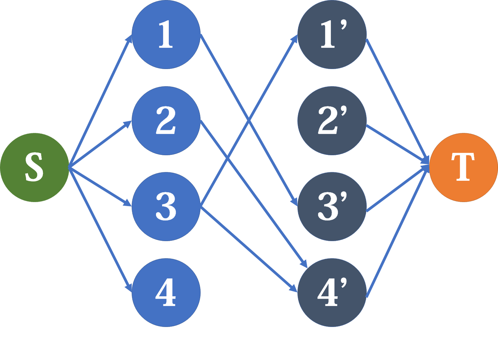

# 网络流建模 学习笔记

## 一、[二者取一式问题](https://zhuanlan.zhihu.com/p/123308502)

二者取一式问题可以这样描述：将若干元素 $e_1, e_2, \ldots, e_n$ 划分到两个集合 $A, B$ 中，对于元素 $e_i$，它被划分到 $A$ 或 $B$ 中分别能获得一个 $a_{e_i}$ 或 $b_{e_i}$ 的分值。除此之外，还给出若干个组合 $C_i \subseteq A$，当组合中的元素被同时划分到 $A$ 或 $B$ 时，可以获得额外的分值 $a'_i$ 或 $b'_i$。求最大的分值。

这个问题可以被转化为网络流中的最小割问题。如果我们把 $A$ 作为源点，$B$ 作为汇点，那么这个网络的一个割就是一种划分方法。如果没有组合的话，我们很容易就能建立这样的模型：

当我们去割它时，与 $A$ 连通的点代表放到 $A$ 集合中，与 $B$ 连通的点代表放到 $B$ 集合中。当这个割是最小割时，剩下的边的容量和是最大的，故设最小割为 `cut`，边权总和为 `sum`，则所求最大分值为 `sum-cut`。

现在我们考虑组合：假设 $C_1 = \{ e_1, e_2 \}$ 且对应的额外分值为 $a'_1$ 和 $b'_1$。

我们从 $A$ 点伸出一条容量为 $a'_1$ 的边通向虚点 $X$：

现在我们的需求是：只有当 $1$、$2$ 点都被归入 $A$ 所在点集时，$X$ 才与 $A$ 连通。

反过来想，当 $1$ 被归入 $B$ 所在点集时，要让 $A\to X$ 被割掉。很自然地想到，让 $X$ 连向 $1$，这样当 $1$ 被归入 $B$ 所在点集时，$A\to X\to 1$ 必然会断，否则 $A$ 就与 $B$ 连通了。但如何确保割掉的是 $A\to X$ 而不是 $X\to 1$ 呢？只要令 $X\to 1$ 的容量为 $INF$ 即可，无穷大的边不会被割掉。$2$ 号点同理。

对于 $B$ 号点，道理是一样的：

好了，这就是我们需要的模型。这时我们求最小割 `cut`，并记非无穷边权和为 `sum`，那么跟刚刚一样，`sum-cut` 就是所求分数。

#### 自己的话

其实换一个角度来考虑，把原图看作最大权闭合子图的建模，初始时的每个节点看作“选 $B$ 而不选 $A$ ”的收益，选择某个节点就是将其改为划在 $A$ 内：

- 在 $B$ 内的组合初始时就是满足的，所以向汇点连边表示可能的负贡献（修改之后变成不满足了），所以要选某个节点，就一定要选与之相连的 $B$ 组合节点，表示不满足了，需要撤回收益
- 而在 $A$ 内的组合原来并不满足，向源点连边表示可能的正收益，向组合内成员连边表示如果你要获取这一份收益，你需要把这些成员全部划到 $A$ 内
- 由于初始时的收益相当于 $\sum b_i+\sum b'_i$ ，而我们的闭合子图权值 $\sum a_i+\sum a'_i-minCut$ 的意义相当于价值的变化量，所以最后的总收益就相当于 $\sum b_i+\sum b'_i+\sum a_i+\sum a'_i-minCut$ ，也就是总收益减去最小割

所以我们知道这样的建图手法等价于把问题转化为了最大权闭合子图问题

## 二、[路径覆盖问题](https://zhuanlan.zhihu.com/p/125759333)

我们再来看能够用网络流模型解决的另一类问题：**路径覆盖问题**。

这里说的路径覆盖，是在 $DAG$（有向无环图）上进行的，是指用找出尽可能少的一系列路径，使这些路径经过 $DAG$ 上的所有点恰好各一次。

我们可以使用下面这样的思路：最开始，把每个点自己作为一条路径（这时一共有 $n$ 条路径），然后不断地将已有的路径首尾相连，合并成更长的路径，直到所有点被覆盖为止。

但是，要如何保证覆盖数量最少呢？我们可以使用网络流解决这个问题。

接下来，我们以这张 $DAG$ 为例：

建网络流模型。我们把原图上的每个点**拆**成两个点（对于点 `x`，可以把从它拆出去的点记为 `x+n`），其中一个点与源点相连，另一个与汇点相连。

然后对于原 DAG 上的边 $A\to B$ ，我们在网络中连接上 $A\to B'$ ：

这里每一条边的容量均为 $1$。现在我说：跑一遍最大流，便能得到最大合并路径数，再用点数去减即得最小路径覆盖数。这几乎是显然的：从 $A$ 点到 $B'$ 点的每一条流，都代表着一次合并。而从源点只给每个点输送 $1$ 单位流量，又保证了每个点只被经过一次。

实际上，这里本质上就是**二分图匹配**，所以用匈牙利算法也是可以的，复杂度略差一点。