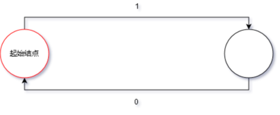

# 自动机 学习笔记

OI 中所说的「自动机」一般都指「确定有限状态自动机」。

## 前置知识

-   基础图论

## 自动机入门

首先理解一下自动机是用来干什么的：自动机是一个对信号序列进行判定的数学模型。

这句话涉及到的名词比较多，逐一解释一下。「信号序列」是指一连串有顺序的信号，例如字符串从前到后的每一个字符、数组从 1 到 n 的每一个数、数从高到低的每一位等。「判定」是指针对某一个命题给出或真或假的回答。有时我们需要对一个信号序列进行判定。一个简单的例子就是判定一个二进制数是奇数还是偶数，较复杂的例子例如判定一个字符串是否回文，判定一个字符串是不是某个特定字符串的子序列等等。

自动机的工作原理和地图很类似。假设你在你家，然后你从你家到学校，按顺序经过了很多路口。每个路口都有岔路，而你在所有这些路口的选择就构成了一个序列。

例如，你的选择序列是「家门 -> 右拐 -> 萍水西街 -> 尚园街 -> 古墩路 -> 地铁站 -> 下宁桥」，那你按顺序经过的路口可能是「家 -> 家门口 -> 萍水西街竞舟北路口 -> 萍水西街尚圆街路口 -> 尚园街古墩路口 -> 古墩路中 -> 三坝地铁站 -> 下宁桥地铁站」。可以发现，上学的选择序列不止这一个。同样要去地铁站，你还可以从竞舟北路绕道，或者横穿文鼎苑抄近路。

而我们如果找到一个选择序列，就可以在地图上比划出这个选择序列能不能去学校。比如，如果一个选择序列是「家门 -> 右拐 -> 萍水西街 -> 尚园街 -> 古墩路 -> 地铁站 -> 钱江路 -> 四号线站台 -> 联庄」，那么它就不会带你去同一个学校，但是仍旧可能是一个可被接受的序列，因为目标地点可能不止一个。

也就是说，我们通过这个地图和一组目的地，将信号序列分成了三类，一类是无法识别的信号序列（例如「家门 -> ???」），一类是能去学校的信号序列，另一类是不能的信号序列。我们将所有合法的信号序列分成了两类，完成了一个判定问题。

既然自动机是一个数学模型，那么显然不可能是一张地图。对地图进行抽象之后，可以简化为一个有向图。因此，自动机的结构就是一张有向图。

而自动机的工作方式和流程图类似，不同的是：自动机的每一个结点都是一个判定结点；自动机的结点只是一个单纯的状态而非任务；自动机的边可以接受多种字符（不局限于 T 或 F）。

例如，完成「判断一个二进制数是不是偶数」的自动机如下：

从起始结点开始，从高到低接受这个数的二进制序列，然后看最终停在哪里。如果最终停在红圈结点，则是偶数，否则不是。

如果需要判定一个有限的信号序列和另外一个信号序列的关系（例如另一个信号序列是不是某个信号序列的子序列），那么常用的方法是针对那个有限的信号序列构建一个自动机。这个在学习 KMP 的时候会讲到。

需要注意的是，自动机只是一个 **数学模型**，而 **不是算法**，也 **不是数据结构**。实现同一个自动机的方法有很多种，可能会有不一样的时空复杂度。