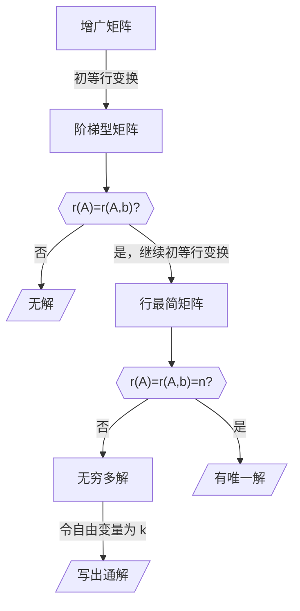

# 3.3 用矩阵解线性方程组

在上一节中我们其实已经弄清楚了如何用矩阵解线性方程组。不过，还有一些小问题。

## 无穷多解的表示问题

接着上一节的这个方程组：
$$
\left\{\begin{array}l
  x_1-x_2+x_3=1\\
  x_1-x_2-x_3=3\\
  2x_1-2x_2-x_3=5
\end{array}\right.
\to\left(\begin{array}{ccc:c}
1&-1&0&2\\
0&0&1&-1\\
0&0&0&0
\end{array}\right)
$$
现在有一个问题：其解应该如何表示？

化为行最简形矩阵之后，每一行有一个主元。主元对应的未知数称为**主变量**，因此每个非零行都有一个主变量。

除了主变量之外的变量，称为**自由变量**。

例如上面的这个矩阵中 $x_1,x_3$ 分别对应第一行和第三行的主元，因此它们是主变量；$x_2$ 是自由变量。

表示解的时候，**通过主变量表示自由变量**。
$$
\left\{\begin{array}l
  x_1-x_2=2\\
  x_3=-1
\end{array}\right.
\Rightarrow
\left\{\begin{array}l
  x_1=2+x_2\\
  x_3=-1
\end{array}\right.
$$
令 $x_2=k$，
$$
\left\{\begin{array}l
  x_1=k+2\\
  x_2=k\\
  x_3=-1
\end{array}\right.
$$

> [!warning]
>
> 别把 $x_2=k$ 漏掉了！

我们也可以用矩阵的方式来表示。一般地，将参数 $k$ 提出。
$$
\boldsymbol x=
\begin{pmatrix}
x_1\\x_2\\x_3
\end{pmatrix}
=\begin{pmatrix}
k+2\\k\\-1
\end{pmatrix}
=k\begin{pmatrix}
1\\1\\0
\end{pmatrix}+
\begin{pmatrix}
2\\0\\-1
\end{pmatrix}
$$
所以，最终的解写作：
$$
\boldsymbol x=
k\begin{pmatrix}
1\\1\\0
\end{pmatrix}+
\begin{pmatrix}
2\\0\\-1
\end{pmatrix},\:k\:为任意常数.
$$
所以，我们可以绘出用矩阵解线性方程组的完整流程。

---

**例** 求解线性方程组
$$
\left\{\begin{array}l
  x_1+2x_2+2x_3+x_4=0\\
  2x_1+x_2-2x_3-2x_4=0\\
  x_1-x_2-4x_3-3x_4=0
\end{array}\right.
$$
解：写出增广矩阵
$$
\begin{align}
(\boldsymbol A,\boldsymbol b)=&
\left(\begin{array}{cccc:c}
1&2&2&1&0\\
2&1&-2&-2&0\\
1&-1&-4&-3&0
\end{array}\right) \\
\to&
\left(\begin{array}{cccc:c}
1&2&2&1&0\\
0&-3&-6&-4&0\\
0&-3&-6&-4&0
\end{array}\right) \\
\to&
\left(\begin{array}{cccc:c}
1&2&2&1&0\\
0&-3&-6&-4&0\\
0&0&0&0&0
\end{array}\right) \\
\end{align}
$$
$r(\boldsymbol A,\boldsymbol b)=r(\boldsymbol A)<n$，有无穷多解。
$$
\begin{align}
&\left(\begin{array}{cccc:c}
1&2&2&1&0\\
0&-3&-6&-4&0\\
0&0&0&0&0
\end{array}\right) \\
\to&
\left(\begin{array}{cccc:c}
3&6&6&3&0\\
0&-6&-12&-8&0\\
0&0&0&0&0
\end{array}\right) \\
\to&
\left(\begin{array}{cccc:c}
3&0&-6&-5&0\\
0&-6&-12&-8&0\\
0&0&0&0&0
\end{array}\right) \\
\to&
\left(\begin{array}{cccc:c}
1&0&-2&-\frac53&0\\
0&1&2&\frac43&0\\
0&0&0&0&0
\end{array}\right) \\
\Rightarrow&
\left\{\begin{array}l
  x_1-2x_3-\frac53x_4=0\\
  x_2+2x_3+\frac43x_4=0
\end{array}\right.
\end{align}
$$
$x_1,x_2$ 为主变量，$x_3,x_4$ 为自由变量。

令 $x_3=k_1,x_4=k_2$，有
$$
\left\{\begin{array}l
  x_1=2k_1+\frac53k_2\\
  x_2=-2k_1-\frac43k_2\\
  x_3=k_1\\
  x_4=k_2
\end{array}\right.
$$

>  [!warning]
>
> 别把 $x_3=k_1,x_4=k_2$ 漏掉了！

因此，方程组的解为
$$
\boldsymbol x=
k_1\begin{pmatrix}
2\\-2\\1\\0
\end{pmatrix}+
k_2\begin{pmatrix}
\frac53\\-\frac43\\0\\1
\end{pmatrix},\:k_1,k_2\:为任意常数.
$$

## 齐次与非齐次线性方程组

方程组常数项不全为零的称为**非齐次线性方程组**。
$$
\boldsymbol{Ax}=\boldsymbol{b}
\Leftrightarrow
\left\{\begin{array}l
  a_{11}x_1+a_{12}x_2+\cdots+a_{1n}x_n=b_1 \\
  a_{21}x_1+a_{22}x_2+\cdots+a_{2n}x_n=b_2 \\
  \cdots \\
  a_{m1}x_1+a_{m2}x_2+\cdots+a_{mn}x_n=b_m
\end{array}\right.
$$
常数项全为零的称为**齐次线性方程组**。
$$
\boldsymbol{Ax}=\boldsymbol{O}
\Leftrightarrow
\left\{\begin{array}l
  a_{11}x_1+a_{12}x_2+\cdots+a_{1n}x_n=0 \\
  a_{21}x_1+a_{22}x_2+\cdots+a_{2n}x_n=0 \\
  \cdots \\
  a_{m1}x_1+a_{m2}x_2+\cdots+a_{mn}x_n=0
\end{array}\right.
$$
可以看出，齐次线性方程组就是一般线性方程组的一个特例。

我们在上一节已经研究了**一般线性方程组的解的情况**：

1. $r(\boldsymbol A,\boldsymbol b)>r(\boldsymbol A)$，方程组无解；
2. $r(\boldsymbol A,\boldsymbol b)=r(\boldsymbol A)=n$，方程组有唯一解；
3. $r(\boldsymbol A,\boldsymbol b)=r(\boldsymbol A)<n$，方程组有无穷多解。

我们现在研究齐次线性方程组作为一个特例，其解的情况有什么特点。

对于方程组
$$
\left\{\begin{array}l
  a_{11}x_1+a_{12}x_2+\cdots+a_{1n}x_n=0 \\
  a_{21}x_1+a_{22}x_2+\cdots+a_{2n}x_n=0 \\
  \cdots \\
  a_{n1}x_1+a_{n2}x_2+\cdots+a_{nn}x_n=0
\end{array}\right.
$$
显然其有一个解：
$$
x_1=x_2=x_3=\cdots=x_n=0
$$
因此，齐次线性方程组**不可能无解**，再怎么着也会有一个**零解**。

> [!note]
>
> 从无解的条件 $r(\boldsymbol A,\boldsymbol b)>r(\boldsymbol A)$ 也可以看出来齐次线性方程组不可能无解。因为 $\boldsymbol b$ 的元素全为零，没法出现系数矩阵部分为零但常数项不为零的情况。

所以，齐次线性方程组的解的情况缩减为：

1. $r(\boldsymbol A)=n$，仅有唯一解（零解）；
2. $r(\boldsymbol A)<n$，无穷多解。

