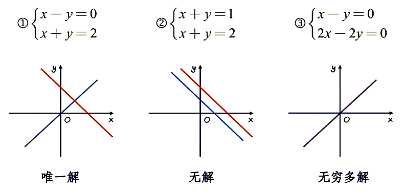
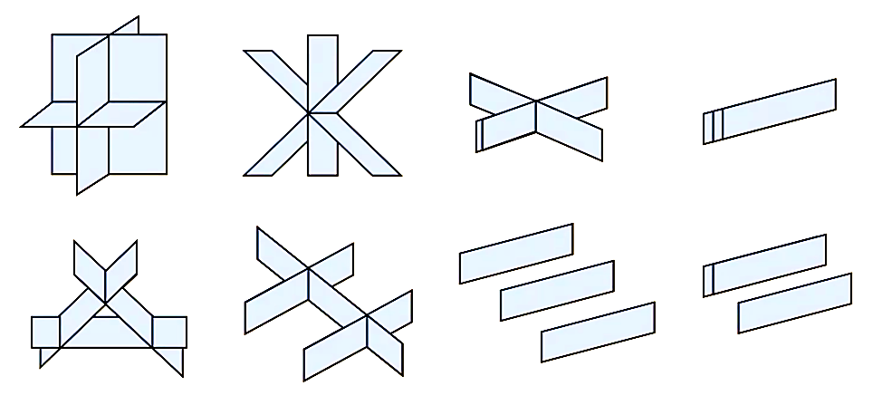

# 3.1 从方程组到矩阵初等变换

[1.7 克拉默法则（一）](../1-行列式/1.7-克拉默法则（一）)、[2.6 克拉默法则（二）](../2-矩阵/2.6-克拉默法则（二）) 中我们比较详细地通过行列式和矩阵两个工具讨论了 $n$ 元线性方程组的解的情况。

但是，克拉默法则求解线性方程组有一个限制：线性方程组未知数的数量必须等于方程的数量，这样系数矩阵才是方阵，系数行列式才能存在。

另外，就算未知数的数量必须等于方程的数量，如果系数行列式 $|\boldsymbol A|=0$，我们只知道有无穷多解或无解，无法得到具体是哪一种情况，也无法求出这无穷多解的通解。

## 从方程组解的情况谈起

不妨利用几何直观来判断方程组解的情况。

对于二元方程组，我们可以通过将方程绘制为平面上的直线来判断。图中，所有直线的公共点代表即所有方程的公共解，公共点有几个，解就有几个。

容易得到，只有唯一解、无解、无穷多解三种情况。

对于三元方程组，我们可以将将方程绘制为空间中的平面。

同样的道理，左上第一张图有一个公共点，有唯一解。上面一行的右边三张图都有无穷多个公共点，因此有无穷多解。下面一行的四张图中，找不到同时在三个面上的点，因此无解。

> [!note]
>
> 能不能有**有穷且不唯一的解**？
>
> 结论：不行。这是由「线性」的特性决定的。
>
> 我们用三元来举例子。假设对于某个三元线性方程组，我们找到了两个解，那么这两个解在空间中对应两个点，这两个点同时在所有平面上。对于每个平面来说，这两个点在平面上，则经过这两个点的直线也一定在这个平面上。那么，这两个点连成的直线就必然在所有平面上，换言之，这条直线上的每个点都对应原方程组的一个解。因此原方程组必有无穷多个解。
>
> 这个结论对于四元、五元到 $n$ 元都有效。从更本质的角度讲，线性系统有两大特性：叠加性和齐次性。
>
> $$
> \begin{align}
> x(t)\to y(t) &\Longrightarrow kx(t)\to ky(t) \\
> \left.\begin{array}r
>   x_1(t)\to y_1(t) \\
>   x_2(t)\to y_2(t)
> \end{array}\right\}
> &\Longrightarrow ax_1(t)+bx_2(t)\to ay_1(t)+by_2(t)
> \end{align}
> $$
>
> 因此，当有两个解 $\vec v,\vec u$ 后我们就可以构造 $0.9\vec v+0.1\vec u,0.8\vec v+0.2\vec u,0.7\vec v+0.3\vec u$ 等无穷多个解。

## 高斯消元法与初等行变换

这是一个很高大上的名字。人话就是小学的加减消元法。

$$
\cases{4x+2y=94 \\ x+y=35}
\to\cases{x+y=35 \\ 4x+2y=94}
\to\cases{x+y=35 \\ 2x+y=47}
\to\cases{x+y=35 \\ -y=-23}
\to\cases{x=12 \\ y=23}
$$

这里的操作无非就是方程之间交换位置、方程两边同乘非零数、方程之间相加减。

总结一下，就是

1. 互换变换：两个方程之间互换位置；
2. 倍乘变换：某个方程乘一个非零常数 $k$；
3. 倍加变换：把某个方程的倍数加到另一个方程上。

这三个变换称为**同解变换**，因为这样的操作不会让方程组的解改变。

我们可以用矩阵来描述这个过程：

$$
\left(\begin{array}{cc:c}
4 & 2 & 94 \\
1 & 1 & 35 \\
\end{array}\right)\to
\left(\begin{array}{cc:c}
1 & 1 & 35 \\
4 & 2 & 94 \\
\end{array}\right)\to
\left(\begin{array}{cc:c}
1 & 1 & 35 \\
2 & 1 & 47 \\
\end{array}\right)\to
\left(\begin{array}{cc:c}
1 & 1 & 35 \\
  &-1 & -23 \\
\end{array}\right)\to
\left(\begin{array}{cc:c}
1 &   & 12 \\
  & 1 & 23 \\
\end{array}\right)
$$

这时，这三个操作变成了：

1. 互换变换：交换两行的位置；
2. 倍乘变换：某一行乘一个非零常数 $k$；
3. 倍加变换：把某一行的 $k$ 倍加到另一个行上。

这三个针对行的操作称为**初等行变换**。

> [!warning]
>
> 注意区分矩阵的初等变换和行列式的变换！
>
> 行列式的两行交换时，行列式反号。
>
> 行列式的某一行乘上一个常数 $k$，等价于这个行列式的值乘上这个常数 $k$。

> [!note]
>
> 有没有初等列变换？有，但这**不是同解变换**。
>
> 取刚刚矩阵变换过程的倒数第二个，进行初等列变换。
>
> $$
> \left(\begin{array}{cc:c}
> 1 & 1 & 35 \\
>   &-1 & -23 \\
> \end{array}\right)\to\left(\begin{array}{cc:c}
> 1 & 0 & 35 \\
>   &-1 & -23 \\
> \end{array}\right)\Rightarrow
> \cases{
> x=35\\y=-23
> }
> $$
>
> 这时的解与刚刚我们求出来的不同。因此，初等列变换会改变解，我们不展开讨论。

## 用矩阵求解方程组

回忆一下之前行列式变换的技巧：

> $$
> D=\begin{vmatrix}
> a_{11}&a_{12}&\cdots&a_{1n} \\
> a_{21}&a_{22}&\cdots&a_{2n} \\
> \vdots&\vdots&\ddots&\vdots \\
> a_{n1}&a_{n2}&\cdots&a_{nn} \\
> \end{vmatrix}\to
> \begin{vmatrix}
> p_{11}&p_{12}&\cdots&p_{1n} \\
>       &p_{22}&\cdots&p_{2n} \\
>       &      &\ddots&\vdots \\
>       &      &      &p_{nn} \\
> \end{vmatrix}\to
> \begin{vmatrix}
> p_{11} \\
>       &p_{22} \\
>       &      &\ddots \\
>       &      &      &p_{nn} \\
> \end{vmatrix}
> $$
>
> 先找到 $a_{11}$，用第一行的 $k_i$ 倍分别减去下面几行，使得第一行除了 $a_{11}$ 之外都是 $0$；然后在第二列重复这样的操作，然后是第三列……直到化为上三角行列式。
>
> 然后最后一行的最后一个元素 $p_{nn}$ 减去上面几行，使得上面几行的最后一个元素都为零；然后在倒数第二列重复这样的操作，然后是倒数第三列……直到化为主对角型行列式。

对于矩阵，我们只需要做类似的操作：

$$
\left(\begin{array}{cccc:c}
a_{11}&a_{12}&\cdots&a_{1n}&b_1\\
a_{21}&a_{22}&\cdots&a_{2n}&b_2\\
\vdots&\vdots&\ddots&\vdots&\vdots\\
a_{n1}&a_{n2}&\cdots&a_{nn}&b_n\\
\end{array}\right)\to

\left(\begin{array}{cccc:c}
c_{11}&c_{12}&\cdots&c_{1n}&d_1\\
&c_{22}&\cdots&c_{2n}&d_2\\
&&\ddots&\vdots&\vdots\\
&&&c_{nn}&d_n\\
\end{array}\right)\to

\left(\begin{array}{cccc:c}
1&0&\cdots&0&p_1\\
&1&\cdots&0&p_2\\
&&\ddots&\vdots&\vdots\\
&&&1&p_n\\
\end{array}\right)
$$
最右边的矩阵就相当于方程组 $\cases{x_1=p_1\\x_2=p_2\\\cdots\\x_n=p_m}$，已经解出来了。

现在，我们研究我们化出来的这两个矩阵。

### 行阶梯形矩阵

从一般的矩阵「自上而下」操作得到，类似「上三角行列式」的矩阵。
$$
\left(\begin{array}{cccc:c}
c_{11}&c_{12}&\cdots&c_{1n}&d_1\\
&c_{22}&\cdots&c_{2n}&d_2\\
&&\ddots&\vdots&\vdots\\
&&&c_{nn}&d_n\\
\end{array}\right)\
$$
特点：

1. 若有零行，零行都在最下方；
2. 非零行的第一个不为零的元素称为主元，并且下一行主元的列标必然增加。

### 行最简形矩阵

从行阶梯形矩阵「自下而上」操作得到。
$$
\left(\begin{array}{cccc:c}1&0&\cdots&0&p_1\\&1&\cdots&0&p_2\\&&\ddots&\vdots&\vdots\\&&&1&p_n\\\end{array}\right)
$$
特点：

1. 是行阶梯形矩阵；
2. 每个非零行的主元全部是 $1$；
3. 每个主元所在的列的其余元素全部为零。

::: example

$$
\begin{gathered}
\begin{pmatrix}
 1&-1&1&1\\
 0&0&1&-1\\
 0&0&0&0
\end{pmatrix}\to
\begin{pmatrix}
 1&-1&0&2\\
 0&0&1&-1\\
 0&0&0&0
\end{pmatrix} \\

\begin{pmatrix}
 3&-1&2&1\\
 0&0&1&-1\\
 0&0&0&0
\end{pmatrix}\to
\begin{pmatrix}
 1&-\frac13&0&1\\
 0&0&1&-1\\
 0&0&0&0
\end{pmatrix} \\
\end{gathered}
$$

:::

行最简形矩阵对应着最简的方程组，每个方程左边都只有一个未知数，右边只有一个常数。

所以，我们解方程的目标就是把增广矩阵化成行最简形矩阵。
