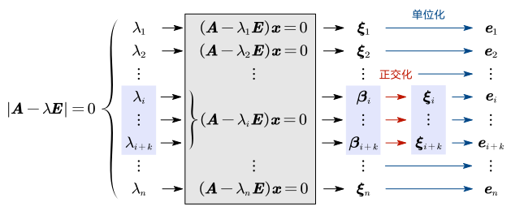

# 5.4 对称矩阵的对角化

现在回忆一下此前的相似对角化的条件：

1. 每个单根特征值，都能提供一个无关的特征向量；
2. 不同特征值的特征向量一定线性无关；
3. 如果 $n$ 阶矩阵 $\boldsymbol A$ 具有 $n$ 个不同的特征值，则矩阵一定可以相似对角化。

因此，我们判断矩阵 $\boldsymbol A$ 是否可以相似对角化，其关键就在于那些重根能否提供足够的无关向量。

## 对称矩阵的对角化

在 [2.1 中介绍矩阵概念时](../2%20矩阵/2.1%20线性方程组和矩阵#几个特殊矩阵)，我们提到过了对称矩阵的概念。

> 如果一个方阵中的所有元素关于主对角线对称，即 $\boldsymbol A=\boldsymbol A^{\rm T}$，该矩阵称为对称矩阵：
>
> $$
> \begin{pmatrix}
>   a&d&e\\
>   d&b&f\\
>   e&f&c
> \end{pmatrix}
> $$

对称矩阵的对角化有以下两个结论：

1. 实对称矩阵，一定可以相似对角化；
2. 不同特征值的特征向量一定正交（比无关更强）。

而属于同一特征值的特征向量，如果不正交，我们可以将其正交化。在此基础上，如果我们把这些特征向量单位化，我们就一定能得到一个正交矩阵 $\boldsymbol Q$，使得 $\boldsymbol Q^{-1}\boldsymbol {AQ}=\boldsymbol {\mit\Lambda}$。

如下图（其中 $\lambda_i$ 到 $\lambda_{i+k}$ 表示重根）：

::: example

设矩阵 $\boldsymbol A=\begin{pmatrix}3&-1\\-1&3\end{pmatrix}$，求正交矩阵 $\boldsymbol Q$，使得 $\boldsymbol Q^{\rm T}\boldsymbol {AQ}=\boldsymbol {\mit\Lambda}$。

对于正交矩阵 $\boldsymbol Q$，有 $\boldsymbol Q^{\rm T}=\boldsymbol Q^{-1}$。本质还是对角化。

1. 求特征值：

   $$
   |\boldsymbol A-\lambda\boldsymbol E|=0\Rightarrow\lambda_1=2,\lambda_24
   $$

2. 求特征向量：

   $$
   \left\{\begin{array}l
   (\boldsymbol A-\lambda_1\boldsymbol E)\boldsymbol x=\boldsymbol 0\Longrightarrow 基础解系:\boldsymbol \xi_1=\begin{pmatrix} 1\\1\end{pmatrix} \\
   (\boldsymbol A-\lambda_2\boldsymbol E)\boldsymbol x=\boldsymbol 0\Longrightarrow 基础解系:\boldsymbol \xi_2=\begin{pmatrix} -1\\1\end{pmatrix} \\
   \end{array} \right.
   $$

3. 正交相似对角化：$\boldsymbol \xi_1,\boldsymbol \xi_2$ 属于不同特征值的特征向量，必然正交
   $$
   \begin{gathered}
   \boldsymbol e_1=\frac{\boldsymbol \xi_1}{\|\boldsymbol \xi_1\|}
   =\frac1{\sqrt2}\begin{pmatrix}1\\1\end{pmatrix}
   =\begin{pmatrix}\frac1{\sqrt2}\\\frac1{\sqrt2} \end{pmatrix} \\
   \boldsymbol e_2=\frac{\boldsymbol \xi_2}{\|\boldsymbol \xi_2\|}
   =\frac1{\sqrt2}\begin{pmatrix}-1\\1\end{pmatrix}
   =\begin{pmatrix}-\frac1{\sqrt2}\\\frac1{\sqrt2} \end{pmatrix} \\
   \end{gathered}
   $$

因此我们有

$$
\boldsymbol Q=\begin{pmatrix}
\frac1{\sqrt2}&-\frac1{\sqrt2}\\
\frac1{\sqrt2}&\frac1{\sqrt2}
\end{pmatrix},
\boldsymbol{\mit\Lambda}=\begin{pmatrix}
2&0\\0&4
\end{pmatrix}
$$

则 $\boldsymbol Q^{\rm T}\boldsymbol {AQ}=\boldsymbol {\mit\Lambda}$。

:::

::: example

求矩阵 $\boldsymbol A=\begin{pmatrix}0&-1&1\\-1&0&1\\1&1&0\end{pmatrix}$，求一个正交矩阵 $\boldsymbol P$，使得 $\boldsymbol P^{-1}\boldsymbol A\boldsymbol P=\boldsymbol {\mit\Lambda}$。

1. 求特征值

   $$
   \begin{align}
   |\boldsymbol A-\lambda\boldsymbol E|&=\begin{vmatrix}
   -\lambda&-1&1\\
   -1&-\lambda&1\\
   1&1&-\lambda
   \end{vmatrix}
   =\begin{vmatrix}
   1-\lambda&0&0\\
   -1&-1-\lambda&1\\
   1&2&-\lambda
   \end{vmatrix} \\
   &=(1-\lambda)(\lambda^2+\lambda-2)\\
   &=-(\lambda-1)^2(\lambda+2)=0
   \end{align}
   $$

   解得 $\lambda_1=-2$，$\lambda_2=\lambda_3=1$。

2. 求特征向量

   1. 当 $\lambda_1=-2$ 时，求解 $(\boldsymbol A+2\boldsymbol E)\boldsymbol x=\boldsymbol 0$

      $$
      \begin{gathered}
      \begin{pmatrix}
      2&-1&1\\
      -1&2&1\\
      1&1&2
      \end{pmatrix}
      \mathop\sim^r
      \begin{pmatrix}
      1&0&1\\
      0&1&1\\
      0&0&0
      \end{pmatrix} \\
      \Rightarrow
      \cases{
        x_1=-x_3\\
        x_2=-x_3\\
        x_3=x_3
      }
      \Rightarrow
      \boldsymbol x=\begin{pmatrix}-1\\-1\\1\end{pmatrix}k_2
      \end{gathered}
      $$

      其中 $k_1$ 为任意常数。因此得到基础解系 $\begin{pmatrix}-1\\-1\\1\end{pmatrix}$。

   2. 当 $\lambda_2=\lambda_3=1$ 时，求解 $(\boldsymbol A-\boldsymbol E)\boldsymbol x=\boldsymbol 0$
      $$
      \begin{gathered}
      \begin{pmatrix}
      -1&-1&1\\
      -1&-1&1\\
      1&1&-1
      \end{pmatrix}
      \mathop\sim^r
      \begin{pmatrix}
      1&1&-1\\
      0&0&0\\
      0&0&0
      \end{pmatrix} \\
      \Rightarrow
      \cases{
        x_1=x_2+x_3\\
        x_2=x_2\\
        x_3=x_3
      }
      \Rightarrow
      \boldsymbol x=
      \begin{pmatrix}-1\\1\\0 \end{pmatrix}k_2+\begin{pmatrix}1\\0\\1 \end{pmatrix}k_3
      \end{gathered}
      $$
      其中 $k_2,k_3$ 为任意常数，得到基础解系 $\begin{pmatrix}-1\\1\\0 \end{pmatrix}$，$\begin{pmatrix}1\\0\\1 \end{pmatrix}$。

3. 正交化单位化

   1. 重根的特征向量正交化
      $$
      \begin{align}
      \boldsymbol b_1&=\boldsymbol a_1=\begin{pmatrix}-1\\1\\0 \end{pmatrix}\\
      \boldsymbol b_2&=\boldsymbol a_2-{(\boldsymbol a_2,\boldsymbol b_1)\over(\boldsymbol b_1,\boldsymbol b_1)}\boldsymbol b_1=\begin{pmatrix}1\\0\\1 \end{pmatrix}-\frac{-1}2
      \end{align}
      $$

:::
