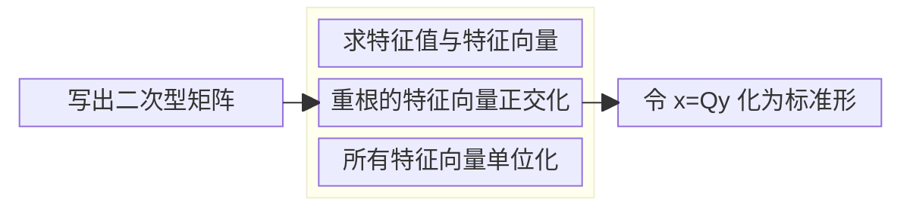

# 5.6 正交变换化标准形

## 线性变换

### 线性变换的概念

「线性」，意味着「一次」；「变换」，可以理解为「换元」。

线性变换的形式和线性方程组十分类似。设有两组变量 $x_1,x_2,\cdots,x_n$ 和 $y_1,y_2,\cdots,y_n$，设其满足下列关系：

$$
\left\{\begin{array}l
x_1=c_{11}y_1+c_{12}y_2+\cdots+c_{1n}y_n\\
x_2=c_{21}y_1+c_{22}y_2+\cdots+c_{2n}y_n\\
\cdots\\
x_n=c_{n1}y_1+c_{n2}y_2+\cdots+c_{nn}y_n\\
\end{array} \right.
$$

用矩阵形式表达，就是

$$
\begin{align}
\begin{pmatrix}
x_1\\x_2\\\vdots\\x_n
\end{pmatrix}
&=
\begin{pmatrix}
c_{11}&c_{12}&\cdots&c_{1n}\\
c_{21}&c_{22}&\cdots&c_{2n}\\
\vdots&\vdots&\ddots&\vdots\\
c_{n1}&c_{n2}&\cdots&c_{nn}\\
\end{pmatrix}
\begin{pmatrix}
y_1\\y_2\\\vdots\\y_n
\end{pmatrix} \\&\,\:\Updownarrow \\
\boldsymbol x&=\boldsymbol C\boldsymbol y
\end{align}
$$

这称为由 $x_1,x_2,\cdots,x_n$ 到 $y_1,y_2,\cdots,y_n$ 的一个**线性变换**，记为 $\boldsymbol x=\boldsymbol {Cy}$。特别地，如果 $\boldsymbol C$ 是正交矩阵，那么这一变换称为**正交变换**。

> [!warning]
>
> **判断线性变换的要点**
>
> - 线性变换要求 $x$ 的个数与 $y$ 的个数一致，不能「缺斤少两」；
> - 线性变换中不能出现常数项。

### 线性变换的可逆性

考虑 $x_1,x_2,x_3$ 到 $y_1,y_2,y_3$ 的一个线性变换：

$$
\left\{\begin{array}l
x_1=0\\x_2=0\\x_3=0
\end{array} \right.
$$

这样换元之后，得到三个 $0$，显然是无法根据 $y_1,y_2,y_3$ 求 $x_1,x_2,x_3$ 的。也就是说，这个线性变换是不可逆的。而如下的线性变换：

$$
\left\{\begin{array}l
x_1=y_1-y_2+y_3\\
x_2=y_2-2y_3\\
x_3=y_3
\end{array} \right.
$$

则是可逆的。

事实上，向量 $\boldsymbol x$ 与 $\boldsymbol y$ 互求的过程其实就是解线性方程组的过程（两个向量可以分别对应线性方程组中的 $\boldsymbol x$ 和 $\boldsymbol b$，也可以反过来）。从方程组的角度看，**线性变换可逆的充要条件便是矩阵 $\boldsymbol C$ 满秩**。

也可以从矩阵的角度看。由 $\boldsymbol y$ 得到 $\boldsymbol x$ 的式子为

$$
\boldsymbol x=\boldsymbol C\boldsymbol y
$$

那要反过来，自然是

$$
\boldsymbol y=\boldsymbol C^{-1}\boldsymbol x
$$

所以可逆的充要条件是矩阵 $\boldsymbol C$ 可逆。可逆与满秩是等价条件。

显而易见的是，可逆的线性变换是我们希望的，因为这样的变换过程中不会损失信息。

## 线性变换与二次型

设有二次型 $f(x_1,x_2,x_3)=\boldsymbol x^{\rm T}\boldsymbol A\boldsymbol x$，我们希望通过换元的方式，将其转化为标准形。使用可逆线性变换 $\boldsymbol x=\boldsymbol {Cy}$ 代入：

$$
\begin{align}
f(x_1,x_2,x_3)
&=\boldsymbol x^{\rm T}\boldsymbol A\boldsymbol x \\
&=(\boldsymbol{Cy})^{\rm T}\boldsymbol A(\boldsymbol {Cy}) \\
&=\boldsymbol y^{\rm T}\boldsymbol C^{\rm T}\boldsymbol {ACy}
\end{align}
$$

设 $\boldsymbol B=\boldsymbol C^{\rm T}\boldsymbol {AC}$，二次型便被表示为：

$$
f(x_1,x_2,x_3)=\boldsymbol y^{\rm T}\boldsymbol B\boldsymbol y
$$

其中 $\boldsymbol B=\boldsymbol C^{\rm T}\boldsymbol {AC}$ 这一过程称为**合同变换**。

既然我们希望 $\boldsymbol y^{\rm T}\boldsymbol B\boldsymbol y$ 是标准形，那 $\boldsymbol B$ 就应该是一个对角矩阵，也就是说

$$
\boldsymbol \varLambda=\boldsymbol B=\boldsymbol C^{\rm T}\boldsymbol {AC}
$$

所以，我们只需要对 $\boldsymbol A$ 进行正交相似对角化，就可以找到 $\boldsymbol C$ 和 $\boldsymbol \varLambda$。

### 矩阵的合同

这里顺带介绍一下矩阵的合同变换。

#### 矩阵合同

设 $\boldsymbol A,\boldsymbol B$ 为 $n$ 阶矩阵，若存在可逆矩阵 $\boldsymbol C$，使得 $\boldsymbol C^{\rm T}\boldsymbol {AC}=\boldsymbol B$，就说 $\boldsymbol A$ 与 $\boldsymbol B$ **合同**。

#### 合同对角化

设对称矩阵 $\boldsymbol A$，一定存在可逆矩阵 $\boldsymbol C$，使得 $\boldsymbol C^{\rm T}\boldsymbol A\boldsymbol C=\boldsymbol \varLambda$，这一过程称为**合同对角化**。

## 可逆变换中的不变量

### 正负惯性指数

**定义** 矩阵的正特征值的个数称为正惯性指数，一般记作 $p$；矩阵的负特征值的个数称为负惯性指数，一般记作 $q$。

二次型化为标准形 $f=\boldsymbol y^{\rm T}\boldsymbol {\varLambda y}$ 之后，中间的这个 $\boldsymbol \varLambda$ 就是相似对角化之后的结果，是由原矩阵特征值拼成的对角矩阵。因此，化成标准形中的平方项（也就是 $\boldsymbol \varLambda$ 主对角线上的元素）就是平方项的系数。所以，正惯性指数等于标准形中正平方项的个数，负惯性指数等于标准形中负平方项的个数。

规范形作为特殊的标准形，正惯性指数等于规范形中 $+1$ 的个数，负惯性指数等于规范形中 $-1$ 的个数。

所以我们有

- 正惯性指数 = 正特征值的个数 = 标准形正平方项的个数 = 规范形中 $+1$ 的个数
- 负惯性指数 = 负特征值的个数 = 标准形负平方项的个数 = 规范形中 $-1$ 的个数

并且，对于对角矩阵 $\boldsymbol \varLambda$，其秩 $R(\boldsymbol \varLambda)$ 就等于其中非零元素的个数，那也就是正特征值个数与负特征值个数之和，所以我们有：

二次型矩阵的秩 $R(\boldsymbol A)$ 满足

$$
R(\boldsymbol A)=p+q
$$

### 惯性定理

**二次型经过多次可逆变换，正负惯性指数不变。**

## 正交变换化标准形

### 正交变换的原理

正交变换是特殊的可逆线性变换，具有**不改变图像形状**的特点。

对于实对称矩阵 $\boldsymbol A$，根据相似的知识，一定存在正交矩阵 $\boldsymbol Q$，使得 $\boldsymbol Q^{\rm T}\boldsymbol A\boldsymbol Q=\boldsymbol \varLambda$。因此有

$$
\begin{align}
f&=\boldsymbol x^{\rm T}\boldsymbol {Ax}\\
&=(\boldsymbol Q\boldsymbol y)^{\rm T}\boldsymbol A(\boldsymbol {Qy})\\
&=\boldsymbol y^{\rm T}(\boldsymbol Q^{\rm T}\boldsymbol A\boldsymbol Q)\boldsymbol y\\
&=\boldsymbol y^{\rm T}\boldsymbol \varLambda\boldsymbol y\\
&=\lambda_1y_1^2+\lambda_2y_2^2+\cdots+\lambda_ny_n^2
\end{align}
$$

且 $\lambda_i$ 均为 $\boldsymbol A$ 的特征值。

因此，正交变换化二次型的流程可以表示为：

