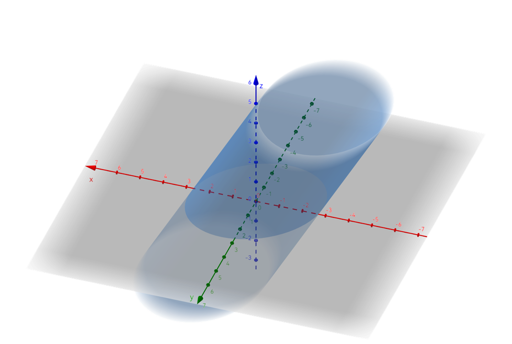

# 5.6 正交变换化标准形

## 线性变换

### 线性变换的概念

「线性」，意味着「一次」；「变换」，可以理解为「换元」。

线性变换的形式和线性方程组十分类似。设有两组变量 $x_1,x_2,\cdots,x_n$ 和 $y_1,y_2,\cdots,y_n$，设其满足下列关系：

$$
\left\{\begin{array}l
x_1=c_{11}y_1+c_{12}y_2+\cdots+c_{1n}y_n\\
x_2=c_{21}y_1+c_{22}y_2+\cdots+c_{2n}y_n\\
\cdots\\
x_n=c_{n1}y_1+c_{n2}y_2+\cdots+c_{nn}y_n\\
\end{array} \right.
$$

用矩阵形式表达，就是

$$
\begin{align}
\begin{pmatrix}
x_1\\x_2\\\vdots\\x_n
\end{pmatrix}
&=
\begin{pmatrix}
c_{11}&c_{12}&\cdots&c_{1n}\\
c_{21}&c_{22}&\cdots&c_{2n}\\
\vdots&\vdots&\ddots&\vdots\\
c_{n1}&c_{n2}&\cdots&c_{nn}\\
\end{pmatrix}
\begin{pmatrix}
y_1\\y_2\\\vdots\\y_n
\end{pmatrix} \\&\,\:\Updownarrow \\
\boldsymbol x&=\boldsymbol C\boldsymbol y
\end{align}
$$

这称为由 $x_1,x_2,\cdots,x_n$ 到 $y_1,y_2,\cdots,y_n$ 的一个**线性变换**，记为 $\boldsymbol x=\boldsymbol {Cy}$。特别地，如果 $\boldsymbol C$ 是正交矩阵，那么这一变换称为**正交变换**。

### 线性变换的可逆性

考虑 $x_1,x_2,x_3$ 到 $y_1,y_2,y_3$ 的一个线性变换：

$$
\left\{\begin{array}l
x_1=0\\x_2=0\\x_3=0
\end{array} \right.
$$

这样换元之后，得到三个 $0$，显然是无法根据 $y_1,y_2,y_3$ 求 $x_1,x_2,x_3$ 的。也就是说，这个线性变换是不可逆的。而如下的线性变换：

$$
\left\{\begin{array}l
x_1=y_1-y_2+y_3\\
x_2=y_2-2y_3\\
x_3=y_3
\end{array} \right.
$$

则是可逆的。

事实上，向量 $\boldsymbol x$ 与 $\boldsymbol y$ 互求的过程其实就是解线性方程组的过程（两个向量可以分别对应线性方程组中的 $\boldsymbol x$ 和 $\boldsymbol b$，也可以反过来）。从方程组的角度看，**线性变换可逆的充要条件便是矩阵 $\boldsymbol C$ 满秩**。

也可以从矩阵的角度看。由 $\boldsymbol y$ 得到 $\boldsymbol x$ 的式子为

$$
\boldsymbol x=\boldsymbol C\boldsymbol y
$$

那要反过来，自然是

$$
\boldsymbol y=\boldsymbol C^{-1}\boldsymbol x
$$

所以可逆的充要条件是矩阵 $\boldsymbol C$ 可逆。可逆与满秩是等价条件。

显而易见的是，可逆的线性变换是我们希望的，因为这样的变换过程中不会损失信息。

## 线性变换与二次型

设有二次型 $f(x_1,x_2,x_3)=\boldsymbol x^{\rm T}\boldsymbol A\boldsymbol x$，我们希望通过换元的方式，将其转化为标准形。使用可逆线性变换 $\boldsymbol x=\boldsymbol {Cy}$ 代入：

$$
\begin{align}
f(x_1,x_2,x_3)
&=\boldsymbol x^{\rm T}\boldsymbol A\boldsymbol x \\
&=(\boldsymbol{Cy})^{\rm T}\boldsymbol A(\boldsymbol {Cy}) \\
&=\boldsymbol y^{\rm T}\boldsymbol C^{\rm T}\boldsymbol {ACy}
\end{align}
$$

设 $\boldsymbol B=\boldsymbol C^{\rm T}\boldsymbol {AC}$，二次型便被表示为：

$$
f(x_1,x_2,x_3)=\boldsymbol y^{\rm T}\boldsymbol B\boldsymbol y
$$

其中 $\boldsymbol B=\boldsymbol C^{\rm T}\boldsymbol {AC}$ 这一过程称为**合同变换**。我们将在 [5.8 正定二次型](./5.8%20正定二次型#矩阵合同) 中详细介绍。

既然我们希望 $\boldsymbol y^{\rm T}\boldsymbol B\boldsymbol y$ 是标准形，那 $\boldsymbol B$ 就应该是一个对角矩阵，也就是说

$$
\boldsymbol \varLambda=\boldsymbol B=\boldsymbol C^{\rm T}\boldsymbol {AC}
$$

由于正交矩阵的转置等于其逆矩阵，所以如果 $\boldsymbol C$ 是正交矩阵，就有 $\boldsymbol \varLambda=\boldsymbol C^{-1}\boldsymbol {AC}$。所以，我们只需要对 $\boldsymbol A$ 进行正交相似对角化，就可以找到 $\boldsymbol C$ 和 $\boldsymbol \varLambda$。

## 正交变换化标准形

### 正交变换的原理

正交变换是特殊的可逆线性变换，具有**不改变图像形状**的特点。

对于实对称矩阵 $\boldsymbol A$，根据相似的知识，一定存在正交矩阵 $\boldsymbol Q$，使得 $\boldsymbol Q^{\rm T}\boldsymbol A\boldsymbol Q=\boldsymbol \varLambda$。因此有

$$
\begin{align}
f&=\boldsymbol x^{\rm T}\boldsymbol {Ax}\\
&=(\boldsymbol Q\boldsymbol y)^{\rm T}\boldsymbol A(\boldsymbol {Qy})\\
&=\boldsymbol y^{\rm T}(\boldsymbol Q^{\rm T}\boldsymbol A\boldsymbol Q)\boldsymbol y\\
&=\boldsymbol y^{\rm T}\boldsymbol \varLambda\boldsymbol y\\
&=\lambda_1y_1^2+\lambda_2y_2^2+\cdots+\lambda_ny_n^2
\end{align}
$$

且 $\lambda_i$ 均为 $\boldsymbol A$ 的特征值。

因此，正交变换化二次型的流程可以表示为：

::: example

求一个正交变换 $\boldsymbol x=\boldsymbol {Py}$，把二次型 $f=-2x_1x_2+2x_1x_3+2x_2x_3$ 化为标准形。

实际上这道题就是在问：设 $\boldsymbol A=\begin{pmatrix}0&-1&1\\-1&0&1\\1&1&0 \end{pmatrix}$，求一个正交矩阵 $\boldsymbol P$，使得 $\boldsymbol P^{-1}\boldsymbol {AP}=\boldsymbol \varLambda$。

1. 求解 $|\boldsymbol A-\lambda\boldsymbol E|=0$，解得 $\lambda=-2,1,1$

2. 求解特征向量

   $$
   \left\{\begin{array}l
   (\boldsymbol A+2\boldsymbol E)\boldsymbol x=0 \Rightarrow (-1,-1,1)^{\rm T} \\
   (\boldsymbol A-\boldsymbol E)\boldsymbol x=0 \Rightarrow (-1,1,0)^{\rm T},(1,0,1)^{\rm T}
   \end{array}\right.
   $$

3. 重根的特征向量正交化

   $$
   \left\{\begin{array}l
   \boldsymbol \beta_1=\boldsymbol \alpha_1=(-1,1,0)^{\rm T}\\
   \boldsymbol \beta_2=\boldsymbol \alpha_2-{(\boldsymbol \alpha_2,\boldsymbol \beta_1)\over (\boldsymbol \beta_1,\boldsymbol \beta_1)}\boldsymbol \beta_1=(\frac12,\frac12,1)^{\rm T}
   \end{array}\right.
   $$

4. 特征向量单位化
   $$
   \left\{\begin{array}l
   \boldsymbol e_1=\frac1{\sqrt3}(-1,-1,1)^{\rm T}\\
   \boldsymbol e_2=\frac1{\sqrt2}(-1,-1,0)^{\rm T}\\
   \boldsymbol e_3=\frac1{\sqrt6}(1,1,2)^{\rm T}
   \end{array}\right.
   $$

得到 $\boldsymbol P=(\boldsymbol e_1,\boldsymbol e_2,\boldsymbol e_3)$。经过正交变换 $\boldsymbol x=\boldsymbol {Py}$，将二次型化为标准形：

$$
f=-2y_1^2+y_2^2+y_3^2
$$

:::

::: example

求一正交变换，将二次型

$$
f(x,y,z)=5x^2+5y^2+3z^2-2xy+6xz-6yz
$$

化为标准形，并指出 $f(x,y,z)=36$ 表示何种曲面。

解：二次型的矩阵为

$$
\boldsymbol A=\begin{pmatrix}
5&-1&3\\
-1&5&-3\\
3&-3&3
\end{pmatrix}
$$

得到特征方程

$$
|\boldsymbol A-\lambda\boldsymbol E|=-\lambda(4-\lambda)(9-\lambda)=0
$$

解得 $\lambda_1=9$, $\lambda_2=4$, $\lambda_3=0$，对应特征向量为

$$
\boldsymbol a_1=\begin{pmatrix}
1\\-1\\1
\end{pmatrix},
\boldsymbol a_2=\begin{pmatrix}
1\\1\\0
\end{pmatrix},
\boldsymbol a_3=\begin{pmatrix}
-1\\1\\2
\end{pmatrix}
$$

将其单位化，得到正交变换

$$
\begin{pmatrix}x\\y\\z \end{pmatrix}
=\begin{pmatrix}
\frac1{\sqrt3}&\frac1{\sqrt2}&-\frac1{\sqrt6}\\
-\frac1{\sqrt3}&\frac1{\sqrt2}&\frac1{\sqrt6}\\
\frac1{\sqrt3}&0&\frac2{\sqrt6}
\end{pmatrix}\begin{pmatrix}
u\\v\\w
\end{pmatrix}
$$

化二次型为 $f=9u^2+4v^2$。

由此得到，$f(x,y,z)=36$ 为椭圆柱面方程。

在 $Oxyz$ 内的图形：

在 $O-uvw$ 中的图形：

:::
