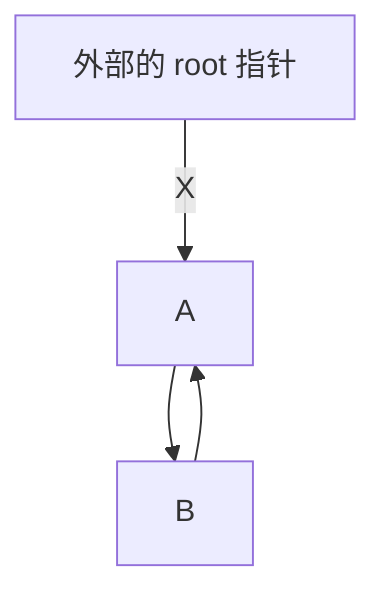

# 2.4 标准库与资源管理

内存泄漏是 C++ 最著名的问题之一，但资源不只有内存。文件、互斥锁、网络连接、窗口句柄等都需要在使用结束后执行相应的释放操作。

如果获取和释放只依赖程序员记住一对函数，控制流稍微复杂就容易出错：

```cpp
bool acquire_and_use_resource() {
    Resource *resource = acquire_resource();

    if (!prepare(resource)) {
        return false; // 忘记 release_resource(resource)
    }

    use(resource);
    release_resource(resource);
    return true;
}
```

以后增加的提前返回和异常也可能绕过释放。现代 C++ 的基本答案就是我们上一节提到过的 RAII：不要让一段控制流负责记忆清理，让对象的生命周期负责。让编译器来分担程序员的记忆与手动管理成本，更高效、更轻松的同时也更安全。

## 优先使用对象本身

我们在前两节已经介绍了类的不变式、构造与析构，这些是让对象管理资源的基础。我们此前使用的 `std::vector` 和 `std::string` 都是资源管理类型。它们内部可能申请动态内存，但调用者不需要手写 `delete`。

再举一些其他的例子。文件流也遵循相同思路：

```cpp
#include <fstream>
#include <stdexcept>

void save_report() {
    std::ofstream output{"report.txt"};
    if (!output) {
        throw std::runtime_error{"Cannot open report.txt"};
    }

    output << "Report contents\n";
} // output 析构时关闭文件
```

> 如果业务需要确认最终写入或关闭是否成功，仅依赖析构函数还不够，因为析构函数不适合报告可恢复错误。可以在正常路径显式执行 `flush` 或 `close` 并检查状态。但即使忘记，析构函数仍然会在所有退出路径上自动工作。

互斥锁是另一个典型例子：

```cpp
#include <mutex>

std::mutex scores_mutex;

void update_scores() {
    std::lock_guard lock{scores_mutex};
    // 操作受保护的数据
} // 自动解锁
```

如果手工调用 `lock()` 和 `unlock()`，中间的提前返回或异常就可能让锁永远不被释放。

局部对象在离开作用域时会自动析构，对象的成员也会随着外层对象一起析构。而直接使用裸指针动态分配对象，则必须另外安排它的销毁。因此，优先使用普通对象和标准库容器，动态分配不应该是创建对象的默认方式。

例如，下面的对象完全可以直接存在于当前作用域：

```cpp
Student student{1001, "Alice", Score{85}};
std::vector<Student> students;
```

没有必要写成：

```cpp
Student* student = new Student{1001, "Alice", Score{85}};
auto* students = new std::vector<Student>;

// 还必须在所有路径上正确 delete
```

只有对象生命周期需要独立于当前作用域、需要运行时多态，或数据结构本身需要间接关系时，才进一步考虑动态分配。

## 独占所有权指针 `unique_ptr`

必须动态创建单个对象时，`std::unique_ptr<T>` 提供了更安全的方案。它表示只有一个所有者：

```cpp
#include <memory>

auto student = std::make_unique<Student>(Student{1001, "Alice", Score{85}});
```

`std::make_unique` 创建对象并立即交给智能指针管理。智能指针销毁时，它拥有的对象也会销毁。

智能指针本身是一个类对象。它重载了 `*` 和 `->` 运算符，因此用起来像指针。例如 `student->id` 访问它所拥有对象的成员。它析构时会销毁所拥有的对象。

独占所有权不能被随意复制，但可以使用 `std::move` 移动：

```cpp
auto first = std::make_unique<Student>(Student{1001, "Alice", Score{85}});

auto second = std::move(first); // 转移所有权，编译通过

auto third = second; // [!code error]
// use of deleted function 'std::unique_ptr<_Tp, _Dp>::unique_ptr(const std::unique_ptr<_Tp, _Dp>&) [with _Tp = Student; _Dp = std::default_delete<Student>]'
```

转移后，`second` 拥有对象，`first` 变为空。换句话说，它允许移动构造和移动赋值，并且会把原指针置空；同时不允许复制构造和复制赋值。

`std::unique_ptr` 对移动后状态作出了明确保证，因此可以用 `if (first)` 检查。我们可以把移动前后的地址打印出来看看：

```cpp
auto first = std::make_unique<Student>(Student{1001, "Alice", Score{85}});
std::cout << "Before move:\n";
std::cout << "first  = " << first << '\n';

auto second = std::move(first);
std::cout << "After move:\n";
std::cout << "first  = " << first << '\n';
std::cout << "second = " << second << '\n';
```

我设备上的一次输出形如：

```
Before move:
first  = 0x284a58bbe80
After move:
first  = 0
second = 0x284a58bbe80
```

可以看到移动之后，`first` 被置空了。

函数按值接收 `unique_ptr`，可以清楚表达「调用后所有权交给函数」：

```cpp
void store_student(std::unique_ptr<Student> student);

auto student = std::make_unique<Student>(Student{1001, "Alice", Score{85}});
store_student(std::move(student));
```

如果函数只需要使用学生，不改变所有权，就不应要求调用者必须使用某种智能指针：

```cpp
void print_student(const Student& student);

print_student(*second);
```

## 共享所有权指针 `shared_ptr`

`std::shared_ptr<T>` 维护共享所有者的数量。最后一个所有者销毁或放弃所有权时，对象才被销毁。

```cpp
#include <memory>

auto first = std::make_shared<Student>(Student{1001, "Alice", Score{85}});
std::cout << first.use_count() << '\n';
std::cout << first << '\n';

auto second = first;
std::cout << first.use_count() << '\n';
std::cout << first << '\n';
std::cout << second << '\n';
```

我设备上的一次输出形如：

```cpp
1
0x182dcdd4f20
2
0x182dcdd4f20
```

可以看到 `auto second = first` 这个操作并不会把 `first` 置空。`first` 和 `second` 指向的地址是相同的。并且，复制操作之后，智能指针保存的引用计数 `use_count` 增加了。

换句话说，它支持复制和移动构造，也支持复制和移动赋值。复制会增加共享所有者的数量，而当最后一个所有者放弃所有权时，对象才会被销毁。

只有需求本身明确要求多个对象共同决定资源寿命时，才应使用共享所有权。大多数所有权关系都可以设计成明确的单一所有者，其他位置只借用对象。**如果两个对象互相持有 `shared_ptr`，引用计数可能永远无法归零**。考虑使用下面的节点代码保存一颗树：

```cpp
#include <memory>
#include <vector>

struct Node {
    std::vector<std::shared_ptr<Node>> children;
    std::shared_ptr<Node> parent;
};
```



这种结构里，引用计数无法归零。当外部的 `root` 析构，`A` 仍被 `B` 的 `parent` 拥有，`B` 也仍被 `A` 的 `children` 拥有。即使整棵树已经无法访问，这两个节点也不会被销毁。

## 非拥有指针 `weak_ptr`

那这个问题要如何解决呢？父节点拥有子节点是合理的，但子节点不应该拥有父节点。`std::weak_ptr` 可以表达这种不增加共享所有者数量的关系：

```cpp
struct Node {
    std::vector<std::shared_ptr<Node>> children;
    std::weak_ptr<Node> parent;
};
```

使用前需要尝试取得一个临时的 `shared_ptr`：

```cpp
if (const auto parent = node.parent.lock()) {
    // parent 在这个作用域中保证对象继续存活
}
```

`weak_ptr` 解决的是共享所有权图中的非拥有边，不是所有裸指针的替代品。

## 裸指针和引用的去路

有了智能指针也并不意味着所有的裸指针都应该走入历史。裸指针与智能指针有不同的语义：

| 类型                 | 常见含义                                     |
| -------------------- | -------------------------------------------- |
| `T`                  | 直接拥有一个值                               |
| `T&`                 | 借用一个必定存在的对象                       |
| `T*`                 | 借用一个可能为空的对象                       |
| `std::unique_ptr<T>` | 独占拥有动态对象                             |
| `std::shared_ptr<T>` | 共享拥有动态对象                             |
| `std::weak_ptr<T>`   | 观察由 `shared_ptr` 管理的对象，但不延长寿命 |

裸指针或引用不拥有对象，所以使用者必须保证被借用对象活得足够久：

```cpp
Student* selected{nullptr};

{
    Student temporary{1001, "Alice", Score{85}};
    selected = &temporary;
} // temporary 已销毁

// selected->id; // 悬空访问
```

## 小结

- 资源包括内存、文件、锁、连接和各种系统句柄
- 优先使用普通对象和标准库资源管理类型
- 必须动态分配时，默认先考虑 `std::unique_ptr`
- 只有确实共享寿命时才使用 `std::shared_ptr`
- `std::weak_ptr` 可以打破共享所有权环
- 裸指针和引用适合表达借用，不负责释放对象
- 析构函数应保证清理，但不适合报告复杂业务失败

延伸阅读：[C++ Core Guidelines：资源管理](https://isocpp.github.io/CppCoreGuidelines/CppCoreGuidelines#S-resource)。
