# 信号与标志

## 信号灯

- 绿灯时，路口拥堵不得进
- 直行绿灯亮，可进入左转待行区
- 单黄灯闪：警示，路口交通信号暂时解除
- 圆形信号灯右转不受限

## 交警手势

- **停止信号**：坐高右低

  

- **直行信号**：双手从未放下

  

- **左转弯待转信号**：单左手下压

  

- **减速慢行信号**：单右手下压

  

- **变道信号**：单右手向中间摆

  

- **右转弯信号**：左手掌心朝前，右手在下

  

- **左转弯信号**：右手掌心朝前，左手在下（看到臂章选左转）

  

记忆：

1. 停止信号：左高右低
2. 直行信号：双手从未放下
3. 左转弯待转信号：单左手下压
4. 减速慢行信号：单右手下压
5. 变道信号：单右手向中间摆动
6. 转弯信号：一手掌心朝前，一手在下；哪只手在下，朝哪儿转

## 交通标志

### 警告

==一急二反三连续==：

| 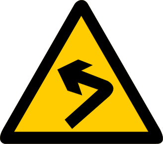 | 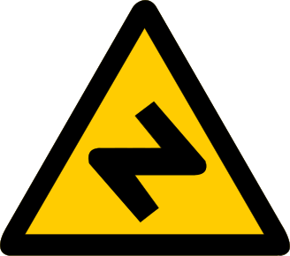 | 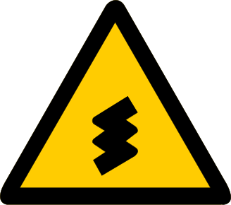 |
| :------------------------------------------------: | :------------------------------------------------------: | :----------------------------------------------------: |
|                       急转弯                       |                         反向转弯                         |                        连续转弯                        |

==有山有石是落石，有山没石是傍山险路==：

| 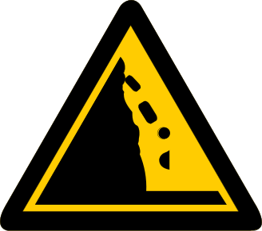 | 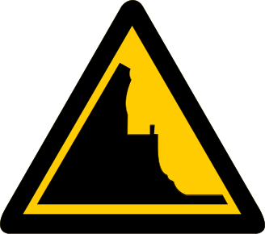 |
| :-------------------------------------------------: | :----------------------------------------------------: |
|                      注意落石                       |                        傍山险路                        |

==火车头无人，栅栏有人==：

| 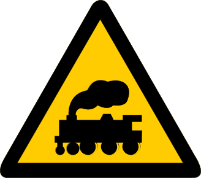 | 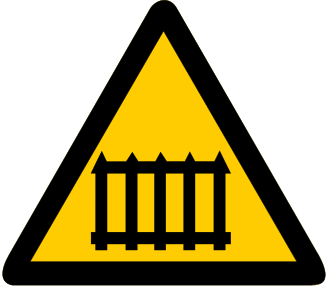 |
| :-------------------------------------------------: | :--------------------------------------------------: |
|                  无人看守铁路道口                   |                   有人看守铁路道口                   |

==一凸高突 二凸不平 门洞找桥==：

| 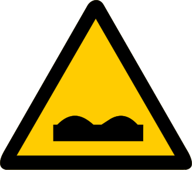 | 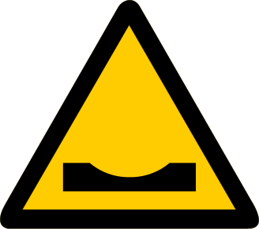 |  | 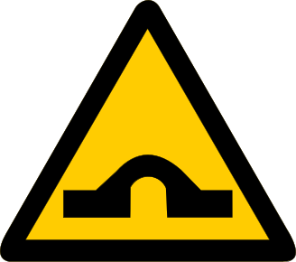 |
| :--------------------------------------------------: | :------------------------------------------------: | :-------------------------------------------------: | :-------------------------------------------------: |
|                       路面不平                       |                      路面低洼                      |               路面高凸 (减速丘)                |                       驼峰桥                        |

其他易混标志：

| 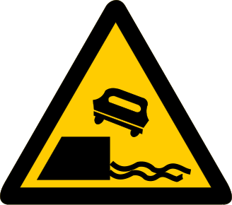 | 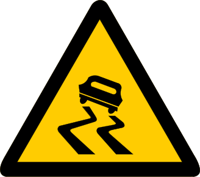 |
| :--------------------------------------------: | :-------------------------------------------: |
|                     堤坝路                     |                     易滑                      |

| 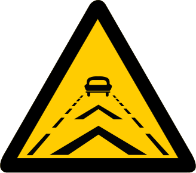 | 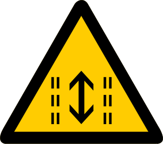 |
| :-------------------------------------------------: | :--------------------------------------------------: |
|                      保持车距                       |                       潮汐车道                       |

| 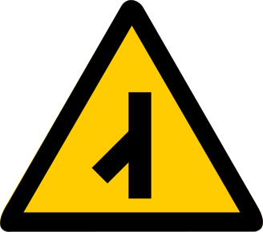 | 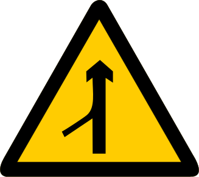 |
| :------------------------------------------------: | :------------------------------------------------: |
|                      Y 形路口                      |                      注意合流                      |

| 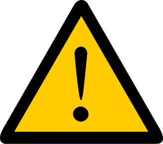 | 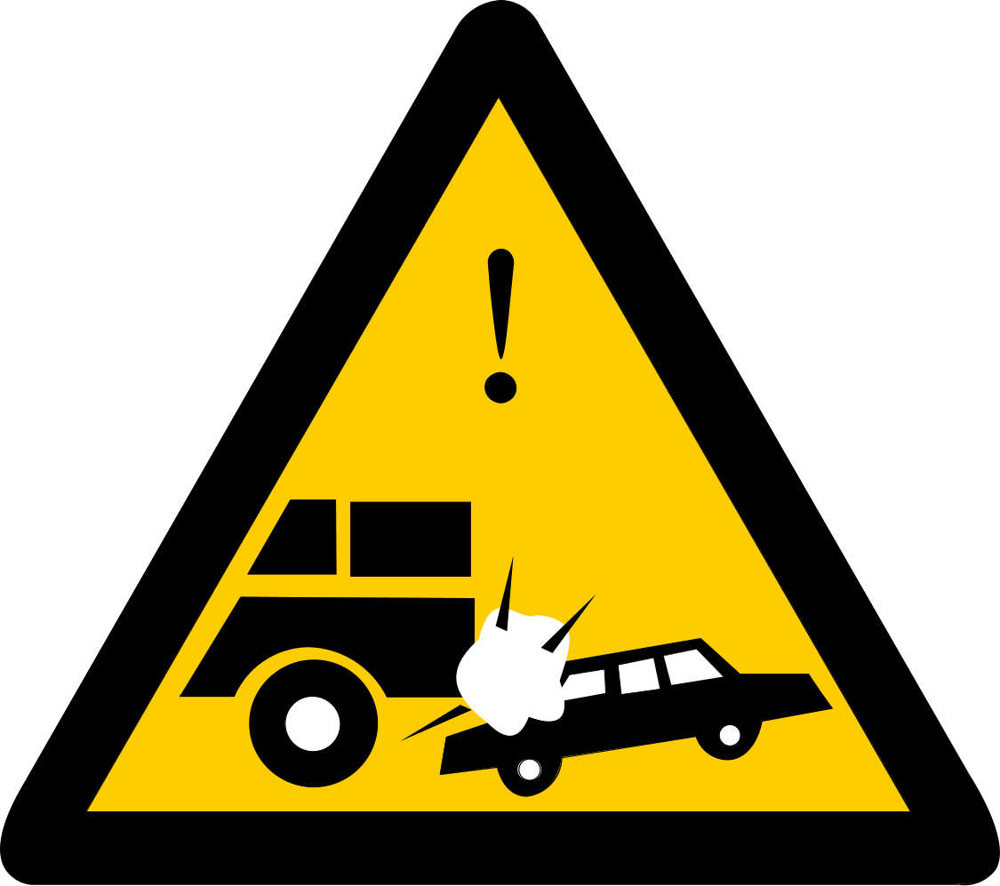 |
| :-------------------------------------------------: | :------------------------------------------------: |
|                      注意危险                       |                      事故多发                      |

| 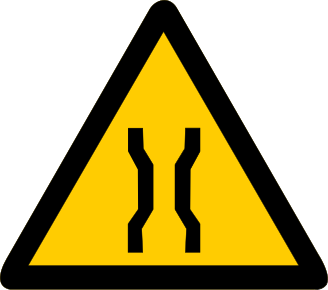 | 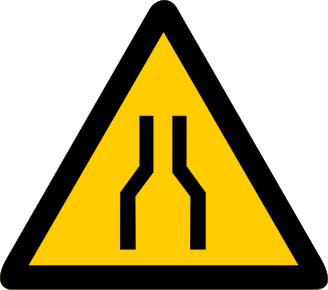 |
| :----------------------------------------------: | :-----------------------------------------------------: |
|                       窄桥                       |                        两侧变窄                         |

| 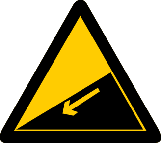 | 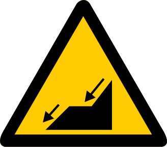 |
| :----------------------------------------------: | :-------------------------------------------------: |
|                      下陡坡                      |                      连续下坡                       |

|  | 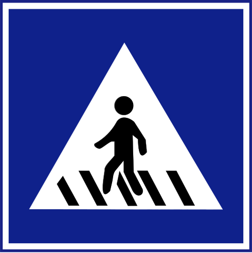 |
| :---------------------------------------------: | :----------------------------------------------------: |
|                    注意行人                     |                        人行横道                        |

### 禁令

==红色禁止，黑色解除==：

| 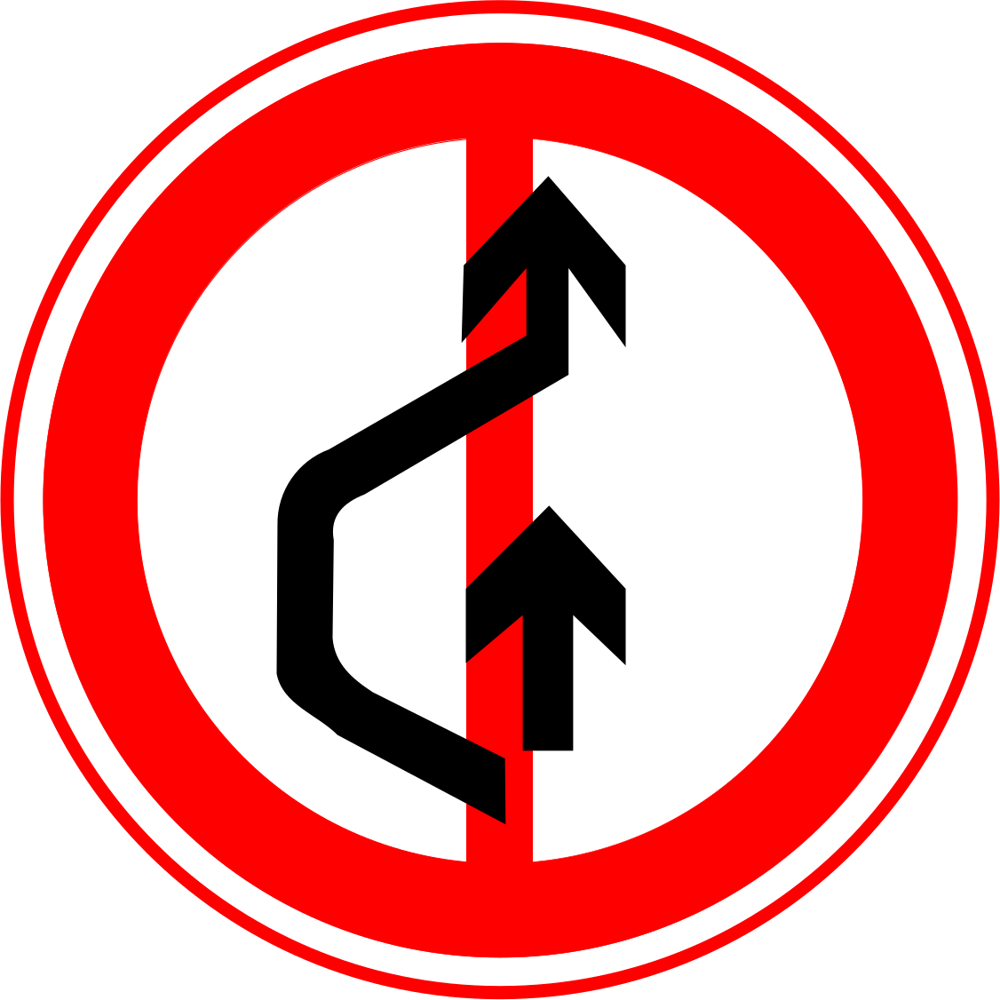 | 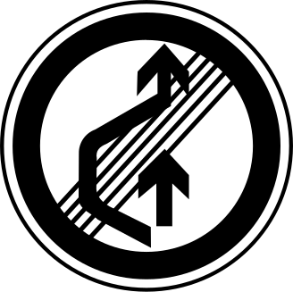 |
| :------------------------------------------: | :------------------------------------------------: |
|                   禁止超车                   |                    解除禁止超车                    |

==三减八停==：

| 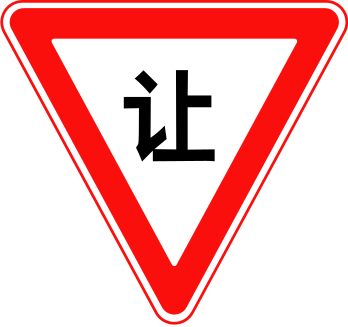 | 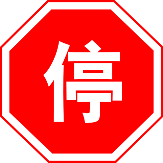 |
| :-----------------------------------------: | :--------------------------------------------------: |
|                  减速让行                   |                       停车让行                       |

==正脸机动车，侧身对应车型==：

| 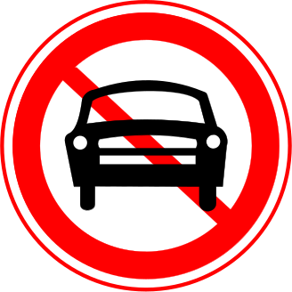 | 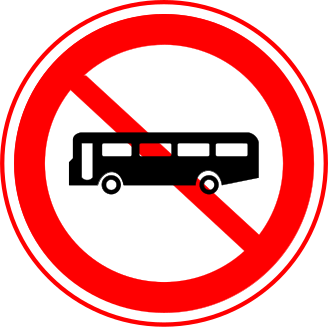 | 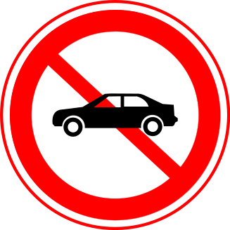 | 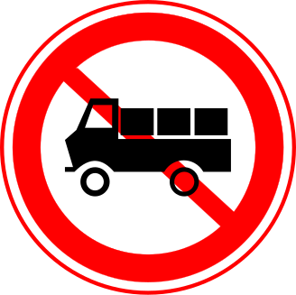 |
| :--------------------------------------------: | :------------------------------------------: | :--------------------------------------------: | :----------------------------------------------: |
|                   机动车禁行                   |                 大型客车禁行                 |                  小型客车禁行                  |                   载货汽车禁行                   |

==横杠禁车，空白全禁==：

| 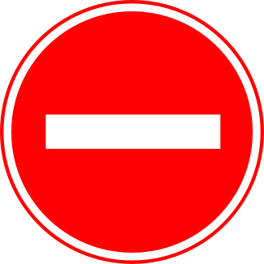 | 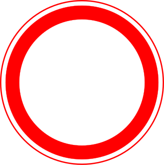 |
| :----------------------------------------: | :-------------------------------------------: |
|                  禁止驶入                  |                   禁止通行                    |

==一杠不停久，两杠都不行：==

| 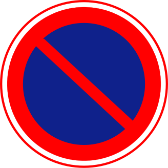 | 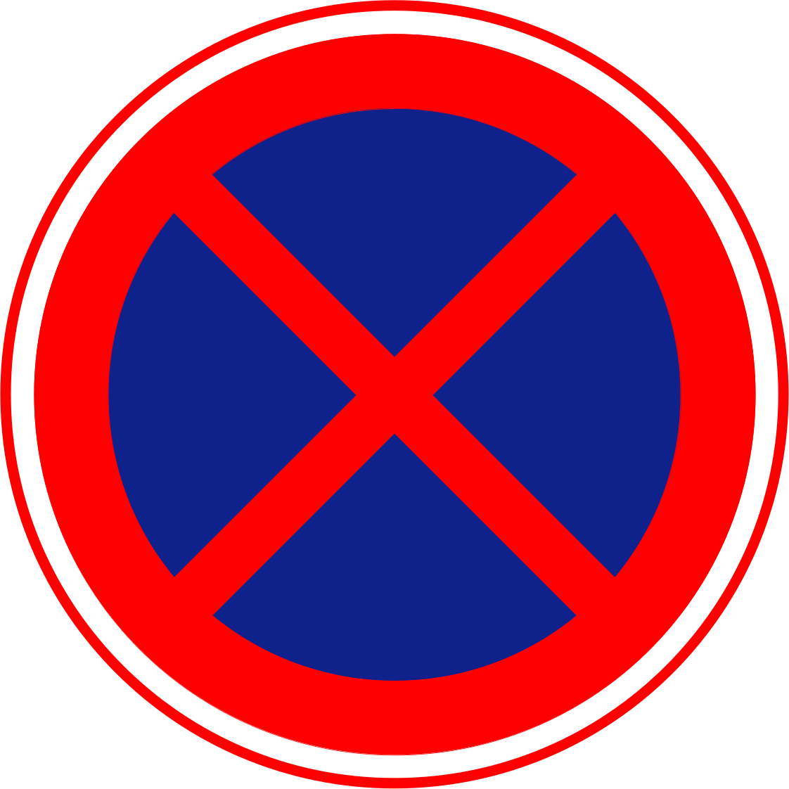 |
| :--------------------------------------------------: | :------------------------------------------: |
|                     禁止长时停车                     |              禁止临时或长时停车              |

==会车粗箭头先走==：

| 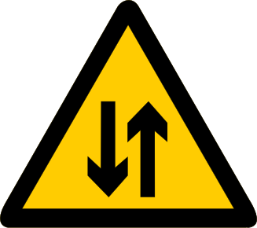 | 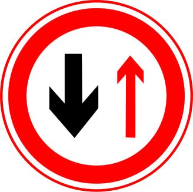 | 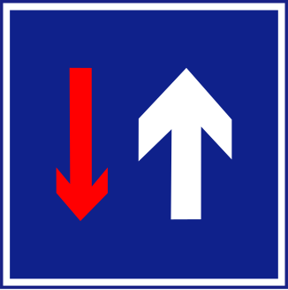 |  |
| :---------------------------------------------------------: | :-------------------------------------------------: | :----------------------------------------------------: | :---------------------------------------------------: |
|                          双向交通                           |                      会车让行                       |                        会车先行                        |                     路口优先通行                      |

### 指示与其他

==圆直 方单 虚车道==：

|  | 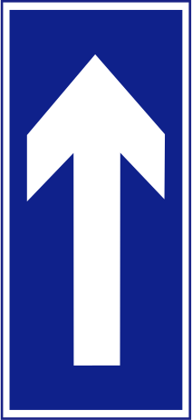 | 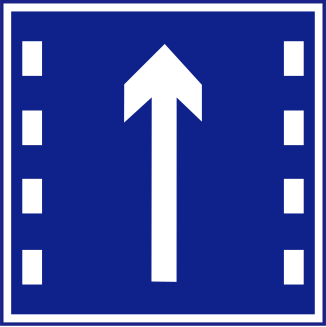 |
| :---------------------------------------------: | :-----------------------------------------------: | :---------------------------------------------------: |
|                      直行                       |                      单行路                       |                       直行车道                        |

==一人逃跑去避难 疏散要走安全门==：

|  | 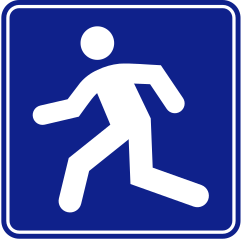 |
| :--------------------------------------------: | :-------------------------------------------: |
|                    疏散标志                    |                 应急避难场所                  |

其他：

| 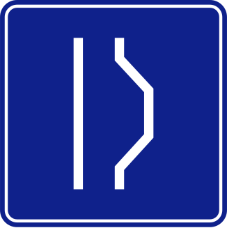 | 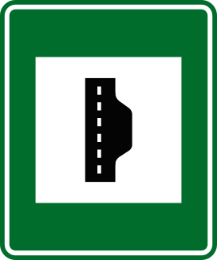 |
| :-----------------------------------------------: | :-----------------------------------------------------: |
|                      错车道                       |                       紧急停车带                        |

| 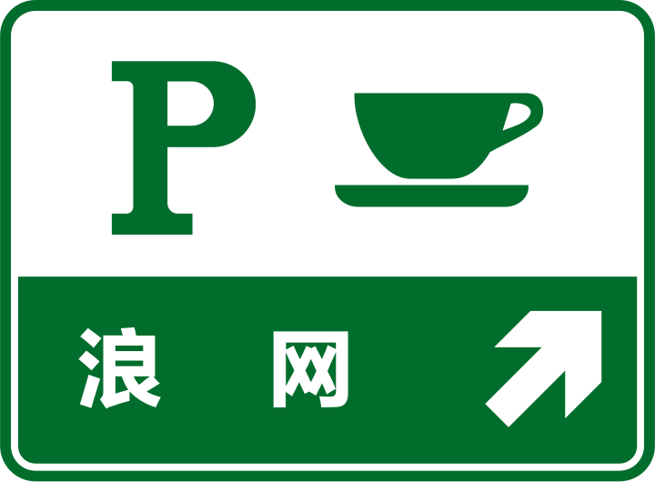 | 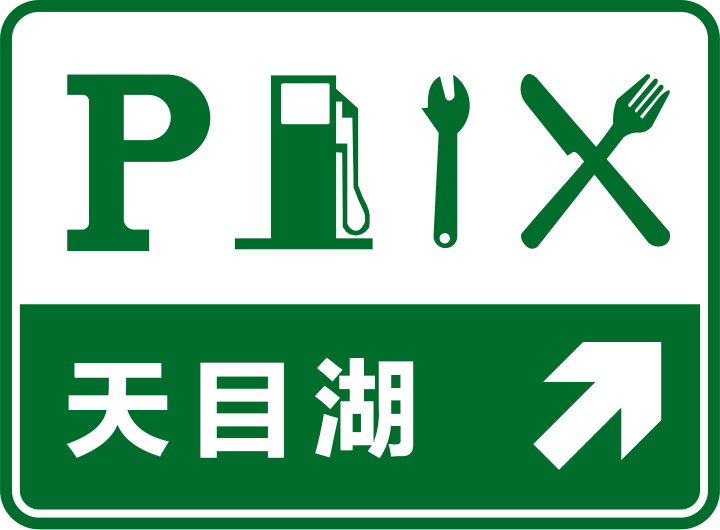 |
| :--------------------------------------------------: | :-----------------------------------------------: |
|                        停车区                        |                      服务区                       |

| 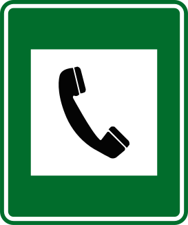 | 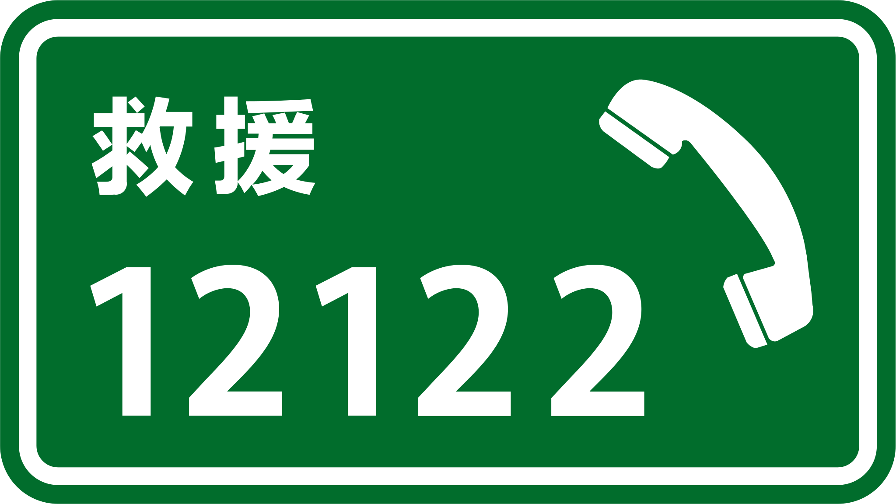 |
| :--------------------------------------------------: | :----------------------------------------------------: |
|                       紧急电话                       |                        救援电话                        |

|  | 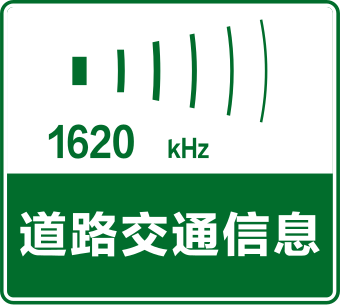 |
| :----------------------------------------------------: | :------------------------------------------------: |
|          **消防设备箱** ==不是灭火器！==          |                    交通广播频率                    |

### 新规

| 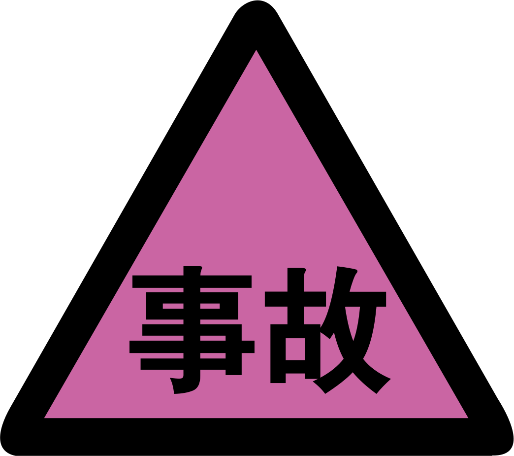 | 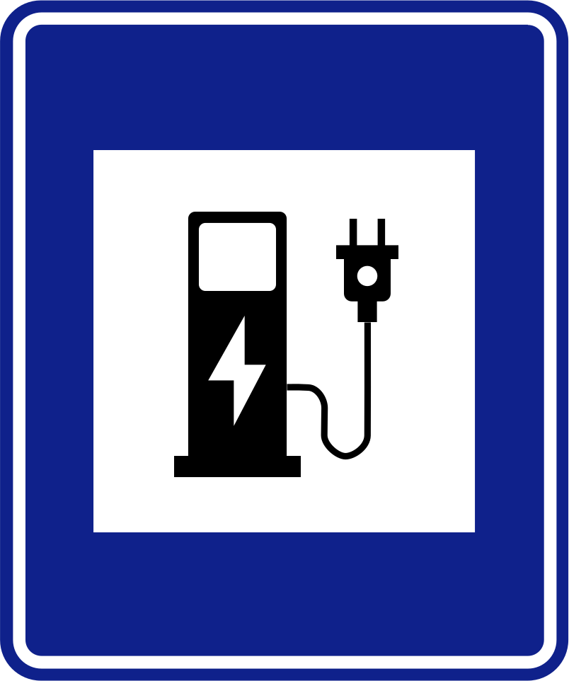 |  |  |  |
| :------------------------------------------------: | :--------------------------------------------------: | :-----------------------------------------------: | :--------------------------------------------------------: | :-------------------------------------------: |
|                    交通事故管理                    |                    电动汽车充电站                    |                      开车灯                       |                     非机动车与行人通行                     |               靠最右侧车道行驶                |
