# 信号与标志

## 信号灯

- 绿灯时，路口拥堵不得进
- 直行绿灯亮，可进入左转待行区
- 单黄灯闪：警示，路口交通信号暂时解除
- 圆形信号灯右转不受限

## 交警手势

- **停止信号**：坐高右低

  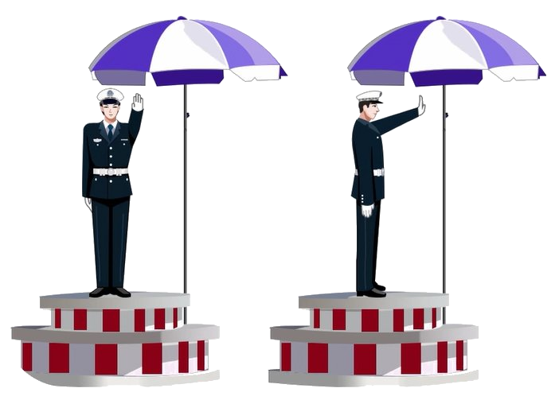

- **直行信号**：双手从未放下

  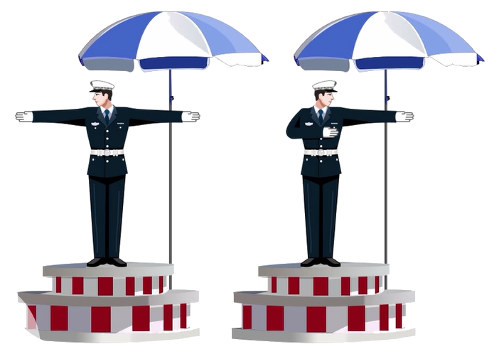

- **左转弯待转信号**：单左手下压

  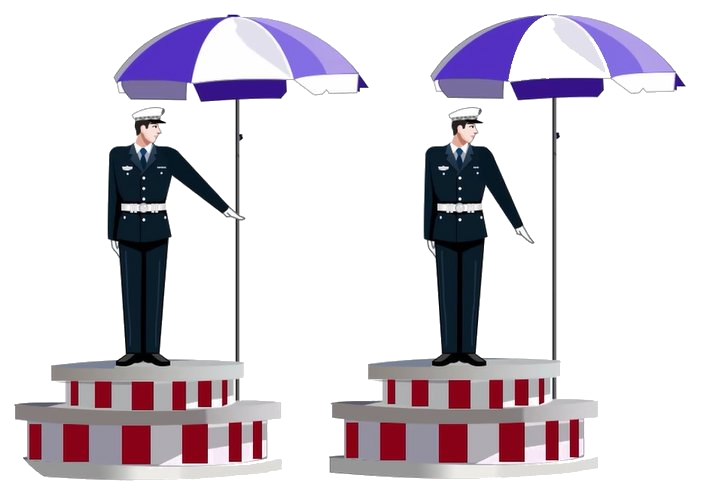

- **减速慢行信号**：单右手下压

  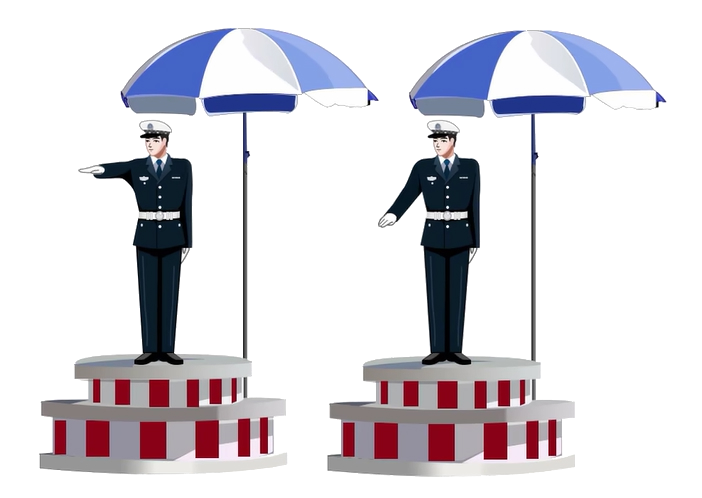

- **变道信号**：单右手向中间摆

  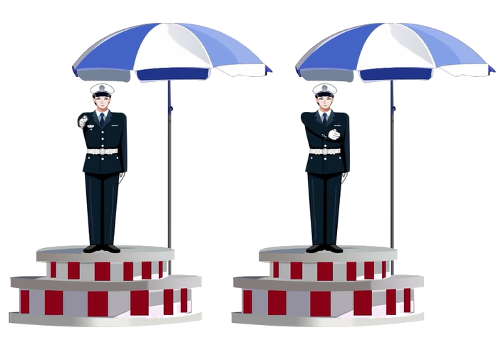

- **右转弯信号**：左手掌心朝前，右手在下

  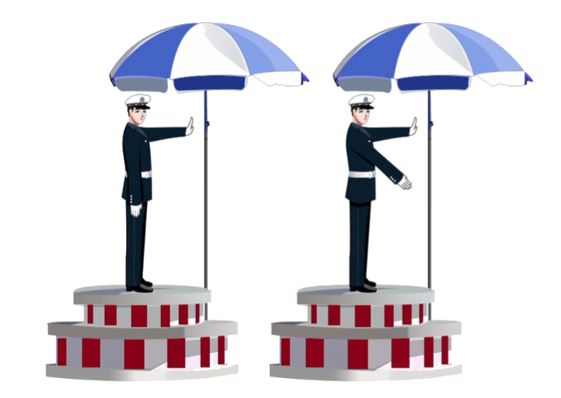

- **左转弯信号**：右手掌心朝前，左手在下（看到臂章选左转）

  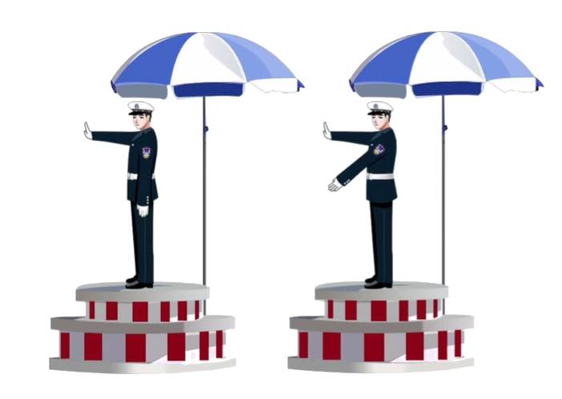

记忆：

1. 停止信号：左高右低
2. 直行信号：双手从未放下
3. 左转弯待转信号：单左手下压
4. 减速慢行信号：单右手下压
5. 变道信号：单右手向中间摆动
6. 转弯信号：一手掌心朝前，一手在下；哪只手在下，朝哪儿转

## 交通标志

### 常考内容

- 警告
  - 一急二反三连续
  
    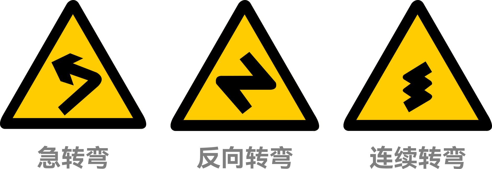
  
  - 有山有石是落石，有山没石是傍山险路
  
    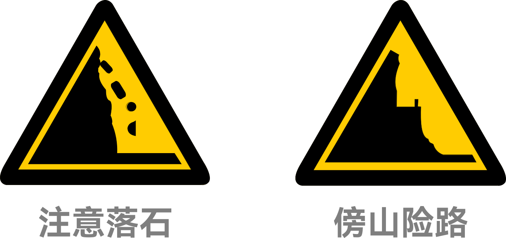
  
  - 火车头无人，栅栏有人
  
    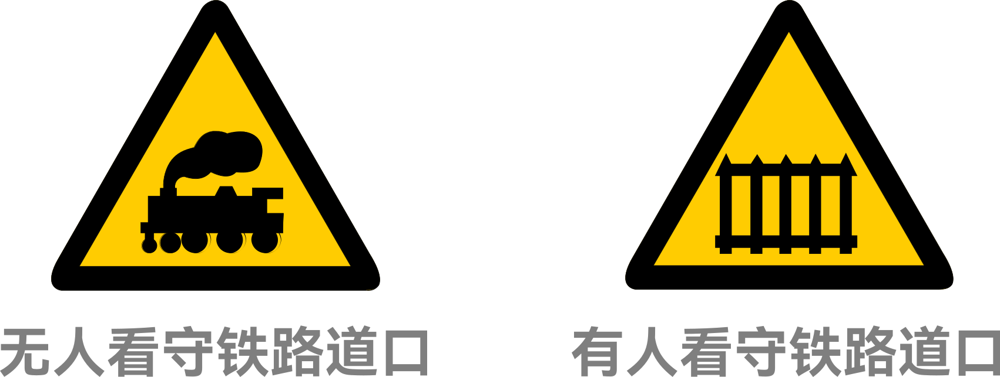
  
- 禁令
  - 红色禁止，黑色解除
  
    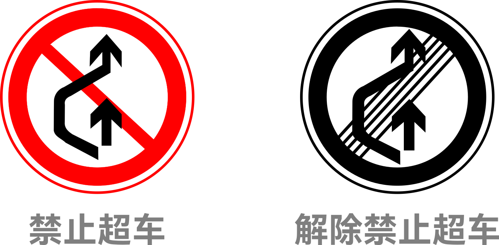
  
  - 三减八停
  
    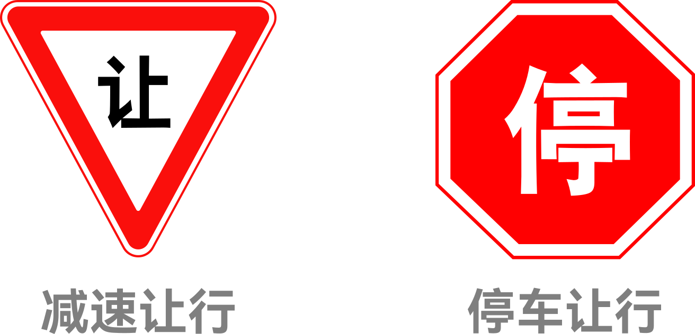
  
  - 正脸机动车，侧身对应车型
  
    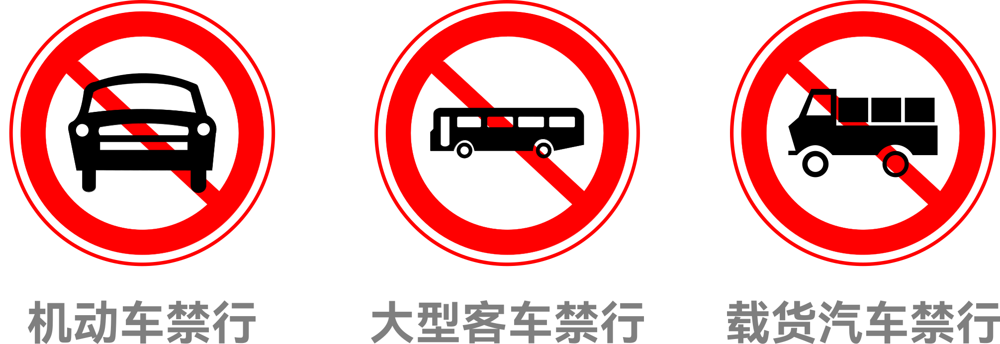
  
- 指示
  - 圆直方单，虚车道
  
    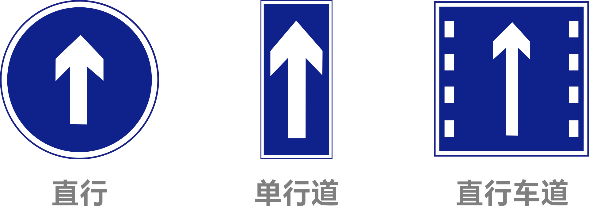
  
  - 箭头朝哪往哪走
  
  - 会车粗箭头先走
  
    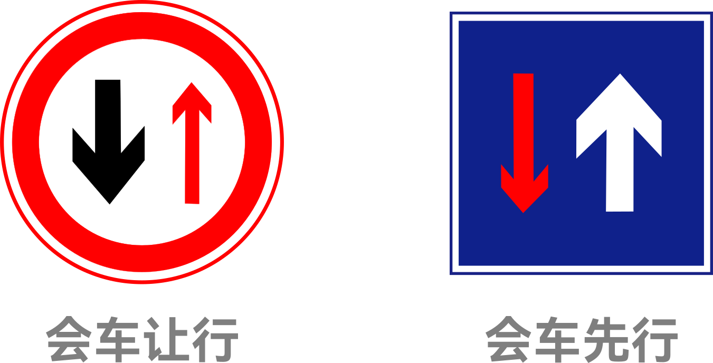

### 易混淆的标志

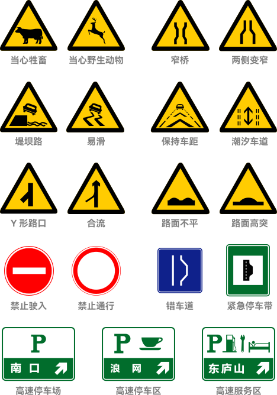
