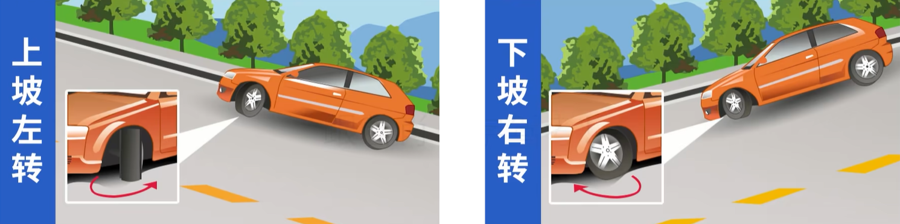
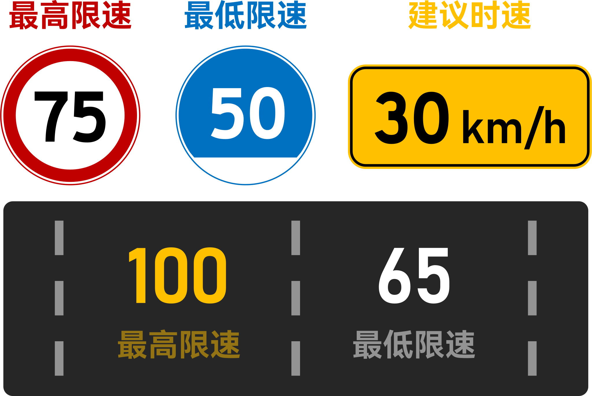
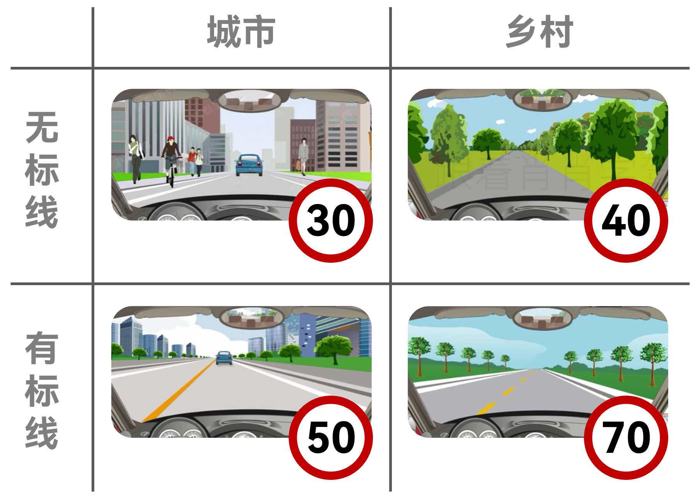

# 复杂路段

## 特殊路段

- 上坡
  - 提前减挡、踏加速踏板
  - 坡顶鸣喇叭示意
- 下坡
  - **不得空挡熄火滑行**
  - 挂低速挡，发动机制动
- 山区
  - 减速 鸣喇叭 靠右行
  - 坡长弯急、视距不足
- 铁路道口
  - 一停二看三通过
  - 中途**不得换挡**（换挡容易熄火）
- 环岛
  - 按逆时针方向行驶（进出都是右转）
  - 进不打灯，出开右转
- 隧道
  - 近光灯 / 示廓灯
  - 禁止停倒掉超
- 过水路面
  - **先停车**察明水情
  - 确认安全后**低速通过**
  - 间断轻踏恢复效能
- 泥泞路段
  - 易侧滑、甩尾
  - 向侧滑的一侧修正
  - 平整坚实路段通过

## 坡道停车打方向

上坡左打，下坡右打，溜坡时轮子卡住路肩，防止事故。

## 特殊天气

- 雨天
  - 路面湿滑
  - **行驶阻力减小**
  - **刚开始下雨时路最滑**（下久了会把泥水冲掉）
  - 雨刮刮不干净时靠边停车，**打双闪**
- 雾天
  - **雾天开雾灯**（不用远光）
  - 浓雾看不清时选择安全地点停车，**打双闪**
- 雪天
  - **制动距离延长**
  - 防滑链装在**驱动轮**，循车辙行驶
  - 前车通过后再上坡
  - 积雪对光反射，造成驾驶人眩目
- 大风天
  - 大风天**不得超车**
  - **握稳转向盘**
  - 按**风的来向**修正转向盘

## 速度高低

### 显式标志标线

- 标志：红高蓝低黄建议
- 标线：黄高白低

### 默认限制

**无线城 3 村 4，有线城 5 村 7**

### 特殊速度找 30

- 特殊路段：非机动车道、铁路道口、急弯、陡坡、窄路窄桥、冰雪路、泥泞路
- 特殊天气：雾天、雨天、雪天、沙尘、能见度在 **50 米内**时
- 牵引故障车

以上情况，**均限速 30 km/h**

## 高速公路

### 跟车距离

- 超过 100km/h，车距 > 100m
- 低于 100km/h，车距 ≥ 50m

### 速度要求

- 最高速度
  - 轿车 120km/h
  - 客车、货车 100km/h
- 各车道最低速度
  - 同向两车道：$\begin{array}{c:c}100&60\end{array}$
  - 同向三车道：$\begin{array}{c:c}110&90&60\end{array}$
  - 同向四车道：$\begin{array}{c:c}110&90&90&60\end{array}$

### 低能见度 <T yellow>重要</T>

|  口诀   |   能见度    |     车速      |   跟车距离   |
| :-----: | :---------: | :-----------: | :----------: |
| **261** | < **2**00 m | ≤ **6**0 km/h | ≥ **1**00 m  |
| **145** | < **1**00 m | ≤ **4**0 km/h | ≥ **5**00 m  |
| **520** | < **5**0 m  | ≤ **2**0 km/h | 尽快驶**离** |

