# 灯与仪表

## 打什么灯？

- **近光灯**
  - 起步、跟车
  - 交叉路口、隧道
- **远光灯**（==非必要不开远光==）
  - 只有夜间照明不良的路能开远光
  - 会车 **150 米**以外改为近光灯
- **远近光交替**（闪灯）
  - 夜间急弯坡道
  - 人行横道
  - 夜间没有信号灯控制的路口
  - **超车**
  - 提醒对向来车关闭远光
- **危险报警闪光灯**（==临时停车必须开==）
  - 牵引故障车、车辆发生故障
  - **低能见度**
- **雾灯**（==雾天==）

## 四个指针表

- 速度和里程表（单位 km/h）
- 发动机转速表（单位 ×1000 r/min，一般量程 1~8）
- 燃油表
- 水温表

## 常考照明指示

|                           |                                                                     |                                                                                   |
| :-----------------------: | :-----------------------------------------------------------------: | :-------------------------------------------------------------------------------: |
|       **近斜远平**        |       近光灯     |                   远光灯                  |
| **烤串** **前绿后黄** |       前雾灯       |              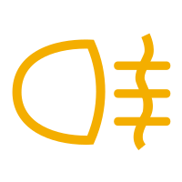 后雾灯              |
|           其他            |  前后位灯 / 示廓灯 |  危险报警闪光灯 |

## 操纵装置

### 操纵杆

口诀：**左灯右水**：

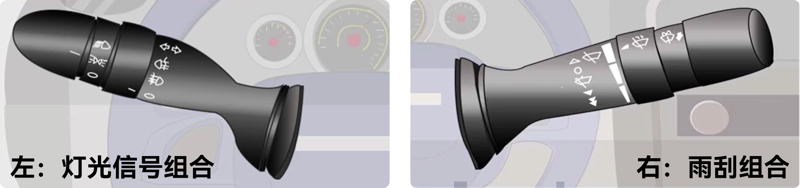

### 钥匙孔

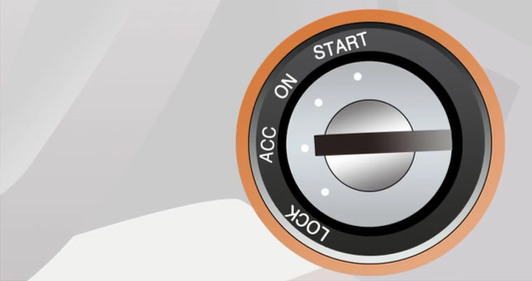

- **LOCK**：切断电源，锁定方向盘
- **ACC**：接通附件电源（accessories）
- **ON**：接通发动机外所有电源
- **START**：启动发动机

### 踏板

- 左离合（自动挡没有）
- 中制动（刹车）
- 右加速（油门）

## 常见图标

### 基本图标

|                                                                        |                                                                        |                                                              |                                                             |
| :--------------------------------------------------------------------: | :--------------------------------------------------------------------: | :----------------------------------------------------------: | :---------------------------------------------------------: |
|      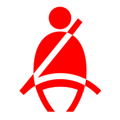  安全带未系      |       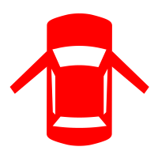  车门未关闭        |        空气内循环       |        空气外循环      |
|   **前**风窗玻璃 刮水器及洗涤器 |   **后**风窗玻璃 刮水器及洗涤器 |   **前**风窗除雾 |   **后**风窗除雾 |

记忆：**前扇后方**（前挡风图标是扇形，后挡风图标是方形）

### 四个过多/过少

技巧：**问温度就是高，其他都是过低/不足**

|                                                              |                                                                                |                                                                             |                                                                        |
| :----------------------------------------------------------: | :----------------------------------------------------------------------------: | :-------------------------------------------------------------------------: | :--------------------------------------------------------------------: |
| 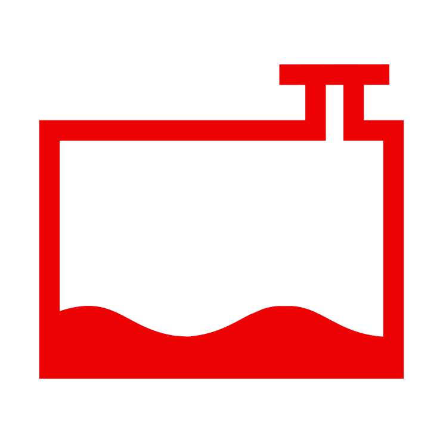  冷却液不足 | 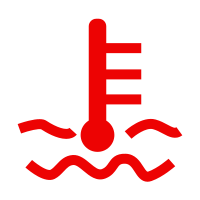  发动机温度过高 或冷却液不足 | 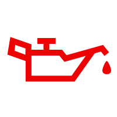  机油压力过低 或机油量不足 | 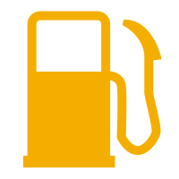  燃油已到 最低液面 |

### 六个状态灯

**只有 P 是工作，其他都是故障异常**（==这个灯也有可能是红的==）

|                                                                        |                                                                    |                                                                                |
| :--------------------------------------------------------------------: | :----------------------------------------------------------------: | :----------------------------------------------------------------------------: |
| 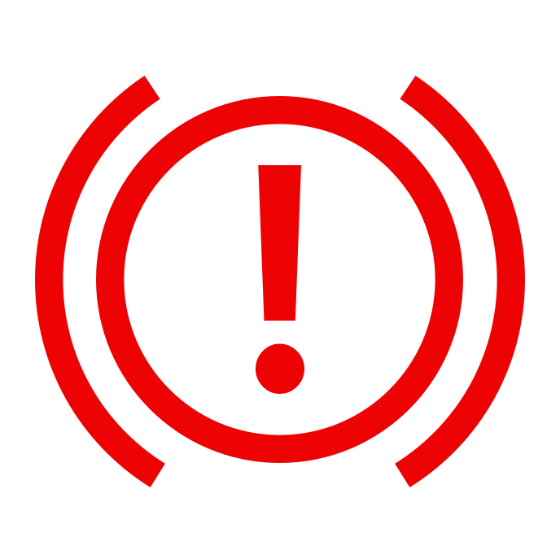  制动系统 异常或故障 | 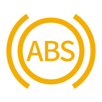  ABS 防抱死 系统故障 |   **驻车制动器 处于制动状态** |
|   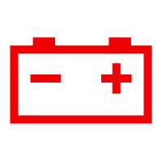  充电电路故障   | 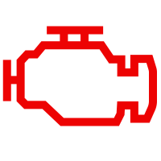  发动机故障 |       安全气囊**故障**      |

> [!tip]
>
> 驻车制动器就是手刹。
