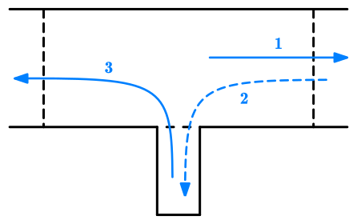
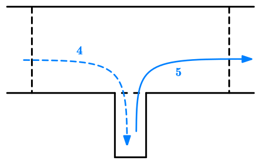

# 倒车入库

## 场地标线

## 考试要求

需要分别完成右倒库和左倒库，全程限时 3 分半钟。要求车头能入库、车尾不出库、车身不碰黄线。

1. 进场，前轮越过虚线；
2. 从右侧倒入库内；
3. 向左出库，前轮越过虚线；
4. 从左侧倒入库内；
5. 向右出库，平稳驶离。

## 点位

### 1. 进场

进场时车身与左侧边线保持在 1.5m 左右，观察方式为==左侧后视镜左下角与实线对齐==。

当==肩膀对齐虚线==时停车。

### 2. 右倒库

挂倒挡向后，当==左侧后视镜下边缘完全盖住虚线==时，方向盘向右打死。

观察右侧后视镜，==在前车门把手未进入虚线时==，如果==前车门把手已经盖住虚线右半段==（表明车身与边线距离小于 30cm），则方向盘回半圈，否则不回。

回头看左后视镜，==当可以从左后视镜中看到左后库角时==方向盘回正。观察左右后视镜中两边线与车身的夹角，哪边大方向盘就往哪边修正。

==当左侧后视镜盖住与车库前边缘线时==停车。

### 3. 向左出库

挂 D 挡前进，==当前方机盖边缘盖住前方实线时==向左打死方向盘。看车身正了就回正，==肩膀与虚线对齐==时停车。

### 4. 左倒库

挂倒挡向后，当==左侧后视镜下边缘碰到虚线时==方向盘向左打死。

观察左侧后视镜，==在前车门把手未进入虚线时==，如果==前车门把手已经盖住虚线左半段==（表明车身与边线距离小于 30cm），则方向盘回半圈，否则不回。

回头看右后视镜，==当可以从右后视镜中看到右后库角时==方向盘回正。观察左右后视镜中两边线与车身的夹角，哪边大方向盘就往哪边修正。

### 5. 向右出库

挂 D 挡前进，==当前方机盖边缘盖住前方实线时==向右打死方向盘。看车身正了就回正。

## 评判标准

- 不按照规定路线顺序行驶的，不合格；
- 项目完成时间超过 210 秒的，不合格；
- 倒车前两个前轮没驶过控制线的，不合格；
- 车头或车尾超出车位的，不合格；
- 中途停车的，扣 5 分。
