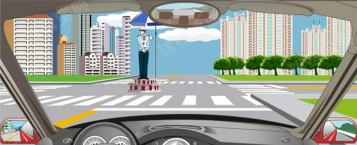
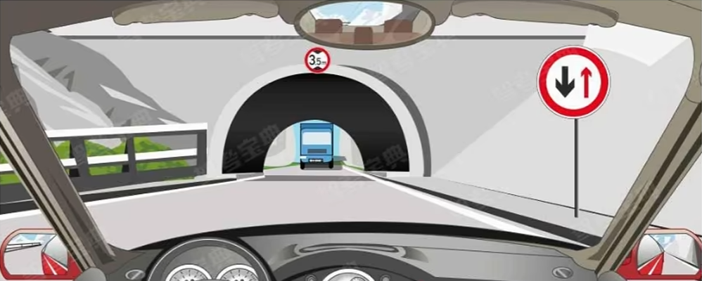
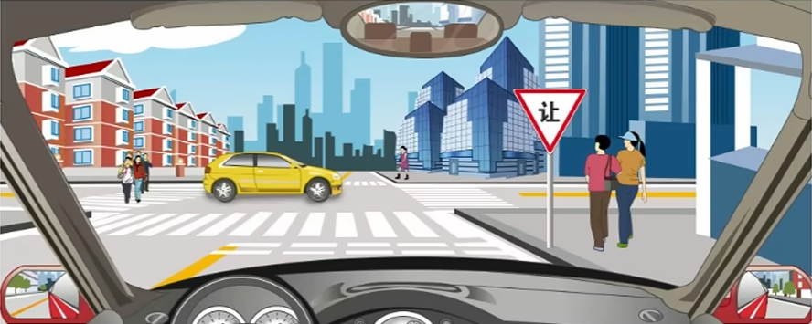
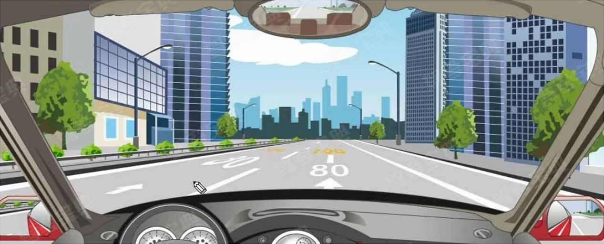
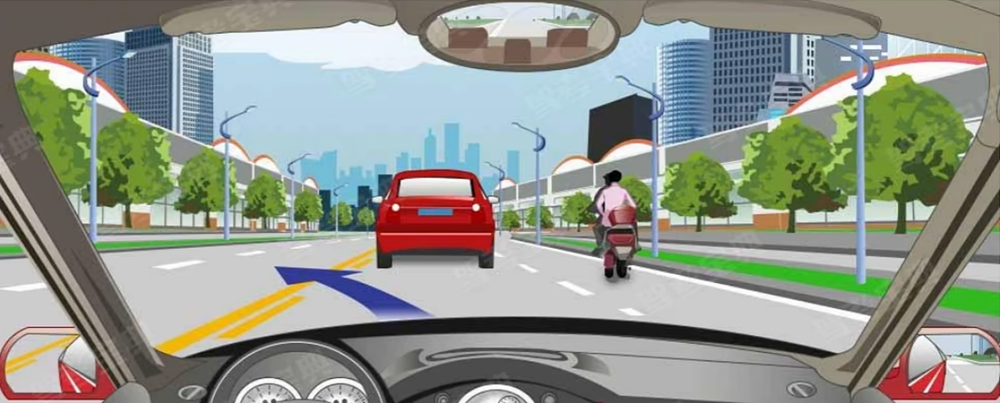

# 交通信号

交通信号分四种：

- 交警手势
- 信号灯
- 交通标志
- 交通标线

这在科目四不是重点。

## 交警手势

七个交警手势仍需要掌握（[科目一 1.10](../1-科目一/1.10-信号与标志#交警手势)）：

- 停止信号：左高右低
- 直行信号：双手从未放下
- 左转弯待转信号：单左手下压
- 减速慢行信号：单右手下压
- 变道信号：单右手向中间摆动
- 转弯信号：一手掌心朝前，一手在下；哪只手在下，朝哪儿转

科目四新考法：具体情境判断。

::: example

如图所示，看到这种手势信号时怎样行驶？

**A.** 在路口向左转弯 **B.** 停车等待 **C.** 在路口直行 **D.** 进入左弯待转区

---

此手势是右转信号，**但是交警面朝左侧，是指挥左侧车辆**。遇此情况应当**停车等候**。

【答案】**B**

:::

> [!important]
>
> 交警脸不对我，掌心对我：**我要停车**

## 标志标线

先复习 [科目一 1.10](../1-科目一/1.10-信号与标志#交通标志)。

::: example

如图所示，驾驶机动车遇到这种情况时，应在隧道口外靠右让行。

**A.** 正确 **B.** 错误

---

哪边粗哪边先走，对向先走因此要让行。

【答案】**A**

:::

::: example

驾驶机动车在有这种标志的路口应怎样通过最安全？

**A.** 停车观察路口情况 **B.** 加速尽快进入路口 **C.** 减速观察左后方情况 **D.** 减速缓慢进入路口

---

【答案】**D**

:::

::: example

路面标记表示这段道路上最高限速为 80 公里/小时。

**A.** 正确 **B.** 错误

---

限速标线黄高白低（[科目一 1.6](../1-科目一/1.6-复杂路段#显式标志标线)），因此是最低 80 最高 100。

【答案】**B**

:::

::: example

图中路中心黄色虚实线指示允许暂时越过超车。

**A.** 正确 **B.** 错误

---

虚线可跨，实线不可跨。虚线一侧，因此可以跨越。

【答案】**A**

:::

::: example

【多选】驾驶机动车在隧道内行驶，以下正确的说法是什么？

**A.** 车道线为白色虚线的，不得随意变更车道 **B.** 车道线为白色实线的，可以变更车道 **C.** 车道线为白色实线的，禁止变更车道 **D.** 车道线为白色虚线的，禁止变更车道

---

虚线可跨，实线不可跨。C 正确。

**无论如何都不能==随意==变更车道。A 正确。**

【答案】**AC**

:::

