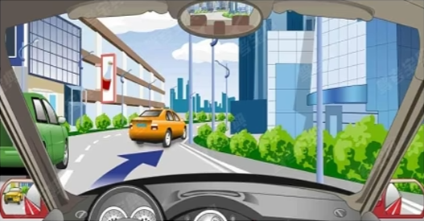
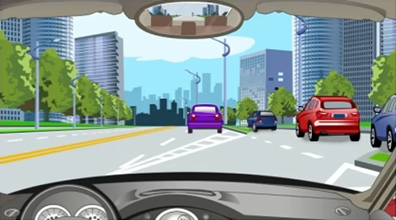
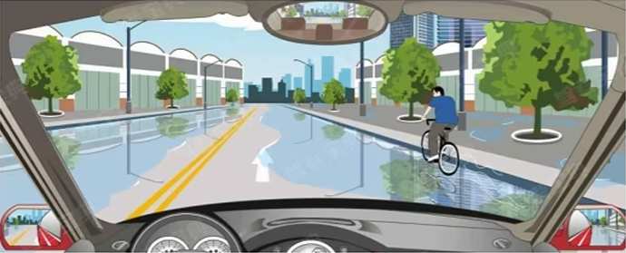
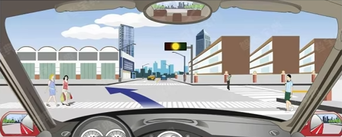
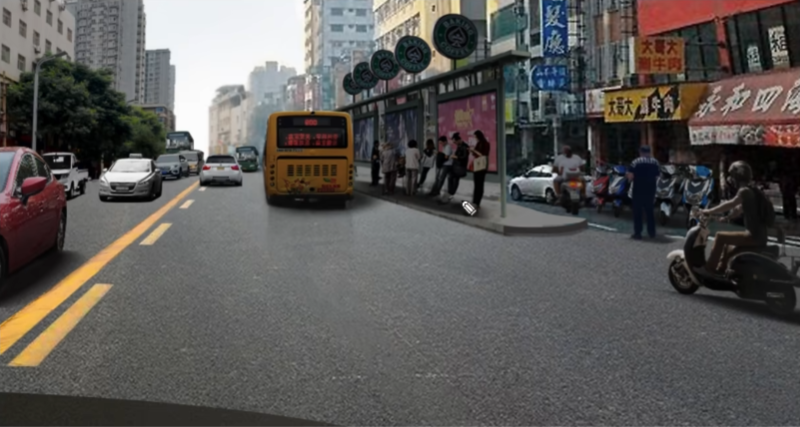
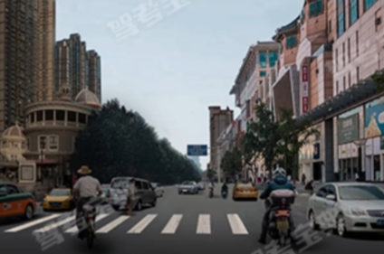
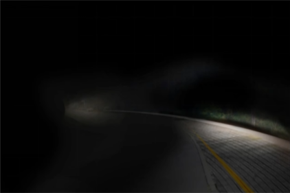

# 安全文明驾驶

## 实际案例

安全都是对的，不安全都是错的。

- **正确**：减速、停车、靠右、让行、安全距离、依次、观察
- **错误**：加速、急转、紧急制动、随意、连续鸣喇叭、紧跟

适用于各类题型，包括：

- 起步、跟车、会车、超车、停车
- 遇车、遇人、特殊路段、特殊天气

::: example

驾驶机动车遇到这种情况应怎样礼让？

**A.** 迅速加速行驶 **B.** 紧跟前车行驶 **C.** 靠右加速行驶 **D.** 靠右减速让行

---

【答案】**D**

:::

::: example

【多选】在这种情况下从主路进入辅路怎样汇入车流？

**A.** 保持必要的安全距离 **B.** 紧跟其后行驶 **C.** 连续鸣喇叭示意 **D.** 低速慢行

---

【答案】**AD**

:::

::: example

驾驶机动车跟车行驶遇到前车遮挡路口交通信号灯时，以下正确的做法是什么？

**A.** 紧跟前车通过交叉口 **B.** 减速做好停车准备 
**C.** 立即变更车道 **D.** 立即停车

---

【答案】**B**

:::

::: example

如图所示，驾驶机动车在这种情况下，要尽快加速通过。

**A.** 正确 **B.** 错误

---

【答案】**B**

:::

::: example

驾驶机动车此时可加速通过路口。

**A.** 正确 **B.** 错误

---

【答案】**B**

:::

::: example

如遇前方机动车正在超车，以下错误的做法是什么？

**A.** 加速行驶，强行超越 **B.** 停止超车，保持安全距离 **C.** 停止超车，让前方机动车先超车 **D.** 连续鸣喇叭催促前车让路

---

【答案】**AD**

:::

## 安全装置

只记两个，必须严格对应

- **安全带**：作用是==减轻驾乘人员伤害==（必须系后排也要系）
- **安全头枕**：作用是==保护颈部，支撑头部==

凡是上面以外的作用均为错

::: example

【多选】车辆发生碰撞时，关于安全带作用的说法**错误**的有

**A.** 保护颈部不受伤害 **B.** 减轻驾乘人员受伤程度 **C.** 减轻驾驶人疲劳 **D.** 保持正确驾驶姿势

---

【答案】**ACD**

:::

::: example

怎样调整汽车座椅安全头枕的高度？

**A.** 调整到头枕中心对正颈部 **B.** 调整到头枕中心与颈部平齐 **C.** 调整到头枕中心高出头顶 **D.** 调整到头枕中心能==支撑头部==

---

【答案】**D**

:::

## 危险品

只记两个（注意区分）：

- **爆炸品**：火药、炸药、起爆药（**带“药”的都是爆炸品**）
- **易燃固体**：火柴、硫磺、赤磷

易燃固体只烧，爆炸品不仅烧还会炸

运输：公安批准、了解特性、警示标

::: example

火柴、硫磺和赤磷属于哪类危险化学品？

**A.** 爆炸品 **B.** 氧化性物质 **C.** 自燃物品 **D.** 易燃固体

---

【答案】**D**

:::

## 「问注意」题

- **多选考==应注意==什么？优先考虑==全选==**
- 再排除警示词：**远光灯、加速**……

::: example

【多选】如图所示，驾驶机动车驶近公交车站时驾驶人==应注意==什么？

**A.** 下车的乘客可能从公交车前方横穿道路 **B.** 公交车可能即将启动并向左变更车道 **C.** 右侧摩托车可能驶入机动车道并穿插变更车道 **D.** 对向车道内的机动车可能违法跨越道路中心线超车

---

【答案】**ABCD**

:::

::: example

【多选】如图所示，驾驶机动车驶近这样的人行横道时，驾驶人==应注意==什么？

**A.** 前方行人可能滞留在人行横道内 **B.** 左前方骑自行车者可能突然右转弯 **C.** 右前方骑摩托车者可能突然向左变更车道横穿道路 **D.** 右前方白色机动车行驶动态

---

【答案】**ABCD**

:::

::: example

【多选】驾驶机动车在行驶过程中遇横风==应注意==什么？

**A.** 握紧转向盘 **B.** 车辆行驶方向偏移 **C.** 需要减速行驶 **D.** 尽量避免制动

---

横风时抓地力不足，确实需要避免制动，D 是正确的。

【答案】**ABCD**

:::

::: example

【多选】如图所示，驾驶机动车遇到这种情况时，==应注意==哪些情况？

**A.** 我方车辆灯光照向路外，前方即将进入弯道 **B.** 前方有灯光出现，可能即将发生会车 **C.** 左前方视线受阻，转弯后可能遇到突发情况 **D.** 为提高会车安全，改用==远光灯==

---

【答案】**ABC**

:::
