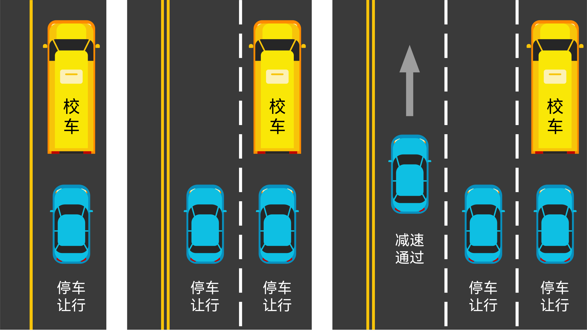

# 通行原则

## 核心口诀

- 辅让主 右让左 弯让直 右方先行
- 禁止停车：口五站三
- 加速、迅速、随意、空挡滑行**都是错的**
- 减速、缓慢、避让**都是对的**
- 一停二看三通过
- 会车减速靠右，遇人停车减速

## 会车让行题

- **路口**
  - **右让左**：右转让左转
  - **弯让直**：转弯让直行
  - **右方先行**：上述条件相同，则让右边的
- 障碍：有障碍让无障碍
- 环岛：环岛外让环岛内
- 山路：靠山让临崖
- 斜坡：**一般上坡先行，但下坡下到一半时下坡先行**
- 特殊车辆先行

## 超车

### 禁止超车的情形

- 前车转弯掉头超车
- 特殊车辆
- 特殊路段（隧道）
- 无超车条件、不让超（前车向左摆等）
- 会车可能

### 超车的要求

- **超车只能从左侧超**
- 变换远近光灯或鸣喇叭示意
- 尽快超越，减少并行时间
- 驶回提前打右转
- 被超越，减速靠右让

## 变道

- 依次行驶
- 不得频繁变更车道
- 每次只能变更一条车道（不得连续变道）
- 不能跨实线

## 禁停

- 人行横道、施工路段
- 禁停标志标线
- **口 5**：交叉路口、隧道、急转弯 **50m 内不得停车**
- **站 3**：公交站、加油站、消防站等 **30m 内不得停车**

> [!tip]
>
> 违停扣 1 分。

## 校车让行 <T yellow>易错</T>

**一、二车道停，三车道最左侧减速**：

