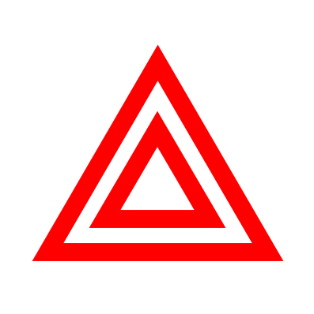

# 灯与仪表

## 打什么灯？

- **近光灯**
  - 起步、跟车
  - 交叉路口、隧道
- **远光灯**（==非必要不开远光==）
  - 只有夜间照明不良的路能开远光
  - 会车 **150 米**以外改为近光灯
- **远近光交替**（闪灯）
  - 夜间急弯坡道
  - 人行横道
  - 夜间没有信号灯控制的路口
  - **超车**
  - 提醒对向来车关闭远光
- **危险报警闪光灯**（==临时停车必须开==）
  - 牵引故障车、车辆发生故障
  - **低能见度**
- **雾灯**（==雾天==）

## 仪表

四个指针表：

- 速度和里程表（单位 km/h）
- 发动机转速表（单位 ×1000 r/min）
- 燃油表
- 水温表

常考照明：

|       口诀        |                                                              |                                                              |
| :---------------: | :----------------------------------------------------------: | :----------------------------------------------------------: |
|     近斜远平      |   近光灯  |        远光灯        |
| 烤串 前绿后黄 |    前雾灯   |    后雾灯    |
|       其他        |  前后位灯 / 示廓灯 |  危险报警闪光灯 |

