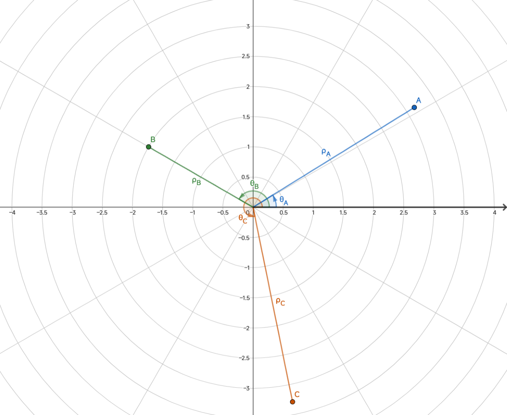

# 2.6\* 补充：极坐标与常见图线

## 基本概念



我们在平面内取一个定点 $O$，叫做**极点**，引一条射线 $Ox$，叫做**极轴**，再选定一个长度单位和角度正方向（默认为逆时针方向），建立起一个坐标轴，称为**极坐标**。对于平面内任意一点 $M$，用 $\rho$ 表示 $OM$ 的长度，$\theta$ 表示 $Ox$ 到 $OM$ 转过的角，则称 $\rho$ 为 $M$ 的级径，$\theta$ 为 $M$ 的极角，有序对 $(\rho ,\theta)$ 称为 $M$ 的极坐标。

通常情况下，极径坐标单位为 $1$，极角坐标单位为 $\rm rad$。

## 表示含义

极坐标相对于直角坐标系，它只关心点到 $O$ 的距离 $\rho$，和 $OM$ 的偏转角 $\theta$，能够更好得描绘曲线，关注线段的长度与所构成的角度（这点在解析几何中作用显著），并能以一种更美观的形式表示直角坐标系所不能描绘的图样。

## 与笛卡尔坐标系互化

$$
\left\{\begin{array}l
  x=\rho \cos \theta \\
  y=\rho \sin \theta \\
\end{array}\right.
$$

即

$$
\left\{\begin{array}l
  x^2+y^2=\rho^2\\
  \frac{y}{x}=\tan\theta \\
\end{array}\right.
$$

## 常见曲线

### 含两种坐标表示的

#### 心形线

$$
\begin{gathered}
x^2+y^2+ax=a \sqrt{x^2+y^2}\\
\rho =a(1-\cos \theta)
\end{gathered}
$$

::: details $a=1$ 时的心形线

```graph
data:
  - r: a*(1-cos(theta))
    scope:
      a: 1
    fnType: polar
    graphType: polyline
x:
  domain:
    - -5
    - 3
```

:::

#### 伯努利双纽线

$$
\begin{gathered}
(x^2+y^2)^2=2a^2xy \\
\rho ^2=a^2\sin 2 \theta
\end{gathered}
$$

或者是

$$
\begin{gathered}
(x^2+y^2)^2=a^2(x^2-y^2) \\
\rho^2=a^2\cos 2 \theta
\end{gathered}
$$

::: details $a=1$ 时的伯努利双纽线

```graph
data:
  - r: sqrt(sin(2*theta))
    fnType: polar
    graphType: polyline
  - r: -sqrt(sin(2*theta))
    fnType: polar
    graphType: polyline
    color: steelblue
  - points:
    - - 0.0004197865
      - 0.0943366429
    - - -0.0004197865
      - -0.0943366429
    fnType: points
    graphType: polyline
    color: steelblue
x:
  domain:
    - -3
    - 3
```

:::

### 极坐标表示

#### 阿基米德螺线

$$
\rho =a \theta
$$

::: details $a=1$ 时的阿基米德螺线

```graph
data:
  - r: a*theta
    fnType: polar
    graphType: polyline
    scope:
      a: 1
    range:
      - 0
      - 105
    nSamples: 2000
x:
  domain:
    - -30
    - 30
```

注：为便于观察，此图只绘出阿基米德螺线的一支，另一支与此图关于 y 轴对称。此图应向外无限延伸。出于性能考虑，只渲染 $-100 < x < 100$ 的图形。

:::

#### 对数螺线

$$
\rho =e^{a \theta}
$$

::: details $a=\frac15$ 时的对数螺线

```graph
data:
  - r: exp(0.2*theta)
    fnType: polar
    graphType: polyline
    range:
      - -50
      - 50
```

注：此图应向内向外无限延伸。出于性能考虑，只渲染 $10^{-4} < |x| <10^4$ 的图形。

:::

#### 双曲螺线

$$
\rho \theta=a
$$

::: details $a=1$ 时的双曲螺线

```graph
data:
  - r: 1/theta
    fnType: polar
    graphType: polyline
    range:
      - 0.1
      - 500
    nSamples: 20000
  - x: 0.002*sin(t)
    y: 0.002*cos(t)
    fnType: parametric
    graphType: polyline
    closed: true
    color: steelBlue
  - points:
    - - 9.95004165
      - 0.99833417
    - - 1000
      - 1
    fnType: points
    graphType: polyline
    color: steelBlue
y:
  domain:
    - -1
    - 1
```

注：为便于观察，仅绘出双曲螺线的一支。另一只与此图线关于 y 轴对称。此图应向内向外无限延伸。出于性能考虑，只渲染 $10^{-2} < |x| <10^3$ 的图形。

:::

#### 三叶玫瑰线

$$
\rho =a \cos 3 \theta
$$

或

$$
\rho = a \sin 3 \theta
$$

::: details $a=1$ 时的三叶玫瑰线

```graph
data:
  - r: a*cos(3*theta)
    fnType: polar
    graphType: polyline
    scope:
      a: 1
y:
  domain:
    - -1.5
    - 1.5
```

:::

#### 四叶玫瑰线

$$
\rho =a \cos 2 \theta
$$

或

$$
\rho = a \sin 2 \theta
$$

::: details $a=1$ 时的四叶玫瑰线

```graph
data:
  - r: a*cos(2*theta)
    fnType: polar
    graphType: polyline
    scope:
      a: 1
y:
  domain:
    - -1.5
    - 1.5
```

:::

### 参数方程表示

#### 笛卡尔叶形线

$$
\begin{gathered}
x^3+y^3-3axy=0\\
\left\{\begin{array}l
x=\frac{3at}{1+t^3}\\
y=\frac{3at^2}{1+t^3}
\end{array}\right.
\end{gathered}
$$

::: details $a=1$ 时的笛卡尔叶形线

```graph
data:
  - x: 3*t/(1+t^3)
    y: 3*t^2/(1+t^3)
    fnType: parametric
    graphType: polyline
    range:
      - 0
      - 4
  - x: 3*t/(1+t^3)
    y: 3*t^2/(1+t^3)
    fnType: parametric
    graphType: polyline
    range:
      - 4
      - 500
    color: steelblue
  - x: 3*t/(1+t^3)
    y: 3*t^2/(1+t^3)
    fnType: parametric
    graphType: polyline
    range:
      - -2
      - -1
    color: steelblue
  - x: 3*t/(1+t^3)
    y: 3*t^2/(1+t^3)
    fnType: parametric
    graphType: polyline
    range:
      - -0.999
      - 0
    color: steelblue
  - x: 3*t/(1+t^3)
    y: 3*t^2/(1+t^3)
    fnType: parametric
    graphType: polyline
    range:
      - -500
      - -2
    color: steelblue
  - points:
    - - 0.000012
      - 0.005999999952
    - - -0.000012
      - -0.005999999952
    fnType: points
    graphType: polyline
    color: steelblue
```

注：此图应向内向外无限延伸。出于性能考虑，只渲染 $-10^3 < x < 10^3$ 的图形。

:::

#### 星形线

$$
\begin{gathered}
x^{\frac{2}{3}}+y^{\frac{2}{3}}=a^{\frac{2}{3}}\\
\left\{\begin{array}l
 x=a\cos^3\theta\\
y=a \sin ^3 \theta\\
\end{array}\right.
\end{gathered}
$$

::: details $a=1$ 时的星形线

```graph
data:
  - x: cos(t)^3
    y: sin(t)^3
    fnType: parametric
    graphType: polyline
    range:
      - -3
      - 3
y:
  domain:
    - -1.5
    - 1.5
```

:::

#### 摆线

$$
\left\{\begin{array}l
x=a(\theta-\sin \theta)\\
y=a(1-\cos \theta) \\
\end{array}\right.
$$

::: details $a=1$ 时的摆线

```graph
data:
  - x: t-sin(t)
    y: 1-cos(t)
    fnType: parametric
    graphType: polyline
    range:
      - -100
      - 100
x:
  domain:
    - -20
    - 20
```

注：此图应向左向右无限延伸。出于性能考虑，只渲染 $-100 < x < 100$ 的图形。

:::

### 其他

#### 概率曲线

$$
y=e^{-x^2}
$$

::: details $a=1$ 时的概率曲线

```graph
data:
  - fn: exp(-x^2)
y:
  domain:
    - -1
    - 2
```

:::

#### 箕舌线

$$
y=\frac{8a^3}{x^2+4a^2}
$$

::: details $a=1$ 时的箕舌线

```graph
data:
  - fn: 8/(x^2+4)
y:
  domain:
    - -3
    - 5
```

:::

#### 蔓叶线

$$
y^2(2a-x)=x^3
$$

::: details $a=1$ 时的蔓叶线

```graph
data:
  - fn: y^2*(2-x)-x^3
    fnType: implicit
x:
  domain:
    - -4
    - 5.5
```

:::