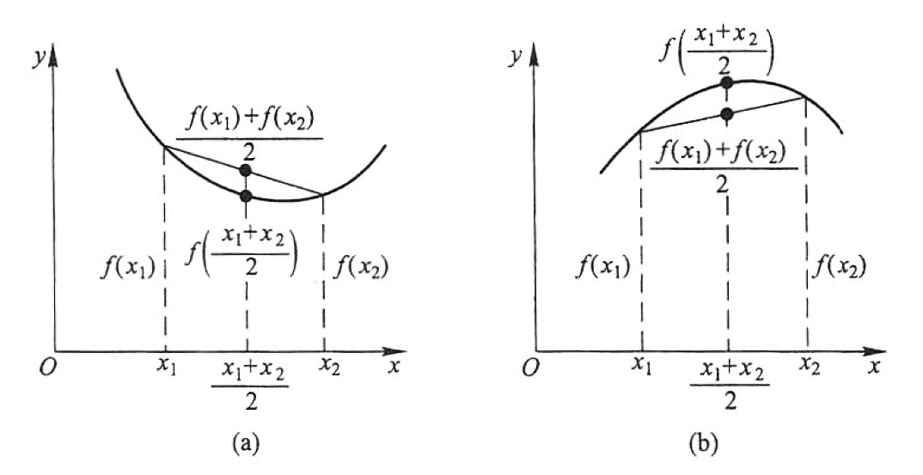

# 3.6 函数的单调性与曲线的凹凸性

## 函数单调性的判定

**定理** 设函数 $y=f(x)$ 在 $[a,b]$ 上连续，在 $(a,b)$ 内可导，

- 如果在 $(a,b)$ 内 $f'(x)\ge0$，且等号仅在有限多个点处成立，那么函数 $y=f(x)$ 在 $[a,b]$ 上单调增加；
- 如果在 $(a,b)$ 内 $f'(x)\le0$，且等号仅在有限多个点处成立，那么函数 $y=f(x)$ 在 $[a,b]$ 上单调减少。

如果把这个判定法中的闭区间换成其他各种区间（对于无穷区间，要求在其任一有限的子区间上满足定理的条件），那么结论也成立。

可通过拉格朗日中值定理证明。

> [!important]
>
> 至此，高数内容全面覆盖高中所学的与导数有关的内容。

## 曲线的凹凸性与拐点

**定义：** 设 $f(x)$ 在区间 $I$ 上连续，$\forall x_1,x_2\in I$，

- 如果恒有
  $$
  f\left({x_1+x_2\over2}\right)<{f(x_1)+f(x_2)\over2}
  $$
  那么称 $f(x)$ 在 $I$ 上的**图形是（向上）凹的**（或**凹弧**）；

- 如果恒有
  $$
  f\left({x_1+x_2\over2}\right)>{f(x_1)+f(x_2)\over2}
  $$
  那么称 $f(x)$ 在 $I$ 上的**图形是（向上）凸的**（或**凸弧**）。

如果函数 $f(x)$ 在 $I$ 内具有二阶导数，那么可以利用二阶导数的符号来判定曲线的凹凸性，这就是下面的曲线凹凸性的判定定理。

**定理** 设 $f(x)$ 在 $[a,b]$ 上连续，在 $(a,b)$ 内具有一阶和二阶导数，那么

- 若在 $(a,b)$ 内 $f''(x)>0$，则 $f(x)$ 在 $[a,b]$ 上的图形是凹的；
- 若在 $(a,b)$ 内 $f''(x)<0$，则 $f(x)$ 在 $[a,b]$ 上的图形是凸的；

这里证明第一个情形。第二个同理。

设 $x_1,x_2$ 为 $[a,b]$ 内任意两点，且 $x_1<x_2$。记 $x_0=\frac12(x_1+x_2)$，并记 $x_2-x_0=x_1-x_0=h$，则 $x_1=x_0-h$，$x_2=x_0+h$，由拉格朗日中值公式，得
$$
\begin{gathered}
f(x_0+h)-f(x_0)=f'(x_0+\theta_1h)h \\
f(x_0)-f(x_0-h)=f'(x_0-\theta_2h)h
\end{gathered}
$$
其中 $\theta_1,\theta_2\in(0,1)$。

两式相减，可得
$$
f(x_0+h)+f(x_0-h)-2f(x_0)=[f'(x_0+\theta_1h)-f'(x_0-\theta_2h)]h
$$
对 $f'(x)$ 在区间 $[x_0-\theta_2h,x_0+\theta_1h]$ 上再利用拉格朗日中值公式，得
$$
[f'(x_0+\theta_1h)-f'(x_0-\theta_2h)]h=f''(\xi)(\theta_1+\theta_2)h^2
$$
其中 $\xi\in(x_0-\theta_2h,x_0+\theta_1h)$。按情形 1 的假设，$f''(\xi)>0$，因此有
$$
\begin{align}
&\,f(x_0+h)+f(x_0-h)-2f(x_0) \\
=&\,[f'(x_0+\theta_1h)-f'(x_0-\theta_2h)]h \\
=&\,f''(\xi)(\theta_1+\theta_2)h^2 \\
>&\,0
\end{align}
$$
也就是说
$$
f\left({x_1+x_2\over2}\right)<{f(x_1)+f(x_2)\over2}
$$
所以 $f(x)$ 在 $[a,b]$ 上的图形是凹的。证毕。

如果把这个判定法中的闭区间换成其他各种区间（包括无穷区间），那么结论也成立。
