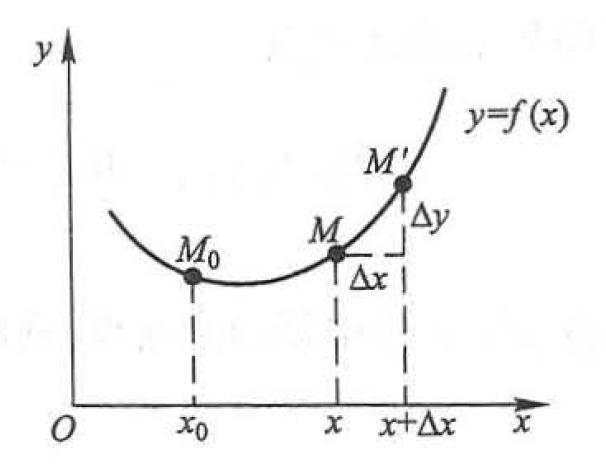

# 3.8 曲率

## 弧微分

设函数 $f(x)$ 在区间 $(a,b)$ 内具有连续导数，在曲线 $y=f(x)$ 上取固定点 $M_0(x_0,y_0)$ 作为度量弧长的基点，并规定依 $x$ 增大的方向作为曲线的正向。

对于曲线上任意一点 $M(x,y)$，规定有向弧段 $\overset{\LARGE{\frown}}{M_0M}$ 的的值 $s$（简称为弧 $s$）如下：$s$ 的绝对值等于这弧段的长度，当有向弧段 $\overset{\LARGE{\frown}}{M_0M}$ 的方向与曲线的正向一致时 $s>0$，相反时 $s<0$。显然，弧 $s$ 与 $x$ 存在函数关系 $s=s(x)$，且这是一个单调增加的函数。

设 $x$ 与 $x+\Delta x$ 为 $(a,b)$ 内两个邻近的点，其在曲线上的对应点分别为 $M$ 和 $M'$。设 $x$ 的增量为 $\Delta x$，$s$ 的增量为 $\Delta s$，则当 $M$ 与 $M'$ 接近时，有
$$
{\Delta s\over\Delta x}={\overset{\LARGE{\frown}}{MM'}\over \Delta x}\Rightarrow {{\rm d}s\over{\rm d}x}={MM'\over {\rm d}x}=\sqrt{1+y'^2}
$$
故有
$$
{\rm d}s=\sqrt{1+y'^2}\,{\rm d}x
$$

## 曲率及其计算公式

当曲线上每一点处都具有切线，且切线随切点的移动而连续转动，这样的曲线称为**光滑曲线**。

设曲线 $C$ 是光滑的，在曲线 $C$ 上选定一点 $M_0$ 作为度量弧 $s$ 的基点。设曲线上点 $M$ 对应于弧 $s$，在点 $M$ 处切线的倾角为 $\alpha$ （这里假定曲线 $C$ 所在的平面上已设立了 $xOy$ 坐标系），曲线上另外一点 $M'$ 对应于弧 $s+\Delta s$，在点 $M'$ 处切线的倾角为 $\alpha+\Delta\alpha$， 则弧段 $\overset{\LARGE{\frown}}{MM'}$ 的长度为 $|\Delta s|$，当动点从点 $M$ 移动到点 $M'$ 时切线转过的角度为 $|\Delta\alpha|$。

