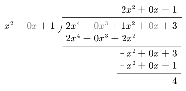

# 4.5 有理函数的积分

两个多项式的商 $\dfrac{P(x)}{Q(x)}$ 称为**有理函数**，又称**有理分式**。一般地，我们讨论 $P(x)$ 与 $Q(x)$ 没有公因式的情况。

## 假分式的拆分

当分子 $P(x)$ 的次数小于分母 $Q(x)$ 的次数时，该式称为**真分式**，否则称为**假分式**。**假分式一定可以化为多项式与真分式的和**。可以使用配凑法或多项式除法（长除法）。

::: example 例：使用配凑法化简
$$
\begin{align}
&\hspace{24mu}{2x^4+x^2+3\over x^2+1}\\
&={2x^2(x^2+1)-x^2+3\over x^2+1}\\
&={2x^2(x^2+1)-(x^2+1)+4\over x^2+1}\\
&={(2x^2-1)(x^2+1)+4\over x^2+1}\\
&=2x^2-1+{4\over x^2+1}\\
\end{align}
$$
:::

::: example 例：使用长除法化简

对于假分式

$$
2x^4+x^2+3\over x^2+1
$$

将分子除以分母

因此有

$$
\begin{gathered}
2x^4+x^2+3=(2x^2-1)(x^2+1)+4 \\
\Rightarrow{2x^4+x^2+3\over x^2+1}=2x^2-1+{4\over x^2+1}
\end{gathered}
$$

:::

## 真分式的拆分

对于真分式 $\dfrac{P(x)}{Q(x)}$，如果分母 $Q(x)$ 可以因式分解为 $Q_1(x)Q_2(x)$，那么该分式可以拆成两个真分式之和

$$
{P(x)\over Q(x)}={P_1(x)\over Q_1(x)}+{P_2(x)\over Q_2(x)}
$$

上述步骤称为把真分式化为部分分式之和。

下面举几个真分式的积分的例子。

::: example

$$
\int{x+1\over x^2-5x+6}{\rm d}x
$$

解：被积函数的分母分解成 $(x-3)(x-2)$，故可设

$$
{x+1\over x^2-5x+6}={A\over x-3}+{B\over x-2}
$$

去分母之后得到

$$
\begin{align}
x+1&=A(x-2)+B(x-3)\\
x+1&=(A+B)x-2A-3B
\end{align}
$$

对比系数可得

$$
\cases{
A+B=1\\
2A+3B=-1
}
$$

解得 $A=4$，$B=-3$。因此

$$
\begin{align}
&\hspace{24mu}\int{x+1\over x^2-5x+6}{\rm d}x \\
&=\int\left({4\over x-3}-{3\over x-2} \right){\rm d}x \\
&=4\ln|x-3|-3\ln|x-2|+C
\end{align}
$$

:::

::: example

$$
\int{x+2\over(2x+1)(x^2+x+1)}{\rm d}x
$$

解：设

$$
{x+2\over(2x+1)(x^2+x+1)}={A\over 2x+1}+{Bx+D\over x^2+x+1}
$$

则有

$$
\begin{align}
x+2&=A(x^2+x+1)+(Bx+D)(2x+1)\\
x+2&=(A+2B)x^2+(A+2B+2D)x+A+D
\end{align}
$$

对比系数可得

$$
\cases{
A+2B=0\\
A+B+2D=1\\
A+D=2
}
$$

得 $A=2$，$B=-1$，$D=0$。于是

$$
\begin{align}
I&=\int\left({2\over2x+1}-{x\over x^2+x+1} \right){\rm d}x \\
&=\ln|2x+1|-\frac12\int{(2x+1)-1\over x^2+x+1}{\rm d}x \\
&=\ln|2x+1|-\frac12\int{{\rm d}(x^2+x+1)\over x^2+x+1}+\frac12\int{{\rm d}x\over (x+\frac12)^2+\frac34} \\
&=\ln|2x+1|-\frac12\ln(x^2+x+1)+\frac1{\sqrt3}\arctan{2x+1\over\sqrt3}+C \\
\end{align}
$$

:::

::: example

求不定积分

$$
\int{\arctan x\over x^2(1+x^2)}
$$

解：

$$
\begin{align}
I&=\int{\arctan x\over x^2}{\rm d}x-\int{\arctan x\over 1+x^2}{\rm d}x \\
&=-\int\arctan x\,{\rm d}\frac1x-\int\arctan x\,{\rm d}(\arctan x) \\
&=-\left[{\arctan x\over x}-\int{{\rm d}x\over x(1+x^2)} \right]-\frac12(\arctan x)^2 \\
&=-{\arctan x\over x}+\int{\left(\frac1x-{x\over 1+x^2} \right)}{\rm d}x-\frac12(\arctan x)^2 \\
&=-{\arctan x\over x}+\ln|x|-\ln\sqrt{x^2+1}-\frac12(\arctan x)^2+C
\end{align}
$$

:::
