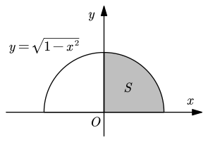

# 5.3 用定积分求 n 项和数列极限

设 $f(x)$ 在 $[0,1]$ 上可积，如果定积分中我们将区间 $n$ 等分，每个区间的 $\xi_i$ 取右端点，就有

$$
\int_0^1f(x){\rm d}x=\lim_{n\to\infty}\sum_{i=1}^nf\left(\frac in \right)\frac1n
$$

所以，遇到 $n$ 项和数列极限时，如果能变形成等号右边的样子，我们就能用定积分求解。

::: example

求极限：

$$
\lim_{n\to\infty}\frac1{n^2}\left(\sqrt{n^2-1^2}+\sqrt{n^2-2^2}+\cdots+\sqrt{n^2-n^2} \right)
$$

解：

1. 先用求和符号整理

   $$
   I=\lim_{n\to\infty}\frac1{n^2}\sum_{n=1}^n\sqrt{n^2-i^2}
   $$

   **注意到 $n$ 和 $i$ 齐次，这种极限往往采用定积分法处理。**（如果 $i$ 的次数低于 $n$，往往考虑放缩、夹逼准则）

2. 提出 $\dfrac1n$，想办法把 $i$ 全部凑成 $\dfrac in$

   $$
   \begin{align}
   I&=\lim_{n\to\infty}\sum_{i=1}^n{\sqrt{n^2-i^2}\over n}\cdot\frac1n \\
   &=\lim_{n\to\infty}\sum_{i=1}^n\sqrt{1-\left(\frac in \right)^2}\cdot\frac1n
   \end{align}
   $$

   到这里我们就找到了 $f(x)=\sqrt{1-\big(\dfrac in\big)^2}$

3. 将凑好的形式中的 $\dfrac1n$ 换成 ${\rm d}x$，把 $\dfrac in$ 换成 $x$，把 $\lim\sum$ 换成 $\int_0^1$

   $$
   \lim_{n\to\infty}\sum_{i=1}^n\sqrt{1-\left(\frac in \right)^2}\cdot\frac1n=\int_0^1\sqrt{1-x^2}\,{\rm d}x
   $$

4. 求解定积分。

这里求解定积分当然可以用牛莱公式，先求不定积分再想减，也不会太复杂（不定积分为 $\frac12x\sqrt{1-x^2}+\frac12\arcsin x+C$）。但是这里我们用几何方法更快。

注意到 $y=\sqrt{1-x^2}$ 实际上是以原点为圆心，以 $1$ 为半径的一个半圆。根据定积分的几何意义，$\int_0^1\sqrt{1-x^2}{\rm d}x$ 实际上是在第一象限的四分之一圆的面积：

所以该定积分的值为 $S=\dfrac{\pi\cdot1^2}4=\dfrac\pi4$。

:::
