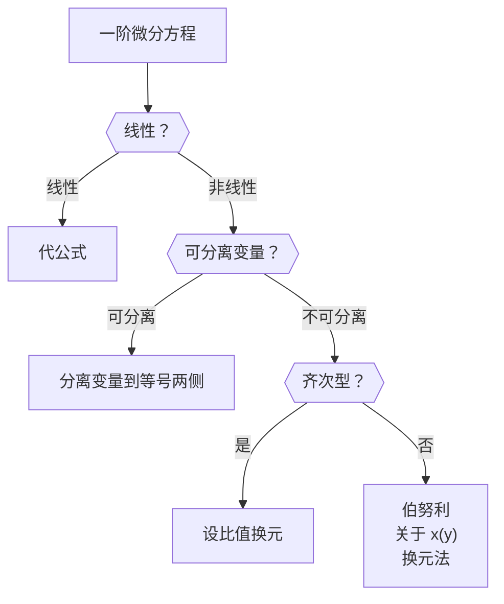

# 6.2 一阶微分方程

## 可分离变量型

### 定义

形如

$$
\begin{gathered}
{{\rm d}y\over {\rm d}x}=f(x)g(y) \\
或\: P(x)Q(x){\rm d}x+M(x)N(y){\rm d}y=0
\end{gathered}
$$

的方程。

### 解法

把 $y'$ 写成 $\dfrac{{\rm d}y}{{\rm d}x}$，将 $x$ 集中在等号一侧，$y$ 放在另一侧，然后两边同时积分

$$
{{\rm d}y\over {\rm d}x}=f(x)g(y)
\Rightarrow
\int{{\rm d}y\over g(y)}=\int f(x){\rm d}x
$$

> [!tip]
>
> 默认 $g(y)\ne 0$， 直接除过来，可能丢掉部分解（「奇解」），求通解不考虑奇解。

::: example

$$
y'\sqrt{1-x^2}=\sqrt{1-y^2}
$$

---

$$
\begin{align}
\sqrt{1-x^2}\cdot\frac{{\rm d}y}{{\rm d}x}&=\sqrt{1-y^2} \\
\frac{{\rm d}y}{\sqrt{1-y^2}}&=\frac{{\rm d}x}{\sqrt{1-x^2}} \\
\int\frac{{\rm d}y}{\sqrt{1-y^2}}&=\int\frac{{\rm d}x}{\sqrt{1-x^2}} \\
\arcsin y &= \arcsin x + C\\
\end{align}
$$

此即所求通解。

> [!tip]
>
> 不一定要化成 $y=\cdots$ 的形式，上面这样就可以了。

:::

> [!note]
>
> **通解与奇解**
>
> 求解时，我们通常不关注 $x$ 和 $y$ 的具体值。
>
> 这里 $\sqrt{1-y^2}=0$ 时，$y=\pm 1$，带回发现确实是方程的解，但没有放在通解中。这样的解称为奇解。
>
> 本题中，通解和奇解的关系是这样的：
>
> ```graph
> {
>   data: [
>     { fnType: "implicit", fn: "asin(y)-asin(x)-2", color: "steelblue" },
>     { fnType: "implicit", fn: "asin(y)-asin(x)-1.8", color: "steelblue" },
>     { fnType: "implicit", fn: "asin(y)-asin(x)-1.6", color: "steelblue" },
>     { fnType: "implicit", fn: "asin(y)-asin(x)-1.4", color: "steelblue" },
>     { fnType: "implicit", fn: "asin(y)-asin(x)-1.2", color: "steelblue" },
>     { fnType: "implicit", fn: "asin(y)-asin(x)-1", color: "steelblue" },
>     { fnType: "implicit", fn: "asin(y)-asin(x)-0.8", color: "steelblue" },
>     { fnType: "implicit", fn: "asin(y)-asin(x)-0.6", color: "steelblue" },
>     { fnType: "implicit", fn: "asin(y)-asin(x)-0.4", color: "steelblue" },
>     { fnType: "implicit", fn: "asin(y)-asin(x)-0.2", color: "steelblue" },
>     { fnType: "implicit", fn: "asin(y)-asin(x)", color: "steelblue" },
>     { fnType: "implicit", fn: "asin(y)-asin(x)+0.2", color: "steelblue" },
>     { fnType: "implicit", fn: "asin(y)-asin(x)+0.4", color: "steelblue" },
>     { fnType: "implicit", fn: "asin(y)-asin(x)+0.6", color: "steelblue" },
>     { fnType: "implicit", fn: "asin(y)-asin(x)+0.8", color: "steelblue" },
>     { fnType: "implicit", fn: "asin(y)-asin(x)+1", color: "steelblue" },
>     { fnType: "implicit", fn: "asin(y)-asin(x)+1.2", color: "steelblue" },
>     { fnType: "implicit", fn: "asin(y)-asin(x)+1.4", color: "steelblue" },
>     { fnType: "implicit", fn: "asin(y)-asin(x)+1.6", color: "steelblue" },
>     { fnType: "implicit", fn: "asin(y)-asin(x)+1.8", color: "steelblue" },
>     { fnType: "implicit", fn: "asin(y)-asin(x)+2", color: "steelblue" },
>     { fn: "1", color: "red" },
>     { fn: "-1", color: "red" },
>   ],
>   disableZoom: true,
>   yAxis: { domain: [-2, 2] },
> }
> ```
>
> 可以看出，奇解和通解看上去很不一样，但是奇解是通解的包络。

## 一阶齐次微分方程

### 定义

形如

$$
{{\rm d}y\over {\rm d}x}=g\left(\frac yx \right)
$$

的方程。

更简便的判断方法是，不算 $y'$，所有项 $x,y$ 的次数之和是相等的。例如，

$$
x^2y\cdot y'+x^3=y^3
$$

是一阶齐次微分方程。

### 解法

令 $u=\dfrac yx$，则

$$
\frac{{\rm d}y}{{\rm d}x}=\frac{{\rm d}(ux)}{{\rm d}x}=u+x\frac{{\rm d}u}{{\rm d}x}
$$

故方程转化为

$$
{{\rm d}u\over g(u)-u}={{\rm d}x\over x}
$$

::: example

求微分方程

$$
{{\rm d}y\over {\rm d}x}=\frac yx-\frac12\left(\frac yx \right)^3
$$

满足 $y|_{x=1}=1$ 的特解。

---

令 $u=\dfrac yx$，故 $\dfrac{{\rm d}y}{{\rm d}x}=u+x\dfrac{{\rm d}u}{{\rm d}x}$，故有

$$
\begin{align}
u+x{{\rm d}u\over {\rm d}x}&=u-\frac12u^3\\
-2{{\rm d}u\over u^3} &= {{\rm d}x\over x}\\
\int -2{{\rm d}u\over u^3} &= \int {{\rm d}x\over x}\\
\frac1{u^2}&=\ln|x|+C \\
\end{align}
$$

> 由于只求 $x=1$ 有定义的特解，故只考虑 $x>0$

$$
\frac1{u^2}=\ln x+C
$$

将 $x=1$，$u=\left.\dfrac yx \right|_{x=y=1}=1$ 代入得到 $C=1$，故有

$$
\begin{gathered}
\frac 1{u^2}={x^2\over y^2}=\ln x+1 \\
\Rightarrow y={x\over\sqrt{\ln x+1}}
\end{gathered}
$$

:::

## 一阶线性微分方程

### 定义

$$
y'+p(x)y=q(x)
$$

当 $q(x)\equiv0$ 时称为齐次，否则称为非齐次。

> [!warning]
>
> 注意这里「齐次」的概念和前面的不一样。糟糕的翻译问题

### 解法

教材使用的是常数变易法，比较复杂，且考研不考。最优方法把通解公式背下来。

$$
y=e^{-\int p(x){\rm d}x}\left[\int q(x)e^{\int p(x){\rm d}x}{\rm d}x+C \right] \\
$$

::: example

设某曲线 $y=f(x)$ 过点 $(1,1)$，其切线的纵截距等于切点横坐标，求该曲线的方程。

---

> [!tip]
>
> 用 $x,y$ 表示点的坐标，用 $X,Y$ 表达切线方程。

设切点为 $(x,y)$，切线方程为

$$
Y-y=y'(X-x)
$$

令 $X=0$，有

$$
Y=y-xy'=x
$$

这是一阶线性微分方程。

> **草稿纸：**
>
> - $y'-\dfrac 1x y=-1$
> - $p(x)=-\dfrac 1x$
> - $q(x)=-1$

故通解为

$$
\begin{align}
y&=e^{\int \frac 1x{\rm d}x}\left[\int(-1)e^{-\int \frac 1x{\rm d}x}{\rm d}x+C \right] \\
&=e^{\ln |x|}\left[-\int e^{-\ln|x|}{\rm d}x+C \right] \\
&=|x|\left[-\int \frac 1{|x|}{\rm d}x+C \right] \\
&=x\left[-\int \frac 1x{\rm d}x+C \right] \\
&=-x\ln |x|+Cx \\
&=-x\ln x+Cx \\
\end{align}
$$

> [!tip]
>
> 这里第三行中的两个 $|x|$ 的绝对值符号可以相互抵消。这一点在求通解时也可以用。
>
> 最后一步去绝对值是因为求特解，$x>0$。

将 $x=y=1$ 代入得到 $C=1$，故有

$$
y=x-x\ln x
$$

:::

### 积分方程

含有变限积分的方程，两端对 $x$ 求导。再令积分上下限相等，得到定解。

::: example

求连续函数 $f(x)$，使其满足

$$
f(x)+2\int_0^xf(t){\rm d}t=x^2
$$

---

由于 $f(x)$ 连续，故 $2\int_0^xf(t){\rm d}t$ 可导，故 $f(x)=-2\int_0^xf(t){\rm d}t+x^2$ 可导。

> [!tip]
>
> 按这个思路继续，可以推出 $f(x)$ **任意阶可导**。

两端对 $x$ 求导得到

$$
f'(x)+2f(x)=2x
$$

**法一：**

瞪眼法看出 $f'(x)+2f(x)$ 应该乘一个 $e^{2x}$ 来发生关系：

$$
\begin{gathered}
2e^{2x}f(x)+f'(x)e^{2x}=2xe^{2x} \\
\Rightarrow e^{2x}f(x)=\int2xe^{2x}{\rm d}x=xe^{2x}-\frac {e^{2x}}2+C \\
\Rightarrow f(x)=x-\frac12+Ce^{-2x}
\end{gathered}
$$

**法二：**

代公式。

> **草稿纸：**
>
> - $p(x)=2$
> - $q(x)=2x$

$$
\begin{align}
f(x)&=e^{-\int2{\rm d}x}\left[\int 2xe^{\int2{\rm d}x}{\rm d}x+C\right] \\
&=e^{-2x}\left[\int 2xe^{2x}{\rm d}x+C\right] \\
&=e^{-2x}\left(xe^{2x}-\frac12e^{2x}+C \right) \\
&=x-\frac12+Ce^{-2x}
\end{align}
$$

**别急！还没结束！再看一眼原来的式子：**

$$
f(x)+2\int_0^xf(t){\rm d}t=x^2
$$

令 $x=0$，则定积分这一项的值为 $0$，有

$$
\begin{align}
f(0) &= 0 \\
0-\frac12+Ce^0&=0 \\
C&=\frac12
\end{align}
$$

因此，有 $f(x)=x-\dfrac12+\dfrac12e^{-2x}$。

:::

> [!tip]
>
> 个别积分方程令积分上下限相等后，式子恒成立，此时直接回答 $C\in\mathbb R$。

::: example

$$
\int_0^1f(tx){\rm d}t=x^2
$$

---

这里介绍将此类微分方程转化为积分方程的方法。

令 $u=tx$，则有（注意在积分中 $t$ 才是变量，$x$ 视为常量）

$$
\begin{align}
\int_0^1f(u){\rm d}\frac ux&=x^2 \\
\frac 1x\int_0^xf(u){\rm d}u&=x^2 \\
\end{align}
$$

接下来按上面的方法处理即可。

:::

## 伯努利方程

### 定义

形如

$$
y'+p(x)y=q(x)y^\alpha\quad\small(\alpha\ne0,1)
$$

的方程称为伯努利方程。

### 解法

首先确定 $\alpha$，令 $z=y^{1-\alpha}$，将方程化为

$$
\textcolor{orange}{z'}+(1-\alpha)\textcolor{orange}{p(x)z}=(1-\alpha)\textcolor{orange}{q(x)}
$$

记忆：橙色部分为一阶线性微分方程的公式，补上 $(1-\alpha)$ 即可。

::: example

求方程通解：

$$
y'+{4x\over x^2-1}y=x\sqrt y
$$

---

$\alpha=\dfrac12$，令 $z=y^{1-\alpha}=\sqrt y$，则有

$$
z'+\dfrac12\cdot{4x\over x^2-1}z=\dfrac12x
$$

故有

$$
\begin{align}
z=&=e^{-\int {4x\over x^2-1}\mathrm dx}\left(\int\frac12x\cdot e^{\int {4x\over x^2-1}\mathrm d x}\mathrm dx +C \right) \\
&=\frac1{x^2-1}\left[\int\frac x2(x^2-1)\mathrm dx+C \right]\\
&={x^2(x^2-2)+C\over8(x^2-1)}
\end{align}
$$

故有

$$
y=\left[x^2(x^2-2)+C\over 8(x^2-1) \right]^2
$$

:::

## 总结



::: example

求 $y'=\dfrac1{xy+y^3}$ 的通解。

---

$$
\begin{align}
{\mathrm dy\over\mathrm dx}&=\frac1{xy+y^3}\\
{\mathrm dx\over\mathrm dy}&=xy+y^3\\
{\mathrm dx\over\mathrm dy}-yx&=y^3
\end{align}
$$

故这是关于 $x=x(y)$ 的一阶线性微分方程，有

$$
\begin{align}
x&=e^{\int y\mathrm dy}\left(\int y^3e^{-\int y\mathrm dy}\mathrm dy+C \right) \\
&=e^{\frac{y^2}2}\left(\int y^3e^{-\frac{y^2}2}\mathrm dy+C \right) \\
&=e^{\frac{y^2}2}\left[2\int {y^2\over2}e^{-\frac{y^2}2}\mathrm d\left(\frac{y^2}2 \right)+C \right] \\
&=e^{\frac{y^2}2}\left[-2\int {y^2\over2}\mathrm d(e^{-\frac{y^2}2})+C \right] \\
&=e^{\frac{y^2}2}\left[-{y^2}e^{-{y^2\over2}}+2\int e^{-\frac{y^2}2}\mathrm d\left(y^2\over2 \right)+C \right] \\
&=e^{\frac{y^2}2}\left[-{y^2}e^{-{y^2\over2}}-2e^{-\frac{y^2}2}+C \right] \\
&=Ce^{y^2\over2}-y^2-2
\end{align}
$$

:::
